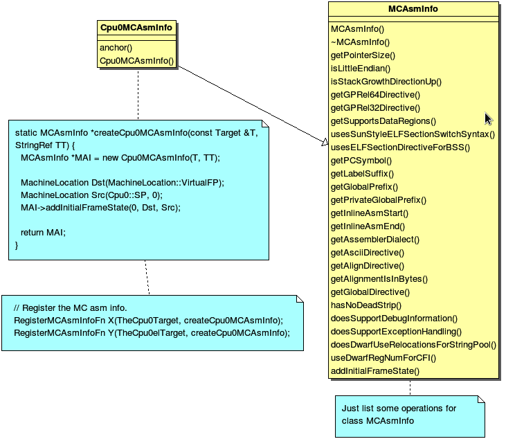
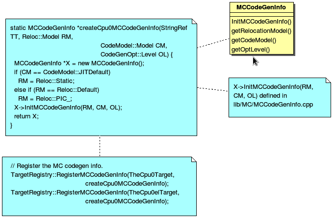
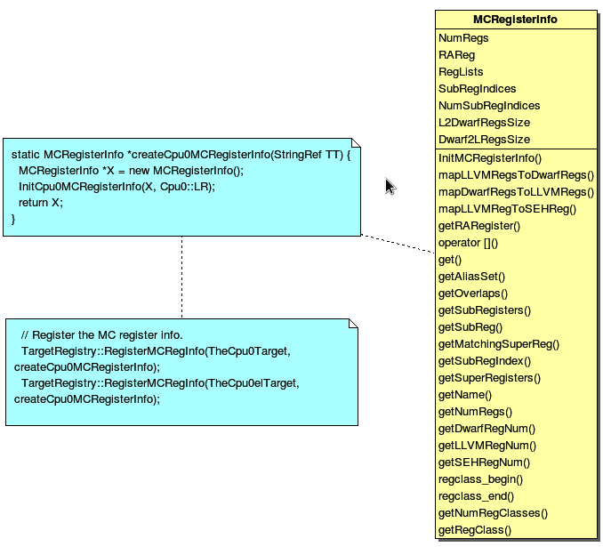
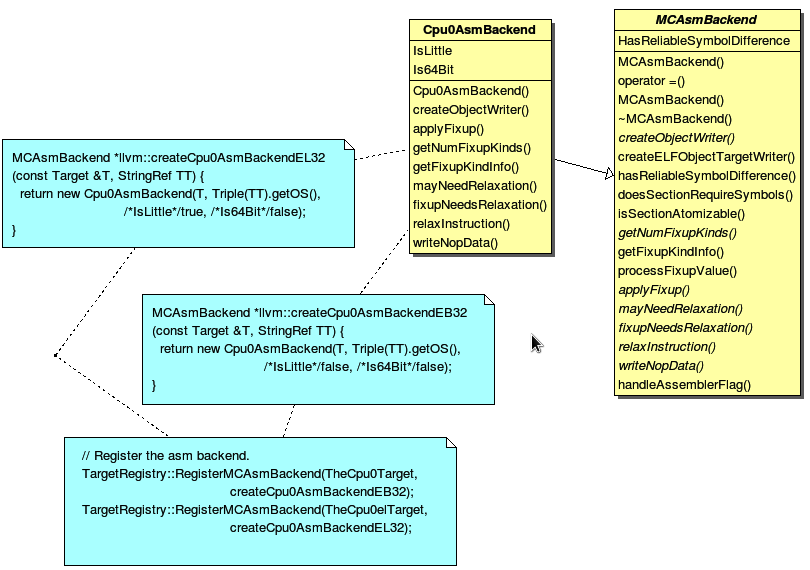

.. _sec-genobjfiles:

Generating object files
=======================

The previous chapters only introduce the assembly code generated. 
This chapter will introduce you the obj support first, and display the obj by 
objdump utility. With LLVM support, the cpu0 backend can generate both big 
endian and little endian obj files with only a few code added.  
The Target Registration mechanism and their structure will be introduced in 
this chapter.

Translate into obj file
------------------------

Currently, we only support translate llvm IR code into assembly code. 
If you try to run 4/6_2/Cpu0 to translate obj code will get the error message as 
follows,

.. code-block:: bash

  [Gamma@localhost 3]$ /usr/local/llvm/test/cmake_debug_build/bin/
  llc -march=cpu0 -relocation-model=pic -filetype=obj ch4_1_2.bc -o ch4_1_2.cpu0.o
  /usr/local/llvm/test/cmake_debug_build/bin/llc: target does not 
  support generation of this file type! 
	
The 5/Cpu0 support obj file generated. 
It can get result for big endian and little endian with command 
``llc -march=cpu0`` and ``llc -march=cpu0el``. 
Run it will get the obj files as follows,

.. code-block:: bash

  [Gamma@localhost InputFiles]$ cat ch4_1_2.cpu0.s 
  ...
    .set  nomacro 
  # BB#0: 
    addiu $sp, $sp, -72
    addiu $2, $zero, 0
    st  $2, 68($sp)
    addiu $3, $zero, 5
    st  $3, 64($sp)
  ...
  
  [Gamma@localhost 3]$ /usr/local/llvm/test/cmake_debug_build/bin/
  llc -march=cpu0 -relocation-model=pic -filetype=obj ch4_2.bc -o ch4_2.cpu0.o
  [Gamma@localhost InputFiles]$ objdump -s ch4_2.cpu0.o 
  
  ch4_2.cpu0.o:     file format elf32-big 
  
  Contents of section .text: 
   0000 09d0ffb8 09200000 012d0044 09300005  ..... ...-.D.0.. 
   0010 013d0040 09300002 013d003c 012d0038  .=.@.0...=.<.-.8 
   0020 012d0034 012d0014 0930fffb 013d0010  .-.4.-...0...=.. 
   0030 012d000c 012d0008 002d003c 003d0040  .-...-...-.<.=.@ 
   0040 13232000 012d0038 002d003c 003d0040  .# ..-.8.-.<.=.@ 
   0050 14232000 012d0034 002d003c 003d0040  .# ..-.4.-.<.=.@ 
   0060 15232000 012d0030 002d003c 003d0040  .# ..-.0.-.<.=.@ 
   0070 16232000 012d002c 002d003c 003d0040  .# ..-.,.-.<.=.@ 
   0080 18232000 012d0028 002d003c 003d0040  .# ..-.(.-.<.=.@ 
   0090 19232000 012d0024 002d003c 003d0040  .# ..-.$.-.<.=.@ 
   00a0 1a232000 012d0020 002d0040 1e220002  .# ..-. .-.@.".. 
   00b0 012d001c 002d0010 1e220002 012d0004  .-...-..."...-.. 
   00c0 002d0010 1f220002 012d000c 09d00048  .-..."...-.....H 
   00d0 2c00000e                                                     ,...            
  Contents of section .eh_frame: 
   0000 00000010 00000000 017a5200 017c0e01  .........zR..|.. 
   0010 000c0d00 00000010 00000018 00000000  ................ 
   0020 000000d4 00440e48                                    .....D.H        
  [Gamma@localhost InputFiles]$ /usr/local/llvm/test/
  cmake_debug_build/bin/llc -march=cpu0el -relocation-model=pic -filetype=obj 
  ch4_2.bc -o ch4_2.cpu0el.o 
  [Gamma@localhost InputFiles]$ objdump -s ch4_2.cpu0el.o 
  
  ch4_2.cpu0el.o:     file format elf32-little 
  
  Contents of section .text: 
   0000 b8ffd009 00002009 44002d01 05003009  ...... .D.-...0. 
   0010 40003d01 02003009 3c003d01 38002d01  @.=...0.<.=.8.-. 
   0020 34002d01 14002d01 fbff3009 10003d01  4.-...-...0...=. 
   0030 0c002d01 08002d01 3c002d00 40003d00  ..-...-.<.-.@.=. 
   0040 00202313 38002d01 3c002d00 40003d00  . #.8.-.<.-.@.=. 
   0050 00202314 34002d01 3c002d00 40003d00  . #.4.-.<.-.@.=. 
   0060 00202315 30002d01 3c002d00 40003d00  . #.0.-.<.-.@.=. 
   0070 00202316 2c002d01 3c002d00 40003d00  . #.,.-.<.-.@.=. 
   0080 00202318 28002d01 3c002d00 40003d00  . #.(.-.<.-.@.=. 
   0090 00202319 24002d01 3c002d00 40003d00  . #.$.-.<.-.@.=. 
   00a0 0020231a 20002d01 40002d00 0200221e  . #. .-.@.-...". 
   00b0 1c002d01 10002d00 0200221e 04002d01  ..-...-..."...-. 
   00c0 10002d00 0200221f 0c002d01 4800d009  ..-..."...-.H... 
   00d0 0e00002c                                                     ...,            
  Contents of section .eh_frame: 
   0000 10000000 00000000 017a5200 017c0e01  .........zR..|.. 
   0010 000c0d00 10000000 18000000 00000000  ................ 
   0020 d4000000 00440e48                                    .....D.H        

The first instruction is **“addiu  $sp, -72”** and it's corresponding obj is 
0x09d0ffb8. 
The addiu opcode is 0x09, 8 bits, $sp register number is 13(0xd), 4bits, second 
register is useless, so assign it to 0x0, and the immediate is 16 bits 
-72(=0xffb8), so it's correct. 
The third instruction **“st  $2, 68($sp)”** and it's corresponding obj 
is 0x012d0044. The **st** opcode is **0x0a**, $2 is 0x2, $sp is 0xd and 
immediate is 68(0x0044). 
Thanks to cpu0 instruction format which opcode, register operand and 
offset(imediate value) size are multiple of 4 bits. 
The obj format is easy to check by eye. 
The big endian (B0, B1, B2, B3) = (09, d0, ff, b8), objdump from B0 to B3 as 
0x09d0ffb8 and the little endian is (B3, B2, B1, B0) = (09, d0, ff, b8), 
objdump from B0 to B3 as 0xb8ffd009. 

Backend Target Registration Structure
--------------------------------------

Now, let's examine Cpu0MCTargetDesc.cpp.

.. code-block:: c++

  // Cpu0MCTargetDesc.cpp
  ...
  extern "C" void LLVMInitializeCpu0TargetMC() { 
    // Register the MC asm info. 
    RegisterMCAsmInfoFn X(TheCpu0Target, createCpu0MCAsmInfo); 
    RegisterMCAsmInfoFn Y(TheCpu0elTarget, createCpu0MCAsmInfo); 
  
    // Register the MC codegen info. 
    TargetRegistry::RegisterMCCodeGenInfo(TheCpu0Target, 
                                            createCpu0MCCodeGenInfo); 
    TargetRegistry::RegisterMCCodeGenInfo(TheCpu0elTarget, 
                                            createCpu0MCCodeGenInfo); 
    // Register the MC instruction info. 
    TargetRegistry::RegisterMCInstrInfo(TheCpu0Target, createCpu0MCInstrInfo); 
    TargetRegistry::RegisterMCInstrInfo(TheCpu0elTarget, createCpu0MCInstrInfo); 
  
    // Register the MC register info. 
    TargetRegistry::RegisterMCRegInfo(TheCpu0Target, createCpu0MCRegisterInfo); 
    TargetRegistry::RegisterMCRegInfo(TheCpu0elTarget, createCpu0MCRegisterInfo); 
    // Register the MC Code Emitter 
    TargetRegistry::RegisterMCCodeEmitter(TheCpu0Target, 
                                            createCpu0MCCodeEmitterEB); 
    TargetRegistry::RegisterMCCodeEmitter(TheCpu0elTarget, 
                                            createCpu0MCCodeEmitterEL); 

    // Register the object streamer. 
    TargetRegistry::RegisterMCObjectStreamer(TheCpu0Target, createMCStreamer); 
    TargetRegistry::RegisterMCObjectStreamer(TheCpu0elTarget, createMCStreamer); 
    // Register the asm backend. 
    TargetRegistry::RegisterMCAsmBackend(TheCpu0Target, 
                                           createCpu0AsmBackendEB32); 
    TargetRegistry::RegisterMCAsmBackend(TheCpu0elTarget, 
                                           createCpu0AsmBackendEL32); 
    // Register the MC subtarget info. 
    TargetRegistry::RegisterMCSubtargetInfo(TheCpu0Target, 
                                              createCpu0MCSubtargetInfo); 
    TargetRegistry::RegisterMCSubtargetInfo(TheCpu0elTarget, 
                                              createCpu0MCSubtargetInfo); 
    // Register the MCInstPrinter. 
    TargetRegistry::RegisterMCInstPrinter(TheCpu0Target, 
                                            createCpu0MCInstPrinter); 
    TargetRegistry::RegisterMCInstPrinter(TheCpu0elTarget, 
                                            createCpu0MCInstPrinter); 
  }

Cpu0MCTargetDesc.cpp do the target registration as mentioned in 
"section Target Registration" [#]_ of the last chapter. 
Drawing the register function and those class it registered in 
:num:`Figure #genobj-f1` to :num:`Figure #genobj-f9` for explanation.

.. _genobj-f1:

	Register Cpu0MCAsmInfo

.. _genobj-f2:

	Register MCCodeGenInfo

.. _genobj-f3:
.. figure:: ../Fig/genobj/3.png
	:height: 313 px
	:width: 606 px
	:scale: 100 %
	:align: center

	Register MCInstrInfo

.. _genobj-f4:

	Register MCRegisterInfo

.. _genobj-f5:
.. figure:: ../Fig/genobj/5.png
	:height: 635 px
	:width: 750 px
	:scale: 100 %
	:align: center

	Register Cpu0MCCodeEmitter

.. _genobj-f6:
.. figure:: ../Fig/genobj/6.png
	:height: 617 px
	:width: 776 px
	:scale: 100 %
	:align: center

	Register MCELFStreamer

.. _genobj-f7:

	Register Cpu0AsmBackend

.. _genobj-f8:
.. figure:: ../Fig/genobj/8.png
	:height: 483 px
	:width: 621 px
	:scale: 100 %
	:align: center

	Register Cpu0MCSubtargetInfo

.. _genobj-f9:
.. figure:: ../Fig/genobj/9.png
	:height: 569 px
	:width: 794 px
	:scale: 100 %
	:align: center

	Register Cpu0InstPrinter

.. _genobj-f10:
.. figure:: ../Fig/genobj/10.png
	:height: 596 px
	:width: 783 px
	:scale: 100 %
	:align: center

	MCELFStreamer inherit tree

In :num:`Figure #genobj-f1`, registering the object of class Cpu0AsmInfo for 
target TheCpu0Target and TheCpu0elTarget. 
TheCpu0Target is for big endian and TheCpu0elTarget is for little endian. 
Cpu0AsmInfo is derived from MCAsmInfo which is llvm built-in class. 
Most code is implemented in it's parent, back end reuse those code by inherit.

In :num:`Figure #genobj-f2`, instancing MCCodeGenInfo, and initialize it by 
pass 
Roloc::PIC because we use command ``llc -relocation-model=pic`` to tell ``llc`` 
compile using position-independent code mode. 
Recall the addressing mode in system program book has two mode, one is PIC 
mode, the other is absolute addressing mode. 
MC stands for Machine Code.

In :num:`Figure #genobj-f3`, instancing MCInstrInfo object X, and initialize it 
by InitCpu0MCInstrInfo(X). 
Since InitCpu0MCInstrInfo(X) is defined in Cpu0GenInstrInfo.inc, it will add 
the information from Cpu0InstrInfo.td we specified. 
:num:`Figure #genobj-f4` is similar to :num:`Figure #genobj-f3`, but it 
initialize the register information specified in Cpu0RegisterInfo.td. 
They share a lot of code with instruction/register td description.

:num:`Figure #genobj-f5`, instancing two objects Cpu0MCCodeEmitter, one is for 
big endian and the other is for little endian. 
They take care the obj format generated. 
So, it's not defined in 4/6_2/Cpu0 which support assembly code only.

:num:`Figure #genobj-f6`, MCELFStreamer take care the obj format also. 
:num:`Figure #genobj-f5` Cpu0MCCodeEmitter take care code emitter while 
MCELFStreamer take care the obj output streamer. 
:num:`Figure #genobj-f10` is MCELFStreamer inherit tree. 
You can find a lot of operations in that inherit tree.

Reader maybe has the question for what are the actual arguments in 
createCpu0MCCodeEmitterEB(const MCInstrInfo &MCII,  const MCSubtargetInfo &STI, 
MCContext &Ctx) and at when they are assigned. 
Yes, we didn't assign it, we register the createXXX() function by function 
pointer only (according C, TargetRegistry::RegisterXXX(TheCpu0Target, 
createXXX()) where createXXX is function pointer). 
LLVM keep a function pointer to createXXX() when we call target registry, and 
will call these createXXX() function back at proper time with arguments 
assigned during the target registration process, RegisterXXX().

:num:`Figure #genobj-f7`, Cpu0AsmBackend class is the bridge for asm to obj. 
Two objects take care big endian and little endian also. 
It derived from MCAsmBackend. 
Most of code for object file generated is implemented by MCELFStreamer and it's 
parent, MCAsmBackend.

:num:`Figure #genobj-f8`, instancing MCSubtargetInfo object and initialize with 
Cpu0.td information. 
:num:`Figure #genobj-f9`, instancing Cpu0InstPrinter to take care printing 
function for instructions. 
Like :num:`Figure #genobj-f1` to :num:`Figure #genobj-f4`, it has been defined 
in 4/6_2/Cpu0 code for assembly file generated support.

.. [#] http://jonathan2251.github.com/lbd/llvmstructure.html#target-registration
