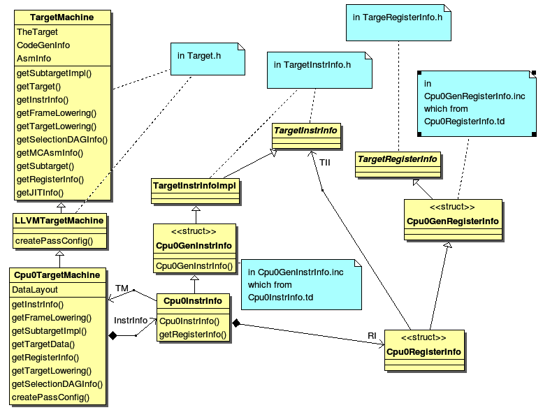

Back end structure
==================

This chapter introduce the back end class inherit tree and class members first. 
Next, following the back end structure, adding individual class implementation 
in each section. 
There are compiler knowledge like DAG (Directed-Acyclic-Graph) and instruction 
selection needed in this chapter. 
This chapter explains these knowledge just when needed. 
At the end of this chapter, we will have a back end to compile llvm 
intermediate code into cpu0 assembly code.

Many code are added in this chapter. They almost are common in every back end 
except the back end name (cpu0 or mips ...). Actually, we copy almost all the 
code from mips and replace the name with cpu0. Please focus on the classes 
relationship in this backend structure. Once knowing the structure, you can 
create your backend structure as quickly as we did, even though there are 3000 
lines of code in this chapter.

TargetMachine structure
-----------------------

Your back end should define a TargetMachine class, for example, we define the 
Cpu0TargetMachine class. 
Cpu0TargetMachine class contains it's own instruction class, frame/stack class, 
DAG (Directed-Acyclic-Graph) class, and register class. 
The Cpu0TargetMachine contents as follows,

.. literalinclude:: ../code_fragment/backendstructure/1.txt

.. _backendstructure_f1: 


	TargetMachine class diagram 1

The Cpu0TargetMachine inherit tree is TargetMachine <- LLVMTargetMachine <- 
Cpu0TargetMachine. 
Cpu0TargetMachine has class Cpu0Subtarget, Cpu0InstrInfo, Cpu0FrameLowering, 
Cpu0TargetLowering and Cpu0SelectionDAGInfo. 
Class Cpu0Subtarget, Cpu0InstrInfo, Cpu0FrameLowering, Cpu0TargetLowering and 
Cpu0SelectionDAGInfo are inherited from parent class TargetSubtargetInfo, 
TargetInstrInfo, TargetFrameLowering, TargetLowering and TargetSelectionDAGInfo.

:ref:`backendstructure_f1` shows Cpu0TargetMachine inherit tree and it's 
Cpu0InstrInfo class inherit tree. 
Cpu0TargetMachine contains Cpu0InstrInfo and ... other class. 
Cpu0InstrInfo contains Cpu0RegisterInfo class, RI. Cpu0InstrInfo.td and 
Cpu0RegisterInfo.td will generate Cpu0GenInstrInfo.inc and 
Cpu0GenRegisterInfo.inc which contain some member functions implementation for 
class Cpu0InstrInfo and Cpu0RegisterInfo.

:ref:`backendstructure_f2` as below shows Cpu0TargetMachine contains class 
TSInfo: Cpu0SelectionDAGInfo, FrameLowering: Cpu0FrameLowering, Subtarget: 
Cpu0Subtarget and TLInfo: Cpu0TargetLowering.

.. _backendstructure_f2:  
.. figure:: ../Fig/backendstructure/2.png
	:align: center

	TargetMachine class diagram 2

.. _backendstructure_f3: 
.. figure:: ../Fig/backendstructure/3.png
	:align: center

	TargetMachine members and operators

:ref:`backendstructure_f3` shows some members and operators (member function) 
of the parent class TargetMachine's. 
:ref:`backendstructure_f4` as below shows some members of class InstrInfo, 
RegisterInfo and TargetLowering. 
Class DAGInfo is skipped here.

.. _backendstructure_f4: 
.. figure:: ../Fig/backendstructure/4.png
	:align: center

	Other class members and operators

Benefit from the inherit tree structure, we just need to implement few code in 
instruction, frame/stack, select DAG class. 
Many code implemented by their parent class. 
The llvm-tblgen generate Cpu0GenInstrInfo.inc from Cpu0InstrInfo.td. 
Cpu0InstrInfo.h extract those code it need from Cpu0GenInstrInfo.inc by define 
“#define GET_INSTRINFO_HEADER”. 
Following is the code fragment from Cpu0GenInstrInfo.inc. 
Code between “#if def  GET_INSTRINFO_HEADER” and “#endif // GET_INSTRINFO_HEADER” 
will be extracted by Cpu0InstrInfo.h.

.. literalinclude:: ../code_fragment/backendstructure/2.txt

Reference Write An LLVM Backend web site [#]_.

Now, the code in 3/1/Cpu0 add class Cpu0TargetMachine(Cpu0TargetMachine.h and 
cpp), Cpu0Subtarget (Cpu0Subtarget.h and .cpp), Cpu0InstrInfo (Cpu0InstrInfo.h 
and .cpp), Cpu0FrameLowering (Cpu0FrameLowering.h and .cpp), Cpu0TargetLowering 
(Cpu0ISelLowering.h and .cpp) and Cpu0SelectionDAGInfo ( Cpu0SelectionDAGInfo.h 
and .cpp). 
CMakeLists.txt  modified with those new added \*.cpp as follows,

.. literalinclude:: ../code_fragment/backendstructure/3.txt

Please take a look for 3/1 code. 
After that, building 3/1 by make as chapter 2 (of course, you should remove old 
Target/Cpu0 and replace with 3/1/Cpu0). 
You can remove lib/Target/Cpu0/\*.inc before do “make” to ensure your code 
rebuild completely. 
By remove \*.inc, all files those have included .inc will be rebuild, then your 
Target library will regenerate. 
Command as follows,

.. literalinclude:: ../terminal_io/backendstructure/1.txt

Add RegisterInfo
----------------

As depicted in :ref:`backendstructure_f1`, the Cpu0InstrInfo class should 
contains Cpu0RegisterInfo. 
So 3/2/Cpu0 add Cpu0RegisterInfo class (Cpu0RegisterInfo.h, 
Cpu0RegisterInfo.cpp), and Cpu0RegisterInfo class in files Cpu0InstrInfo.h, 
Cpu0InstrInfo.cpp, Cpu0TargetMachine.h, and modify CMakeLists.txt as follows,

.. literalinclude:: ../code_fragment/backendstructure/4.txt

Now, let's replace 3/1/Cpu0 with 3/2/Cpu0 of adding register class definition 
and rebuild. 
After that, let's try to run the llc compile command to see what happen,

.. literalinclude:: ../terminal_io/backendstructure/2.txt

The errors say that we have not Target AsmPrinter. 
Let's add it in next section.


Add AsmPrinter
--------------

3/3/cpu0 contains the Cpu0AsmPrinter definition. First, we add definitions in 
Cpu0.td to support AssemblyWriter. 
Cpu0.td is added with the following fragment,

.. literalinclude:: ../code_fragment/backendstructure/5.txt

As comments indicate, it will generate Cpu0GenAsmWrite.inc which is included 
by Cpu0InstPrinter.cpp. 
Cpu0GenAsmWrite.inc has the implementation of 
Cpu0InstPrinter::printInstruction() and Cpu0InstPrinter::getRegisterName(). 
Both of these functions can be auto-generated from the information we defined 
in Cpu0InstrInfo.td and Cpu0RegisterInfo.td. 
To let these two functions work in our code, the only thing need to do is add a 
class Cpu0InstPrinter and include them.

File 3/3/Cpu0/InstPrinter/Cpu0InstPrinter.cpp include Cpu0GenAsmWrite.inc and 
call the auto-generated functions as follows,

.. literalinclude:: ../code_fragment/backendstructure/6.txt

Next, add Cpu0AsmPrinter (Cpu0AsmPrinter.h, Cpu0AsmPrinter.cpp), 
Cpu0MCInstLower (Cpu0MCInstLower.h, Cpu0MCInstLower.cpp), Cpu0BaseInfo.h, 
Cpu0FixupKinds.h and Cpu0MCAsmInfo (Cpu0MCAsmInfo.h, Cpu0MCAsmInfo.cpp) in 
sub-directory MCTargetDesc.

Finally, add code in Cpu0MCTargetDesc.cpp to register Cpu0InstPrinter as 
follows,

.. literalinclude:: ../code_fragment/backendstructure/7.txt

Now, it's time to work with AsmPrinter. According section 
"section Target Registration" [#]_, we can register our AsmPrinter when we need it 
as follows,

.. literalinclude:: ../code_fragment/backendstructure/8.txt

The dynamic register mechanism is a good idea, right.

Except add the new .cpp files to CMakeLists.txt, please remember to add 
subdirectory InstPrinter, enable asmprinter, add libraries AsmPrinter and 
Cpu0AsmPrinter to LLVMBuild.txt as follows,

.. literalinclude:: ../code_fragment/backendstructure/9.txt

Now, run 3/3/Cpu0 for AsmPrinter support, will get error message as follows,

.. literalinclude:: ../terminal_io/backendstructure/3.txt

The llc fails to compile IR code into machine code since we didn't implement 
class Cpu0DAGToDAGISel. Before the implementation, we will introduce the LLVM 
Code Generation Sequence, DAG, and LLVM instruction selection in next 3 
sections.

LLVM Code Generation Sequence
-----------------------------

Following diagram came from tricore_llvm.pdf.

.. _backendstructure_f5: 
.. figure:: ../Fig/backendstructure/5.png
	:align: center

	tricore_llvm.pdf: Code generation sequence. On the path from LLVM code to assembly code, numerous passes are run through and several data structures are used to represent the intermediate results.

LLVM is a Static Single Assignment (SSA) based representation. 
LLVM provides an infinite virtual registers which can hold values of primitive 
type (integral, floating point, or pointer values). 
So, every operand can save in different virtual register in llvm SSA 
representation. 
Comment is “;” in llvm representation. 
Following is the llvm SSA instructions.

.. literalinclude:: ../code_fragment/backendstructure/10.txt

We explain the code generation process as below. 
If you don't feel comfortable, please check tricore_llvm.pdf section 4.2 first. 
You can  read “The LLVM Target-Independent Code Generator” from [#]_ 
and “LLVM Language Reference Manual” from [#]_ 
before go ahead, but we think read section 
4.2 of tricore_llvm.pdf is enough. 
We suggest you read the web site documents as above only when you are still not 
quite understand, even though you have read this section and next 2 sections 
article for DAG and Instruction Selection.

1. Instruction Selection

.. literalinclude:: ../code_fragment/backendstructure/11.txt

2. Scheduling and Formation

.. literalinclude:: ../code_fragment/backendstructure/12.txt

3. SSA-based Machine Code Optimization

    For example, common expression remove, shown in next section DAG.
	
4. Register Allocation

    Allocate real register for virtual register.
	
5. Prologue/Epilogue Code Insertion

    Explain in section Add Prologue/Epilogue functions
	
6. Late Machine Code Optimizations

    Any “last-minute” peephole optimizations of the final machine code can be applied during this phase. For example, replace x = x * 2 by x = x < 1 for integer operand.
	
7. Code Emission
	Finally, the completed machine code is emitted. For static compilation, the end result is an assembly code file; for JIT compilation, the opcodes of the machine instructions are written into memory. 

DAG (Directed Acyclic Graph)
----------------------------

Many important techniques for local optimization begin by transforming a basic 
block into DAG. For example, the basic block code and it's corresponding DAG as 
:ref:`backendstructure_f6`.

.. _backendstructure_f6: 
.. figure:: ../Fig/backendstructure/6.png
	:align: center

	DAG example

If b is not live on exit from the block, then we can do common expression 
remove to get the following code.

.. literalinclude:: ../code_fragment/backendstructure/13.txt

As you can imagine, the common expression remove can apply in IR or machine 
code.

DAG like a tree which opcode is the node and operand (register and 
const/immediate/offset) is leaf. 
It can also be represented by list as prefix order in tree. 
For example, (+ b, c), (+ b, 1) is IR DAG representation.


Instruction Selection
---------------------

In back end, we need to translate IR code into machine code at Instruction 
Selection Process as :ref:`backendstructure_f7`.

.. _backendstructure_f7: 
.. figure:: ../Fig/backendstructure/7.png
	:align: center

	IR and it's corresponding machine instruction

For machine instruction selection, the better solution is represent IR and 
machine instruction by DAG. 
In :ref:`backendstructure_f7`, we skip the register leaf. 
The rj + rk is IR DAG representation (for symbol notation, not llvm SSA form). 
ADD is machine instruction.

.. _backendstructure_f8: 
.. figure:: ../Fig/backendstructure/8.png
	:align: center

	Instruction DAG representation

The IR DAG and machine instruction DAG can also represented as list. 
For example, (+ ri, rj), (- ri, 1) are lists for IR DAG; (ADD ri, rj), 
(SUBI ri, 1) are lists for machine instruction DAG.

Now, let's recall the ADDiu instruction defined on Cpu0InstrInfo.td in the 
previous chapter. 
And It will expand to the following Pattern as mentioned in section Write td 
(Target Description) of the previous chapter as follows,

.. literalinclude:: ../code_fragment/backendstructure/14.txt

This pattern meaning the IR DAG node **add** can translate into machine 
instruction DAG node ADDiu by pattern match mechanism. 
Similarly, the machine instruction DAG node LD and ST can be got from IR DAG 
node **load** and **store**.

Some cpu/fpu (floating point processor) has multiply-and-add floating point 
instruction, fmadd. 
It can be represented by DAG list (fadd (fmul ra, rc), rb). 
For this implementation, we can assign fmadd DAG pattern to instruction td as 
follows,

.. literalinclude:: ../code_fragment/backendstructure/15.txt

Similar with ADDiu, [(set F4RC:$FRT, (fadd (fmul F4RC:$FRA, F4RC:$FRC), 
F4RC:$FRB))] is the pattern which include node **fmul** and node **fadd**.

Now, for the following basic block notation IR and llvm SSA IR code,

.. literalinclude:: ../code_fragment/backendstructure/16.txt

The llvm SelectionDAG Optimization Phase (is part of Instruction Selection 
Process) prefered to translate this 2 IR DAG node (fmul %a, %b) (fadd %d, %c) 
into one machine instruction DAG node (**fmadd** %a, %c, %b), than translate 
them into 2 machine instruction nodes **fmul** and **fadd**.

.. literalinclude:: ../code_fragment/backendstructure/17.txt

As you can see, the IR notation representation is easier to read then llvm SSA 
IR form. 
So, we  use the notation form in this book sometimes.

For the following basic block code,

.. literalinclude:: ../code_fragment/backendstructure/18.txt

We can apply :ref:`backendstructure_f7` Instruction tree pattern to get the 
following machine code,

.. literalinclude:: ../code_fragment/backendstructure/19.txt


Add Cpu0DAGToDAGISel class
--------------------------

The IR DAG to machine instruction DAG transformation is introduced in the 
previous section. 
Now, let's check what IR DAG node the file ch3.bc has. List ch3.ll as follows,

.. literalinclude:: ../code_fragment/backendstructure/20.txt

As above, ch3.ll use the IR DAG node **store**, **ret**. Actually, it also use 
**add** for sp (stack point) register adjust. 
So, the definitions in Cpu0InstInfo.td as follows is enough. 
IR DAG is defined in file  include/llvm/Target/TargetSelectionDAG.td.

.. literalinclude:: ../code_fragment/backendstructure/21.txt

Add  class Cpu0DAGToDAGISel (Cpu0ISelDAGToDAG.cpp) to CMakeLists.txt, and add 
following fragment to Cpu0TargetMachine.cpp,

.. literalinclude:: ../code_fragment/backendstructure/22.txt

This version adding the following code in Cpu0InstInfo.cpp to enable debug 
information which called by llvm at proper time.

.. literalinclude:: ../code_fragment/backendstructure/23.txt

Build 3/4, run it, we find the error message in 3/3 is gone. The new error 
message for 3/4 as follows,

.. literalinclude:: ../terminal_io/backendstructure/4.txt


Add Prologue/Epilogue functions
-------------------------------

Following came from tricore_llvm.pdf section “4.4.2 Non-static Register 
Information ”.

For some target architectures, some aspects of the target architecture’s 
register set are dependent upon variable factors and have to be determined at 
runtime. 
As a consequence, they cannot be generated statically from a TableGen 
description – although that would be possible for the bulk of them in the case 
of the TriCore backend. 
Among them are the following points:

• Callee-saved registers. Normally, the ABI specifies a set of registers that a function must save on entry and restore on return if their contents are possibly modified during execution.

• Reserved registers. Although the set of unavailable registers is already defined in the TableGen file, TriCoreRegisterInfo contains a method that marks all non-allocatable register numbers in a bit vector. 

The following methods are implemented:

• emitPrologue() inserts prologue code at the beginning of a function. Thanks to TriCore’s context model, this is a trivial task as it is not required to save any registers manually. The only thing that has to be done is reserving space for the function’s stack frame by decrementing the stack pointer. In addition, if the function needs a frame pointer, the frame register %a14 is set to the old value of the stack pointer beforehand.

• emitEpilogue() is intended to emit instructions to destroy the stack frame and restore all previously saved registers before returning from a function. However, as %a10 (stack pointer), %a11 (return address), and %a14 (frame pointer, if any) are all part of the upper context, no epilogue code is needed at all. All cleanup operations are performed implicitly by the ret instruction. 

• eliminateFrameIndex() is called for each instruction that references a word of data in a stack slot. All previous passes of the code generator have been addressing stack slots through an abstract frame index and an immediate offset. The purpose of this function is to translate such a reference into a register–offset pair. Depending on whether the machine function that contains the instruction has a fixed or a variable stack frame, either the stack pointer %a10 or the frame pointer %a14 is used as the base register. The offset is computed accordingly. Figure 3.9 demonstrates for both cases how a stack slot is addressed. 

If the addressing mode of the affected instruction cannot handle the address because the offset is too large (the offset field has 10 bits for the BO addressing mode and 16 bits for the BOL mode), a sequence of instructions is emitted that explicitly computes the effective address. Interim results are put into an unused address register. If none is available, an already occupied address register is scavenged. For this purpose, LLVM’s framework offers a class named RegScavenger that takes care of all the details.

.. _backendstructure_f9: 
.. figure:: ../Fig/backendstructure/9.png
	:align: center

	Addressing of a variable a located on the stack. If the stack frame has a variable size, slot must be addressed relative to the frame pointer

We will explain the Prologue and Epilogue further by example code. 
So for the following llvm IR code, Cpu0 back end will emit the corresponding 
machine instructions as follows,

.. literalinclude:: ../terminal_io/backendstructure/5.txt

LLVM get the stack size by parsing IR and counting how many virtual registers 
is assigned to local variables. After that, it call emitPrologue(). 
This function will emit machine instructions to adjust sp (stack pointer 
register) for local variables since we don't use fp (frame pointer register). 
For our example, it will emit the instructions,

.. literalinclude:: ../code_fragment/backendstructure/24.txt

The  emitEpilogue will emit “addiu  $sp, $sp, 8”, 8 is the stack size.

Since Instruction Selection and Register Allocation occurs before 
Prologue/Epilogue Code Insertion, eliminateFrameIndex() is called after machine 
instruction and real register allocated. 
It translate the frame index of local variable (%1 and %2 in the following 
example) into stack offset according the frame index order upward (stack grow 
up downward from high address to low address, 0($sp) is the top, 52($sp) is the 
bottom) as follows,

.. literalinclude:: ../terminal_io/backendstructure/6.txt

After add these Prologue and Epilogue functions, and build with 3/5/Cpu0. 
Now we are ready to compile our example code ch3.bc into cpu0 assembly code. 
Following is the command and output file ch3.cpu0.s,

.. literalinclude:: ../terminal_io/backendstructure/7.txt

Summary of this Chapter
-----------------------

We have finished a simple assembler for cpu0 which only support **addiu**, 
**st** and **ret** 3 instructions.

We are satisfied with this result. 
But you may think “After so many codes we program, and just get the 3 
instructions”. 
The point is we have created a frame work for cpu0 target machine (please 
look back the llvm back end structure class inherit tree early in this 
chapter). 
Until now, we have 3027 lines of source code with comments which include files 
\*.cpp, \*.h, \*.td, CMakeLists.txt and LLVMBuild.txt. 
It can be counted by command ``wc `find dir -name *.cpp``` for files \*.cpp, 
\*.h, \*.td, \*.txt. 
LLVM front end tutorial have 700 lines of source code without comments totally. 
Don't feel down with this result. 
In reality, write a back end is warm up slowly but run fast. 
Clang has over 500,000 lines of source code with comments in clang/lib 
directory which include C++ and Obj C support. 
Mips back end has only 15,000 lines with comments. 
Even the complicate X86 CPU which CISC outside and RISC inside (micro 
instruction), has only 45,000 lines with comments. 
In next chapter, we will show you that add a new instruction support is as easy 
as 123.


.. [#] http://llvm.org/docs/WritingAnLLVMBackend.html#TargetMachine

.. [#] http://jonathan2251.github.com/lbd/llvmstructure.html#target-registration

.. [#] http://llvm.org/docs/CodeGenerator.html

.. [#] http://llvm.org/docs/LangRef.html