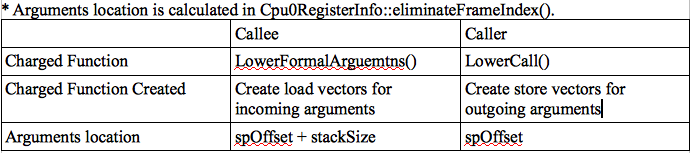

Function call
==============

The subroutine/function call of backend code translation is supported in this 
chapter. 
A lots of code needed in function call. We break it down according llvm 
supplied interface for easy to explanation. 
This chapter introduce the Mips stack frame structure first since we borrow 
many part of ABI from it. 
Although each CPU has it's own ABI, most of RISC CPUs ABI are similar. 
In addition to support fixed number of arguments function call, cpu0 also 
upport variable number of arguments since C/C++ support this feature. 
Supply Mips ABI and assemble language manual on internet link in this chapter 
for your reference. 
The section “4.5 DAG Lowering” of tricore_llvm.pdf contains some knowledge 
about Lowering process. Section “4.5.1 Calling Conventions” of tricore_llvm.pdf 
is the related materials you can reference.

Mips stack frame
-----------------

The first thing for design the cpu0 function call is to decide how to pass 
arguments in function call. There are two options. 
The first is pass arguments all in stack. 
Second is pass arguments in the registers which are reserved for function 
arguments, and put the other arguments in stack if it over the number of 
registers reserved for function call. For example, Mips pass the first 4 
arguments in register $a0, $a1, $a2, $a3, and the other arguments if it over 4 
arguments in stack. :ref:`funccall_f1` is the Mips stack frame.

.. _funccall_f1:
.. figure:: ../Fig/funccall/1.png
    :height: 531 px
    :width: 688 px
    :scale: 100 %
    :align: center

    Mips stack frame
    
Run llc with -march=mips for ch7_1.bc, you will get the following result.

.. code-block:: c++

    // ch7_1.cpp
    int sum_i(int x1, int x2, int x3, int x4, int x5, int x6)
    {
        int sum = x1 + x2 + x3 + x4 + x5 + x6;
        
        return sum; 
    }
    
    int main()
    {
        int a = sum_i(1, 2, 3, 4, 5, 6);
        
        return a;
    }

.. code-block:: bash

    118-165-79-31:InputFiles Jonathan$ clang -c ch7_1.cpp -emit-llvm -o ch7_1.bc
    118-165-79-31:InputFiles Jonathan$ /Users/Jonathan/llvm/3.1.test/cpu0/1/
    cmake_debug_build/bin/Debug/llc -march=mips -relocation-model=pic -filetype=asm 
    ch7_1.bc -o ch7_1.mips.s
    118-165-79-31:InputFiles Jonathan$ cat ch7_1.mips.s
        .section .mdebug.abi32
        .previous
        .file   "ch7_1.bc"
        .text
        .globl  _Z5sum_iiiiiii
        .align  2
        .type   _Z5sum_iiiiiii,@function
        .ent    _Z5sum_iiiiiii          # @_Z5sum_iiiiiii
    _Z5sum_iiiiiii:
        .frame  $sp,32,$ra
        .mask   0x00000000,0
        .fmask  0x00000000,0
        .set    noreorder
        .set    nomacro
    # BB#0:                                 # %entry
        addiu   $sp, $sp, -32
        st  $4, 28($sp)
        st  $5, 24($sp)
        st  $6, 20($sp)
        st  $7, 16($sp)
        ld  $2, 48($sp) // load argument 5
        st  $2, 12($sp)
        ld  $2, 52($sp) // load argument 6
        st  $2, 8($sp)
        ld  $3, 24($sp)
        ld  $4, 28($sp)
        addu    $3, $4, $3
        ld  $4, 20($sp)
        addu    $3, $3, $4
        ld  $4, 16($sp)
        addu    $3, $3, $4
        ld  $4, 12($sp)
        addu    $3, $3, $4
        addu    $2, $3, $2
        st  $2, 4($sp)
        addiu   $sp, $sp, 32
        jr  $ra
        nop
        .set    macro
        .set    reorder
        .end    _Z5sum_iiiiiii
    $tmp1:
        .size   _Z5sum_iiiiiii, ($tmp1)-_Z5sum_iiiiiii
    
        .globl  main
        .align  2
        .type   main,@function
        .ent    main                    # @main
    main:
        .frame  $sp,48,$ra
        .mask   0x80000000,-4
        .fmask  0x00000000,0
        .set    noreorder
        .cpload $25
        .set    nomacro
    # BB#0:                                 # %entry
        addiu   $sp, $sp, -48
        st  $ra, 44($sp)            # 4-byte Folded Spill
        .cprestore  24
        st  $zero, 40($sp)
        addiu   $2, $zero, 6
        st  $2, 20($sp) // Save argument 6 to 20($sp)
        addiu   $2, $zero, 5
        st  $2, 16($sp) // Save argument 5 to 16($sp)
        ld  $25, %call16(_Z5sum_iiiiiii)($gp)
        addiu   $4, $zero, 1    // Pass argument 1 to $4 (=$a0)
        addiu   $5, $zero, 2    // Pass argument 2 to $5 (=$a1)
        addiu   $6, $zero, 3
        addiu   $7, $zero, 4
        jalr    $25
        nop
        ld  $gp, 24($sp)
        st  $2, 36($sp)
        ld  $ra, 44($sp)            # 4-byte Folded Reload
        addiu   $sp, $sp, 48
        jr  $ra
        nop
        .set    macro
        .set    reorder
        .end    main
    $tmp4:
        .size   main, ($tmp4)-main

From the mips assembly code generated as above, we know it save the first 4 
arguments to $a0..$a3 and last 2 arguments to 16($sp) and 20($sp). 
:ref:`funccall_f2` is the arguments location for example code ch7_1.cpp. 
It load argument 5 from 48($sp) in sum_i() since the argument 5 is saved to 
16($sp) in main(). 
The stack size of sum_i() is 32, so 16+32($sp) is the location of incoming 
argument 5.

.. _funccall_f2:
.. figure:: ../Fig/funccall/2.png
    :height: 577 px
    :width: 740 px
    :scale: 100 %
    :align: center

    Mips arguments location in stack frame

The 007-2418-003.pdf in 
https://www.dropbox.com/home/LLVMBackendTutorial/doc/MIPSproAssemblyLanguageProgrammerGuide 
is the Mips assembly language manual. 
psABI-mips.pdf in https://www.dropbox.com/sh/2pkh1fewlq2zag9/buvX_zeN09/doc is 
Mips Application Binary Interface which include the :ref:`funccall_f1`.

Load incoming arguments from stack frame
-----------------------------------------

From last section, to support function call, we need implement the arguments 
pass mechanism with stack frame. Before do that, let's run the old version of 
code 6/1/Cpu0 with ch7_1.cpp and see what happen.

.. code-block:: bash

  118-165-79-31:InputFiles Jonathan$ /Users/Jonathan/llvm/3.1.test/cpu0/1/
  cmake_debug_build/bin/Debug/llc -march=cpu0 -relocation-model=pic -filetype=asm 
  ch7_1.bc -o ch7_1.cpu0.s
  Assertion failed: (InVals.size() == Ins.size() && "LowerFormalArguments didn't 
  emit the correct number of values!"), function LowerArguments, file /Users/
  Jonathan/llvm/3.1.test/cpu0/1/src/lib/CodeGen/SelectionDAG/
  SelectionDAGBuilder.cpp, line 6671.
  Stack dump:
  0.  Program arguments: /Users/Jonathan/llvm/3.1.test/cpu0/1/cmake_debug_build/
  bin/Debug/llc -march=cpu0 -relocation-model=pic -filetype=asm ch7_1.bc -o 
  ch7_1.cpu0.s 
  1.  Running pass 'Function Pass Manager' on module 'ch7_1.bc'.
  2.  Running pass 'CPU0 DAG->DAG Pattern Instruction Selection' on function 
  '@_Z5sum_iiiiiii'
  Illegal instruction: 4

Since 6/1/Cpu0 define the LowerFormalArguments() with empty, we get the error 
message as above. 
Before define LowerFormalArguments(), we have to choose how to pass arguments 
in function call. We choose pass arguments all in stack frame. 
We don't reserve any dedicated register for arguments passing since cpu0 has 
only 16 registers while Mips has 32 registers. Cpu0CallingConv.td is defined 
for cpu0 passing rule as follows,

.. code-block:: c++

    // Cpu0CallingConv.td
    ...
    def RetCC_Cpu0EABI : CallingConv<[ 
      // i32 are returned in registers V0, V1
      CCIfType<[i32], CCAssignToReg<[V0, V1]>>
    ]>;
    
    //===----------------------------------------------------------------------===//
    // Cpu0 EABI Calling Convention
    //===----------------------------------------------------------------------===//
    
    def CC_Cpu0EABI : CallingConv<[
      // Promote i8/i16 arguments to i32.
      CCIfType<[i8, i16], CCPromoteToType<i32>>,
      // Integer values get stored in stack slots that are 4 bytes in
      // size and 4-byte aligned.
      CCIfType<[i32], CCAssignToStack<4, 4>>
    ]>;
    
    
    //===----------------------------------------------------------------------===//
    // Cpu0 Calling Convention Dispatch
    //===----------------------------------------------------------------------===//
    
    def CC_Cpu0 : CallingConv<[
      CCDelegateTo<CC_Cpu0EABI>
    ]>;
    
    
    def RetCC_Cpu0 : CallingConv<[
      CCDelegateTo<RetCC_Cpu0EABI>
    ]>;
    
    def CSR_O32 : CalleeSavedRegs<(add LR, FP,
                                       (sequence "S%u", 2, 0))>;

As above, CC_Cpu0 is the cpu0 Calling Convention which delegate to CC_Cpu0EABI 
and define the CC_Cpu0EABI. 
The reason we don't define the Calling Convention directly in CC_Cpu0 is that 
a real general CPU like Mips can have several Calling Convention. 
Combine with the mechanism of `section Target Registration`_ which llvm 
supplied, we can use different Calling Convention in  different target. 
Although cpu0 only have a Calling Convention right now, define with a dedicate 
Call Convention name (CC_Cpu0EABI in this example) is a better solution for 
system expand, and naming your Calling Convention. CC_Cpu0EABI as above, say it 
pass arguments in stack frame.

Function LowerFormalArguments() charge function incoming arguments creation. 
We define it as follows,

.. code-block:: c++

    // Cpu0ISelLowering.cpp
    ...
    /// LowerFormalArguments - transform physical registers into virtual registers
    /// and generate load operations for arguments places on the stack.
    SDValue
    Cpu0TargetLowering::LowerFormalArguments(SDValue Chain,
                                             CallingConv::ID CallConv,
                                             bool isVarArg,
                                          const SmallVectorImpl<ISD::InputArg> &Ins,
                                             DebugLoc dl, SelectionDAG &DAG,
                                             SmallVectorImpl<SDValue> &InVals)
                                              const {
      MachineFunction &MF = DAG.getMachineFunction();
      MachineFrameInfo *MFI = MF.getFrameInfo();
      Cpu0FunctionInfo *Cpu0FI = MF.getInfo<Cpu0FunctionInfo>();
    
      Cpu0FI->setVarArgsFrameIndex(0);
    
      // Used with vargs to acumulate store chains.
      std::vector<SDValue> OutChains;
    
      // Assign locations to all of the incoming arguments.
      SmallVector<CCValAssign, 16> ArgLocs;
      CCState CCInfo(CallConv, isVarArg, DAG.getMachineFunction(),
                     getTargetMachine(), ArgLocs, *DAG.getContext());
                             
      CCInfo.AnalyzeFormalArguments(Ins, CC_Cpu0);
    
      Function::const_arg_iterator FuncArg =
        DAG.getMachineFunction().getFunction()->arg_begin();
      int LastFI = 0;// Cpu0FI->LastInArgFI is 0 at the entry of this function.
    
      for (unsigned i = 0, e = ArgLocs.size(); i != e; ++i, ++FuncArg) {
        CCValAssign &VA = ArgLocs[i];
        EVT ValVT = VA.getValVT();
        ISD::ArgFlagsTy Flags = Ins[i].Flags;
        bool IsRegLoc = VA.isRegLoc();
    
        if (Flags.isByVal()) {
          assert(Flags.getByValSize() &&
                 "ByVal args of size 0 should have been ignored by front-end."); 
          continue;
        }
        // sanity check
        assert(VA.isMemLoc());
    
        // The stack pointer offset is relative to the caller stack frame.
        LastFI = MFI->CreateFixedObject(ValVT.getSizeInBits()/8,
                                        VA.getLocMemOffset(), true);
    
        // Create load nodes to retrieve arguments from the stack
        SDValue FIN = DAG.getFrameIndex(LastFI, getPointerTy());
        InVals.push_back(DAG.getLoad(ValVT, dl, Chain, FIN,
                                     MachinePointerInfo::getFixedStack(LastFI),
                                     false, false, false, 0));
      }
      Cpu0FI->setLastInArgFI(LastFI);
      // All stores are grouped in one node to allow the matching between
      // the size of Ins and InVals. This only happens when on varg functions
      if (!OutChains.empty()) {
        OutChains.push_back(Chain);
        Chain = DAG.getNode(ISD::TokenFactor, dl, MVT::Other,
                            &OutChains[0], OutChains.size());
      }
      return Chain;
    }

Refresh `section Global variable`_, we have take care global 
variable translation by create the IR DAG in LowerGlobalAddress() first, and 
then do the Instruction Selection by their corresponding machine instruction 
DAG in Cpu0InstrInfo.td. 
LowerGlobalAddress() is called when llc meet the global variable access. 
LowerFormalArguments() work with the same way. 
It is called when function is entered. 
It get incoming arguments information by CCInfo(CallConv,..., ArgLocs, …) 
before enter “for loop”. In ch7_1.cpp, there are 6 arguments in sum_i(...) 
function call and we use the stack frame only for arguments passing without 
any arguments pass in registers. 
So ArgLocs.size() is 6, each argument information is in ArgLocs[i] and 
ArgLocs[i].isMemLoc() is true. 
In “for loop”, it create each frame index object by LastFI = 
MFI->CreateFixedObject(ValVT.getSizeInBits()/8,VA.getLocMemOffset(), true) and 
FIN = DAG.getFrameIndex(LastFI, getPointerTy()). 
nd then create IR DAG load node and put the load node into vector InVals by 
InVals.push_back(DAG.getLoad(ValVT, dl, Chain, FIN, 
MachinePointerInfo::getFixedStack(LastFI), false, false, false, 0)). 
Cpu0FI->setVarArgsFrameIndex(0) and Cpu0FI->setLastInArgFI(LastFI) are called 
when before and after above work. In ch7_1.cpp example, LowerFormalArguments() 
will be called twice. First time is for sum_i() which will create 6 load DAG 
for 6 incoming arguments passing into this function. 
Second time is for main() which didn't create any load DAG for no incoming 
argument passing into main(). 
In addition to LowerFormalArguments() which create the load DAG, we need to 
define the loadRegFromStackSlot() to issue the machine instruction 
“ld $r, offset($sp)” to load incoming arguments from stack frame offset.

.. code-block:: c++
    
    // Cpu0InstrInfo.cpp
    ...
    static MachineMemOperand* GetMemOperand(MachineBasicBlock &MBB, int FI,
                                            unsigned Flag) {
      MachineFunction &MF = *MBB.getParent();
      MachineFrameInfo &MFI = *MF.getFrameInfo();
      unsigned Align = MFI.getObjectAlignment(FI);
    
      return MF.getMachineMemOperand(MachinePointerInfo::getFixedStack(FI), Flag,
                                     MFI.getObjectSize(FI), Align);
    }
    
    void Cpu0InstrInfo::
    loadRegFromStackSlot(MachineBasicBlock &MBB, MachineBasicBlock::iterator I,
                         unsigned DestReg, int FI,
                         const TargetRegisterClass *RC,
                         const TargetRegisterInfo *TRI) const
    {
      DebugLoc DL;
      if (I != MBB.end()) DL = I->getDebugLoc();
      MachineMemOperand *MMO = GetMemOperand(MBB, FI, MachineMemOperand::MOLoad);
      unsigned Opc = 0;
    
      if (RC == Cpu0::CPURegsRegisterClass)
        Opc = Cpu0::LD;
      assert(Opc && "Register class not handled!");
      BuildMI(MBB, I, DL, get(Opc), DestReg).addFrameIndex(FI).addImm(0)
        .addMemOperand(MMO);
    }

Beyond Calling Convention and LowerFormalArguments(), 7/2/Cpu0 add following 
code for cpu0 instructions swi (Software Interrupt) and jsub, jalr 
(function call) definition and printing.

.. code-block:: c++

    // Cpu0InstrFormats.td
    ...
    // Cpu0 Pseudo Instructions Format
    class Cpu0Pseudo<dag outs, dag ins, string asmstr, list<dag> pattern>:
          Cpu0Inst<outs, ins, asmstr, pattern, IIPseudo, Pseudo> {
      let isCodeGenOnly = 1;
      let isPseudo = 1;
    }
    
    // Cpu0InstrInfo.td
    ...
    def SDT_Cpu0JmpLink      : SDTypeProfile<0, 1, [SDTCisVT<0, iPTR>]>;
    ...
    // Call
    def Cpu0JmpLink : SDNode<"Cpu0ISD::JmpLink",SDT_Cpu0JmpLink,
                             [SDNPHasChain, SDNPOutGlue, SDNPOptInGlue,
                              SDNPVariadic]>;
    ...
    // These are target-independent nodes, but have target-specific formats.
    def callseq_start : SDNode<"ISD::CALLSEQ_START", SDT_Cpu0CallSeqStart,
                               [SDNPHasChain, SDNPOutGlue]>;
    def callseq_end   : SDNode<"ISD::CALLSEQ_END", SDT_Cpu0CallSeqEnd,
                               [SDNPHasChain, SDNPOptInGlue, SDNPOutGlue]>;
    …
    def jmptarget   : Operand<OtherVT> {
      let EncoderMethod = "getJumpTargetOpValue";
    }
    …
    def calltarget  : Operand<iPTR> {
      let EncoderMethod = "getJumpTargetOpValue";
    }
    …
    // Jump and Link (Call)
    let isCall=1, hasDelaySlot=0 in {
      class JumpLink<bits<8> op, string instr_asm>:
        FJ<op, (outs), (ins calltarget:$target, variable_ops),
           !strconcat(instr_asm, "\t$target"), [(Cpu0JmpLink imm:$target)],
           IIBranch> {
           let DecoderMethod = "DecodeJumpTarget";
           }
    
      class JumpLinkReg<bits<8> op, string instr_asm,
                        RegisterClass RC>:
        FA<op, (outs), (ins RC:$rb, variable_ops),
           !strconcat(instr_asm, "\t$rb"), [(Cpu0JmpLink RC:$rb)], IIBranch> {
        let rc = 0;
        let ra = 14;
        let shamt = 0;
      }
    }
    …
    /// Jump and Branch Instructions
    def SWI  : JumpLink<0x2A, "swi">;
    def JSUB : JumpLink<0x2B, "jsub">;
    …
    def JALR : JumpLinkReg<0x2D, "jalr", CPURegs>;
    …
    def : Pat<(Cpu0JmpLink (i32 tglobaladdr:$dst)),
              (JSUB tglobaladdr:$dst)>;
    …
    
    // Cpu0InstPrinter.cpp
    …
    static void printExpr(const MCExpr *Expr, raw_ostream &OS) {
      switch (Kind) {
      ...
      case MCSymbolRefExpr::VK_Cpu0_GOT_CALL:  OS << "%call24("; break;
      …
      }
    …
    }
    
    // Cpu0MCCodeEmitter.cpp
    …
    unsigned Cpu0MCCodeEmitter::
    getMachineOpValue(const MCInst &MI, const MCOperand &MO,
                      SmallVectorImpl<MCFixup> &Fixups) const {
    ...
      switch(cast<MCSymbolRefExpr>(Expr)->getKind()) {
      ...
      case MCSymbolRefExpr::VK_Cpu0_GOT_CALL:
        FixupKind = Cpu0::fixup_Cpu0_CALL24;
        break;
      …
      }
    …
    }
    
    // Cpu0MachineFucntion.h
    class Cpu0FunctionInfo : public MachineFunctionInfo {
      ...
        /// VarArgsFrameIndex - FrameIndex for start of varargs area.
      int VarArgsFrameIndex;
    
      // Range of frame object indices.
      // InArgFIRange: Range of indices of all frame objects created during call to
      //               LowerFormalArguments.
      // OutArgFIRange: Range of indices of all frame objects created during call to
      //                LowerCall except for the frame object for restoring $gp.
      std::pair<int, int> InArgFIRange, OutArgFIRange;
      int GPFI; // Index of the frame object for restoring $gp
      mutable int DynAllocFI; // Frame index of dynamically allocated stack area.
      unsigned MaxCallFrameSize;
    
    public:
      Cpu0FunctionInfo(MachineFunction& MF)
      : MF(MF), GlobalBaseReg(0),
        VarArgsFrameIndex(0), InArgFIRange(std::make_pair(-1, 0)),
        OutArgFIRange(std::make_pair(-1, 0)), GPFI(0), DynAllocFI(0),
        MaxCallFrameSize(0)
        {}
      
      bool isInArgFI(int FI) const {
        return FI <= InArgFIRange.first && FI >= InArgFIRange.second;
      }
      void setLastInArgFI(int FI) { InArgFIRange.second = FI; }
    
      void extendOutArgFIRange(int FirstFI, int LastFI) {
        if (!OutArgFIRange.second)
          // this must be the first time this function was called.
          OutArgFIRange.first = FirstFI;
        OutArgFIRange.second = LastFI;
      }
    
      int getGPFI() const { return GPFI; }
      void setGPFI(int FI) { GPFI = FI; }
      bool needGPSaveRestore() const { return getGPFI(); }
      bool isGPFI(int FI) const { return GPFI && GPFI == FI; }
    
      // The first call to this function creates a frame object for dynamically
      // allocated stack area.
      int getDynAllocFI() const {
        if (!DynAllocFI)
          DynAllocFI = MF.getFrameInfo()->CreateFixedObject(4, 0, true);
    
        return DynAllocFI;
      }
      bool isDynAllocFI(int FI) const { return DynAllocFI && DynAllocFI == FI; }
      ...
      int getVarArgsFrameIndex() const { return VarArgsFrameIndex; }
      void setVarArgsFrameIndex(int Index) { VarArgsFrameIndex = Index; }
    
      unsigned getMaxCallFrameSize() const { return MaxCallFrameSize; }
      void setMaxCallFrameSize(unsigned S) { MaxCallFrameSize = S; }
    };

After above changes, you can run 7/2/Cpu0 with ch7_1.cpp and see what happen 
as follows,

.. code-block:: bash

    118-165-79-83:InputFiles Jonathan$ /Users/Jonathan/llvm/3.1.test/cpu0/1/
    cmake_debug_build/bin/Debug/llc -march=cpu0 -relocation-model=pic -filetype=asm 
    ch7_1.bc -o ch7_1.cpu0.s
    Assertion failed: ((isTailCall || InVals.size() == Ins.size()) && 
    "LowerCall didn't emit the correct number of values!"), function LowerCallTo, 
    file /Users/Jonathan/llvm/3.1.test/cpu0/1/src/lib/CodeGen/SelectionDAG/
    SelectionDAGBuilder.cpp, line 6482.
    Stack dump:
    0.  Program arguments: /Users/Jonathan/llvm/3.1.test/cpu0/1/cmake_debug_build/
    bin/Debug/llc -march=cpu0 -relocation-model=pic -filetype=asm ch7_1.bc -o 
    ch7_1.cpu0.s 
    1.  Running pass 'Function Pass Manager' on module 'ch7_1.bc'.
    2.  Running pass 'CPU0 DAG->DAG Pattern Instruction Selection' on function 
    '@main'
    Illegal instruction: 4

Store outgoing arguments to stack frame
----------------------------------------

:ref:`funccall_f2` depicted two steps to take care arguments passing. 
One is store outgoing arguments in caller function, and the other is load 
incoming arguments in callee function. 
We define LowerFormalArguments() to do “load incoming arguments” in callee 
function of the last section. 
Now, we have to finish “store outgoing arguments” in caller function. 
LowerCall() is responsible to do this. The implementation as follows,

.. code-block:: c++

    // Cpu0ISelLowering.cpp
    ...
    SDValue
    Cpu0TargetLowering::LowerCall(SDValue InChain, SDValue Callee,
                                  CallingConv::ID CallConv, bool isVarArg,
                                  bool doesNotRet, bool &isTailCall,
                                  const SmallVectorImpl<ISD::OutputArg> &Outs,
                                  const SmallVectorImpl<SDValue> &OutVals,
                                  const SmallVectorImpl<ISD::InputArg> &Ins,
                                  DebugLoc dl, SelectionDAG &DAG,
                                  SmallVectorImpl<SDValue> &InVals) const {
      // Cpu0 target does not yet support tail call optimization.
      isTailCall = false;
    
      MachineFunction &MF = DAG.getMachineFunction();
      MachineFrameInfo *MFI = MF.getFrameInfo();
      const TargetFrameLowering *TFL = MF.getTarget().getFrameLowering();
      bool IsPIC = getTargetMachine().getRelocationModel() == Reloc::PIC_;
      Cpu0FunctionInfo *Cpu0FI = MF.getInfo<Cpu0FunctionInfo>();
    
      // Analyze operands of the call, assigning locations to each operand.
      SmallVector<CCValAssign, 16> ArgLocs;
      CCState CCInfo(CallConv, isVarArg, DAG.getMachineFunction(),
                     getTargetMachine(), ArgLocs, *DAG.getContext());
    
      CCInfo.AnalyzeCallOperands(Outs, CC_Cpu0);
    
      // Get a count of how many bytes are to be pushed on the stack.
      unsigned NextStackOffset = CCInfo.getNextStackOffset();
    
      // If this is the first call, create a stack frame object that points to
      // a location to which .cprestore saves $gp.
      if (IsPIC && Cpu0FI->globalBaseRegFixed() && !Cpu0FI->getGPFI())
        Cpu0FI->setGPFI(MFI->CreateFixedObject(4, 0, true));
      // Get the frame index of the stack frame object that points to the location
      // of dynamically allocated area on the stack.
      int DynAllocFI = Cpu0FI->getDynAllocFI();
      unsigned MaxCallFrameSize = Cpu0FI->getMaxCallFrameSize();
    
      if (MaxCallFrameSize < NextStackOffset) {
        Cpu0FI->setMaxCallFrameSize(NextStackOffset);
    
        // Set the offsets relative to $sp of the $gp restore slot and dynamically
        // allocated stack space. These offsets must be aligned to a boundary
        // determined by the stack alignment of the ABI.
        unsigned StackAlignment = TFL->getStackAlignment();
        NextStackOffset = (NextStackOffset + StackAlignment - 1) /
                          StackAlignment * StackAlignment;
    
        MFI->setObjectOffset(DynAllocFI, NextStackOffset);
      }
      // Chain is the output chain of the last Load/Store or CopyToReg node.
      // ByValChain is the output chain of the last Memcpy node created for copying
      // byval arguments to the stack.
      SDValue Chain, CallSeqStart, ByValChain;
      SDValue NextStackOffsetVal = DAG.getIntPtrConstant(NextStackOffset, true);
      Chain = CallSeqStart = DAG.getCALLSEQ_START(InChain, NextStackOffsetVal);
      ByValChain = InChain;
    
      // With EABI is it possible to have 16 args on registers.
      SmallVector<std::pair<unsigned, SDValue>, 16> RegsToPass;
      SmallVector<SDValue, 8> MemOpChains;
    
      int FirstFI = -MFI->getNumFixedObjects() - 1, LastFI = 0;
    
      // Walk the register/memloc assignments, inserting copies/loads.
      for (unsigned i = 0, e = ArgLocs.size(); i != e; ++i) {
        SDValue Arg = OutVals[i];
        CCValAssign &VA = ArgLocs[i];
        MVT ValVT = VA.getValVT(), LocVT = VA.getLocVT();
        ISD::ArgFlagsTy Flags = Outs[i].Flags;
    
        // ByVal Arg.
        if (Flags.isByVal()) {
          assert("!!!Error!!!, Flags.isByVal()==true");
          assert(Flags.getByValSize() &&
                 "ByVal args of size 0 should have been ignored by front-end.");
          continue;
        }
    
        // Register can't get to this point...
        assert(VA.isMemLoc());
    
        // Create the frame index object for this incoming parameter
        LastFI = MFI->CreateFixedObject(ValVT.getSizeInBits()/8,
                                        VA.getLocMemOffset(), true);
        SDValue PtrOff = DAG.getFrameIndex(LastFI, getPointerTy());
    
        // emit ISD::STORE whichs stores the
        // parameter value to a stack Location
        MemOpChains.push_back(DAG.getStore(Chain, dl, Arg, PtrOff,
                                           MachinePointerInfo(), false, false, 0));
      }
    
      // Extend range of indices of frame objects for outgoing arguments that were
      // created during this function call. Skip this step if no such objects were
      // created.
      if (LastFI)
        Cpu0FI->extendOutArgFIRange(FirstFI, LastFI);
    
      // If a memcpy has been created to copy a byval arg to a stack, replace the
      // chain input of CallSeqStart with ByValChain.
      if (InChain != ByValChain)
        DAG.UpdateNodeOperands(CallSeqStart.getNode(), ByValChain,
                               NextStackOffsetVal);
    
      // Transform all store nodes into one single node because all store
      // nodes are independent of each other.
      if (!MemOpChains.empty())
        Chain = DAG.getNode(ISD::TokenFactor, dl, MVT::Other,
                            &MemOpChains[0], MemOpChains.size());
    
      // If the callee is a GlobalAddress/ExternalSymbol node (quite common, every
      // direct call is) turn it into a TargetGlobalAddress/TargetExternalSymbol
      // node so that legalize doesn't hack it.
      unsigned char OpFlag;
      bool IsPICCall = IsPIC; // true if calls are translated to jalr $25
      bool GlobalOrExternal = false;
      SDValue CalleeLo;
    
      if (GlobalAddressSDNode *G = dyn_cast<GlobalAddressSDNode>(Callee)) {
        OpFlag = IsPICCall ? Cpu0II::MO_GOT_CALL : Cpu0II::MO_NO_FLAG;
        Callee = DAG.getTargetGlobalAddress(G->getGlobal(), dl,
                                              getPointerTy(), 0, OpFlag);
        GlobalOrExternal = true;
      }
      else if (ExternalSymbolSDNode *S = dyn_cast<ExternalSymbolSDNode>(Callee)) {
        if (!IsPIC) // static
          OpFlag = Cpu0II::MO_NO_FLAG;
        else // O32 & PIC
          OpFlag = Cpu0II::MO_GOT_CALL;
        Callee = DAG.getTargetExternalSymbol(S->getSymbol(), getPointerTy(),
                                             OpFlag);
        GlobalOrExternal = true;
      }
    
      SDValue InFlag;
    
      // Create nodes that load address of callee and copy it to T9
      if (IsPICCall) {
        if (GlobalOrExternal) {
          // Load callee address
          Callee = DAG.getNode(Cpu0ISD::Wrapper, dl, getPointerTy(),
                               GetGlobalReg(DAG, getPointerTy()), Callee);
          SDValue LoadValue = DAG.getLoad(getPointerTy(), dl, DAG.getEntryNode(),
                                          Callee, MachinePointerInfo::getGOT(),
                                          false, false, false, 0);
    
          // Use GOT+LO if callee has internal linkage.
          if (CalleeLo.getNode()) {
            SDValue Lo = DAG.getNode(Cpu0ISD::Lo, dl, getPointerTy(), CalleeLo);
            Callee = DAG.getNode(ISD::ADD, dl, getPointerTy(), LoadValue, Lo);
          } else
            Callee = LoadValue;
        }
      }
    
      // T9 should contain the address of the callee function if
      // -reloction-model=pic or it is an indirect call.
      if (IsPICCall || !GlobalOrExternal) {
        // copy to T9
        unsigned T9Reg = Cpu0::T9;
        Chain = DAG.getCopyToReg(Chain, dl, T9Reg, Callee, SDValue(0, 0));
        InFlag = Chain.getValue(1);
        Callee = DAG.getRegister(T9Reg, getPointerTy());
      }
    
      // Cpu0JmpLink = #chain, #target_address, #opt_in_flags...
      //             = Chain, Callee, Reg#1, Reg#2, ...
      //
      // Returns a chain & a flag for retval copy to use.
      SDVTList NodeTys = DAG.getVTList(MVT::Other, MVT::Glue);
      SmallVector<SDValue, 8> Ops;
      Ops.push_back(Chain);
      Ops.push_back(Callee);
    
      // Add argument registers to the end of the list so that they are
      // known live into the call.
      for (unsigned i = 0, e = RegsToPass.size(); i != e; ++i)
        Ops.push_back(DAG.getRegister(RegsToPass[i].first,
                                      RegsToPass[i].second.getValueType()));
    
      // Add a register mask operand representing the call-preserved registers.
      const TargetRegisterInfo *TRI = getTargetMachine().getRegisterInfo();
      const uint32_t *Mask = TRI->getCallPreservedMask(CallConv);
      assert(Mask && "Missing call preserved mask for calling convention");
      Ops.push_back(DAG.getRegisterMask(Mask));
    
      if (InFlag.getNode())
        Ops.push_back(InFlag);
    
      Chain  = DAG.getNode(Cpu0ISD::JmpLink, dl, NodeTys, &Ops[0], Ops.size());
      InFlag = Chain.getValue(1);
    
      // Create the CALLSEQ_END node.
      Chain = DAG.getCALLSEQ_END(Chain,
                                 DAG.getIntPtrConstant(NextStackOffset, true),
                                 DAG.getIntPtrConstant(0, true), InFlag);
      InFlag = Chain.getValue(1);
    
      // Handle result values, copying them out of physregs into vregs that we
      // return.
      return LowerCallResult(Chain, InFlag, CallConv, isVarArg,
                             Ins, dl, DAG, InVals);
    }
    
    /// LowerCallResult - Lower the result values of a call into the
    /// appropriate copies out of appropriate physical registers.
    SDValue
    Cpu0TargetLowering::LowerCallResult(SDValue Chain, SDValue InFlag,
                                        CallingConv::ID CallConv, bool isVarArg,
                                        const SmallVectorImpl<ISD::InputArg> &Ins,
                                        DebugLoc dl, SelectionDAG &DAG,
                                        SmallVectorImpl<SDValue> &InVals) const {
      // Assign locations to each value returned by this call.
      SmallVector<CCValAssign, 16> RVLocs;
      CCState CCInfo(CallConv, isVarArg, DAG.getMachineFunction(),
             getTargetMachine(), RVLocs, *DAG.getContext());
    
      CCInfo.AnalyzeCallResult(Ins, RetCC_Cpu0);
    
      // Copy all of the result registers out of their specified physreg.
      for (unsigned i = 0; i != RVLocs.size(); ++i) {
        Chain = DAG.getCopyFromReg(Chain, dl, RVLocs[i].getLocReg(),
                                   RVLocs[i].getValVT(), InFlag).getValue(1);
        InFlag = Chain.getValue(2);
        InVals.push_back(Chain.getValue(0));
      }
    
      return Chain;
    }

Just like load incoming arguments from stack frame, we call 
CCInfo(CallConv,..., ArgLocs, …) to get outgoing arguments information before 
enter “for loop” and set stack alignment with 8 bytes. 
They're almost same in “for loop” with LowerFormalArguments(), except 
LowerCall() create store DAG vector instead of load DAG vector. 
DAG.getCALLSEQ_START() and DAG.getCALLSEQ_END() are set before and after the 
“for loop”, they insert CALLSEQ_START, CALLSEQ_END, and translate into pseudo 
machine instructions !ADJCALLSTACKDOWN, !ADJCALLSTACKUP later according 
Cpu0InstrInfo.td definition as follows.

.. code-block:: c++

    // Cpu0InstrInfo.td
    ...
    // These are target-independent nodes, but have target-specific formats.
    def callseq_start : SDNode<"ISD::CALLSEQ_START", SDT_Cpu0CallSeqStart,
                               [SDNPHasChain, SDNPOutGlue]>;
    def callseq_end   : SDNode<"ISD::CALLSEQ_END", SDT_Cpu0CallSeqEnd,
                               [SDNPHasChain, SDNPOptInGlue, SDNPOutGlue]>;
    
    //===----------------------------------------------------------------------===//
    // Pseudo instructions
    //===----------------------------------------------------------------------===//
    
    // As stack alignment is always done with addiu, we need a 16-bit immediate
    let Defs = [SP], Uses = [SP] in {
    def ADJCALLSTACKDOWN : Cpu0Pseudo<(outs), (ins uimm16:$amt),
                                      "!ADJCALLSTACKDOWN $amt",
                                      [(callseq_start timm:$amt)]>;
    def ADJCALLSTACKUP   : Cpu0Pseudo<(outs), (ins uimm16:$amt1, uimm16:$amt2),
                                      "!ADJCALLSTACKUP $amt1",
                                      [(callseq_end timm:$amt1, timm:$amt2)]>;
    }
    
    
    Like load incoming arguments, we need to implement storeRegToStackSlot() for 
    store outgoing arguments to stack frame offset.
    
    .. code-block:: c++
    
    // Cpu0InstrInfo.cpp
    ...
    //- st SrcReg, MMO(FI)
    void Cpu0InstrInfo::
    storeRegToStackSlot(MachineBasicBlock &MBB, MachineBasicBlock::iterator I,
                        unsigned SrcReg, bool isKill, int FI,
                        const TargetRegisterClass *RC,
                        const TargetRegisterInfo *TRI) const {
      DebugLoc DL;
      if (I != MBB.end()) DL = I->getDebugLoc();
      MachineMemOperand *MMO = GetMemOperand(MBB, FI, MachineMemOperand::MOStore);
    
      unsigned Opc = 0;
    
      if (RC == Cpu0::CPURegsRegisterClass)
        Opc = Cpu0::ST;
      assert(Opc && "Register class not handled!");
      BuildMI(MBB, I, DL, get(Opc)).addReg(SrcReg, getKillRegState(isKill))
        .addFrameIndex(FI).addImm(0).addMemOperand(MMO);
    }

Now, let's run 7/3/Cpu0 with ch7_1.cpp to get result as follows,

.. code-block:: bash

    118-165-79-83:InputFiles Jonathan$ /Users/Jonathan/llvm/3.1.test/cpu0/1/
    cmake_debug_build/bin/Debug/llc -march=cpu0 -relocation-model=pic -filetype=asm 
    ch7_1.bc -o ch7_1.cpu0.s
    118-165-79-83:InputFiles Jonathan$ cat ch7_1.cpu0.s 
        .section .mdebug.abi32
        .previous
        .file   "ch7_1.bc"
        .text
        .globl  _Z5sum_iiiiiii
        .align  2
        .type   _Z5sum_iiiiiii,@function
        .ent    _Z5sum_iiiiiii          # @_Z5sum_iiiiiii
    _Z5sum_iiiiiii:
        .frame  $sp,32,$lr
        .mask   0x00000000,0
        .set    noreorder
        .set    nomacro
    # BB#0:                                 # %entry
        addiu   $sp, $sp, -32
        ld  $2, 32($sp)
        st  $2, 28($sp)
        ld  $2, 36($sp)
        st  $2, 24($sp)
        ld  $2, 40($sp)
        st  $2, 20($sp)
        ld  $2, 44($sp)
        st  $2, 16($sp)
        ld  $2, 48($sp)
        st  $2, 12($sp)
        ld  $2, 52($sp)
        st  $2, 8($sp)
        ld  $3, 24($sp)
        ld  $4, 28($sp)
        add $3, $4, $3
        ld  $4, 20($sp)
        add $3, $3, $4
        ld  $4, 16($sp)
        add $3, $3, $4
        ld  $4, 12($sp)
        add $3, $3, $4
        add $2, $3, $2
        st  $2, 4($sp)
        addiu   $sp, $sp, 32
        ret $lr
        .set    macro
        .set    reorder
        .end    _Z5sum_iiiiiii
    $tmp1:
        .size   _Z5sum_iiiiiii, ($tmp1)-_Z5sum_iiiiiii
    
        .globl  main
        .align  2
        .type   main,@function
        .ent    main                    # @main
    main:
        .frame  $sp,40,$lr
        .mask   0x00004000,-4
        .set    noreorder
        .cpload $t9
        .set    nomacro
    # BB#0:                                 # %entry
        addiu   $sp, $sp, -40
        st  $lr, 36($sp)            # 4-byte Folded Spill
        addiu   $2, $zero, 0
        st  $2, 32($sp)
        !ADJCALLSTACKDOWN 24
        addiu   $2, $zero, 6
        st  $2, 60($sp) // wrong offset
        addiu   $2, $zero, 5
        st  $2, 56($sp)
        addiu   $2, $zero, 4
        st  $2, 52($sp)
        addiu   $2, $zero, 3
        st  $2, 48($sp)
        addiu   $2, $zero, 2
        st  $2, 44($sp)
        addiu   $2, $zero, 1
        st  $2, 40($sp)
        ld  $6, %call24(_Z5sum_iiiiiii)($gp)
        jalr    $6
        !ADJCALLSTACKUP 24
        st  $2, 28($sp)
        ld  $lr, 36($sp)            # 4-byte Folded Reload
        addiu   $sp, $sp, 40
        ret $lr
        .set    macro
        .set    reorder
        .end    main
    $tmp4:
        .size   main, ($tmp4)-main

It store the arguments to wrong offset. 
We will fix this issue and take care !ADJCALLSTACKUP and !ADJCALLSTACKDOWN in 
next two sections.

Fix the wrong offset in storing arguments to stack frame
---------------------------------------------------------

To fix the wrong offset in storing arguments, we modify the following code 
in eliminateFrameIndex() as follows. 
The bold text as below is added in 7/4/Cpu0 to set the caller outgoing 
arguments into spOffset($sp) (7/3/Cpu0 set them to pOffset+stackSize($sp).

.. code-block:: c++

    // Cpu0RegisterInfo.cpp
    ...
    void Cpu0RegisterInfo::
    eliminateFrameIndex(MachineBasicBlock::iterator II, int SPAdj,
                        RegScavenger *RS) const {
      …
      Cpu0FunctionInfo *Cpu0FI = MF.getInfo<Cpu0FunctionInfo>();
      …
      if (Cpu0FI->isOutArgFI(FrameIndex) || Cpu0FI->isDynAllocFI(FrameIndex) ||
          (FrameIndex >= MinCSFI && FrameIndex <= MaxCSFI))
        FrameReg = Cpu0::SP;
      else
        FrameReg = getFrameRegister(MF);
      …
      // Calculate final offset.
      // - There is no need to change the offset if the frame object is one of the
      //   following: an outgoing argument, pointer to a dynamically allocated
      //   stack space or a $gp restore location,
      // - If the frame object is any of the following, its offset must be adjusted
      //   by adding the size of the stack:
      //   incoming argument, callee-saved register location or local variable.
      if (Cpu0FI->isOutArgFI(FrameIndex) || Cpu0FI->isGPFI(FrameIndex) ||
          Cpu0FI->isDynAllocFI(FrameIndex))
        Offset = spOffset;
      else
        Offset = spOffset + (int64_t)stackSize;
      Offset    += MI.getOperand(i+1).getImm();
    
      DEBUG(errs() << "Offset     : " << Offset << "\n" << "<--------->\n");
    
      // If MI is not a debug value, make sure Offset fits in the 16-bit immediate
      // field.
      if (!MI.isDebugValue() && !isInt<16>(Offset)) {
        assert("(!MI.isDebugValue() && !isInt<16>(Offset))");
      }
    
      MI.getOperand(i).ChangeToRegister(FrameReg, false);
      MI.getOperand(i+1).ChangeToImmediate(Offset);
    
    }
    
    // Cpu0MachineFunction.h
      ...
      bool isOutArgFI(int FI) const {
        return FI <= OutArgFIRange.first && FI >= OutArgFIRange.second;
      }

Run 7/4/Cpu0 with ch7_1.cpp will get the following result.

.. code-block:: bash

  118-165-76-131:InputFiles Jonathan$ /Users/Jonathan/llvm/3.1.test/cpu0/1/
  cmake_debug_build/bin/Debug/llc -march=cpu0 -relocation-model=pic -filetype=
  asm ch7_1.bc -o ch7_1.cpu0.s
  118-165-76-131:InputFiles Jonathan$ cat ch7_1.cpu0.s
    .section .mdebug.abi32
    .previous
    .file "ch7_1.bc"
    .text
    .globl  _Z5sum_iiiiiii
    .align  2
    .type _Z5sum_iiiiiii,@function
    .ent  _Z5sum_iiiiiii          # @_Z5sum_iiiiiii
  _Z5sum_iiiiiii:
    .cfi_startproc
    .frame  $sp,32,$lr
    .mask   0x00000000,0
    .set  noreorder
    .set  nomacro
  # BB#0:
    addiu $sp, $sp, -32
  $tmp1:
    .cfi_def_cfa_offset 32
    ld  $2, 32($sp)
    st  $2, 28($sp)
    ld  $2, 36($sp)
    st  $2, 24($sp)
    ld  $2, 40($sp)
    st  $2, 20($sp)
    ld  $2, 44($sp)
    st  $2, 16($sp)
    ld  $2, 48($sp)
    st  $2, 12($sp)
    ld  $2, 52($sp)
    st  $2, 8($sp)
    ld  $3, 24($sp)
    ld  $4, 28($sp)
    add $3, $4, $3
    ld  $4, 20($sp)
    add $3, $3, $4
    ld  $4, 16($sp)
    add $3, $3, $4
    ld  $4, 12($sp)
    add $3, $3, $4
    add $2, $3, $2
    st  $2, 4($sp)
    addiu $sp, $sp, 32
    ret $lr
    .set  macro
    .set  reorder
    .end  _Z5sum_iiiiiii
  $tmp2:
    .size _Z5sum_iiiiiii, ($tmp2)-_Z5sum_iiiiiii
    .cfi_endproc
  
    .globl  main
    .align  2
    .type main,@function
    .ent  main                    # @main
  main:
    .cfi_startproc
    .frame  $sp,40,$lr
    .mask   0x00004000,-4
    .set  noreorder
    .cpload $t9
    .set  nomacro
  # BB#0:
    addiu $sp, $sp, -40
  $tmp5:
    .cfi_def_cfa_offset 40
    st  $lr, 36($sp)            # 4-byte Folded Spill
  $tmp6:
    .cfi_offset 14, -4
    addiu $2, $zero, 0
    st  $2, 32($sp)
    !ADJCALLSTACKDOWN 24
    addiu $2, $zero, 6
    st  $2, 20($sp)
    addiu $2, $zero, 5
    st  $2, 16($sp)
    addiu $2, $zero, 4
    st  $2, 12($sp)
    addiu $2, $zero, 3
    st  $2, 8($sp)
    addiu $2, $zero, 2
    st  $2, 4($sp)
    addiu $2, $zero, 1
    st  $2, 0($sp)
    ld  $6, %call24(_Z5sum_iiiiiii)($gp)
    jalr  $6
    !ADJCALLSTACKUP 24
    st  $2, 28($sp)
    ld  $lr, 36($sp)            # 4-byte Folded Reload
    addiu $sp, $sp, 40
    ret $lr
    .set  macro
    .set  reorder
    .end  main
  $tmp7:
    .size main, ($tmp7)-main
    .cfi_endproc

Summary callee incoming arguments and caller outgoing arguments as 
:ref:`funccall_t1`.

.. _funccall_t1:

    Callee incoming arguments and caller outgoing arguments

Pseudo hook instruction ADJCALLSTACKDOWN and ADJCALLSTACKUP
------------------------------------------------------------

To fix the !ADJSTACKDOWN and !1ADJSTACKUP, we call Cpu0GenInstrInfo(Cpu0::
ADJCALLSTACKDOWN, Cpu0::ADJCALLSTACKUP) in Cpu0InstrInfo() constructor 
function and define eliminateCallFramePseudoInstr() as follows, 

.. code-block:: c++

  // Cpu0InstrInfo.cpp
  ...
  Cpu0InstrInfo::Cpu0InstrInfo(Cpu0TargetMachine &tm)
    : Cpu0GenInstrInfo(Cpu0::ADJCALLSTACKDOWN, Cpu0::ADJCALLSTACKUP),
  …
  
  // Cpu0RegisterInfo.cpp
  ...
  // Cpu0
  // This function eliminate ADJCALLSTACKDOWN,
  // ADJCALLSTACKUP pseudo instructions
  void Cpu0RegisterInfo::
  eliminateCallFramePseudoInstr(MachineFunction &MF, MachineBasicBlock &MBB,
                  MachineBasicBlock::iterator I) const {
    // Simply discard ADJCALLSTACKDOWN, ADJCALLSTACKUP instructions.
    MBB.erase(I);
  }

With above definition, eliminateCallFramePseudoInstr() will be called when 
llvm meet pseudo instructions ADJCALLSTACKDOWN and ADJCALLSTACKUP. 
We just discard these 2 pseudo instructions. 
Run 7/4/Cpu0 with ch7_1.cpp will get the following result.

.. code-block:: bash

  118-165-76-131:InputFiles Jonathan$ /Users/Jonathan/llvm/3.1.test/cpu0/1/
  cmake_debug_build/bin/Debug/llc -march=cpu0 -relocation-model=pic -filetype
  =asm ch7_1.bc -o ch7_1.cpu0.s
  118-165-76-131:InputFiles Jonathan$ cat ch7_1.cpu0.s
    .section .mdebug.abi32
    .previous
    .file "ch7_1.bc"
    .text
    .globl  _Z5sum_iiiiiii
    .align  2
    .type _Z5sum_iiiiiii,@function
    .ent  _Z5sum_iiiiiii          # @_Z5sum_iiiiiii
  _Z5sum_iiiiiii:
    .cfi_startproc
    .frame  $sp,32,$lr
    .mask   0x00000000,0
    .set  noreorder
    .set  nomacro
  # BB#0:
    addiu $sp, $sp, -32
  $tmp1:
    .cfi_def_cfa_offset 32
    ld  $2, 32($sp)
    st  $2, 28($sp)
    ld  $2, 36($sp)
    st  $2, 24($sp)
    ld  $2, 40($sp)
    st  $2, 20($sp)
    ld  $2, 44($sp)
    st  $2, 16($sp)
    ld  $2, 48($sp)
    st  $2, 12($sp)
    ld  $2, 52($sp)
    st  $2, 8($sp)
    ld  $3, 24($sp)
    ld  $4, 28($sp)
    add $3, $4, $3
    ld  $4, 20($sp)
    add $3, $3, $4
    ld  $4, 16($sp)
    add $3, $3, $4
    ld  $4, 12($sp)
    add $3, $3, $4
    add $2, $3, $2
    st  $2, 4($sp)
    addiu $sp, $sp, 32
    ret $lr
    .set  macro
    .set  reorder
    .end  _Z5sum_iiiiiii
  $tmp2:
    .size _Z5sum_iiiiiii, ($tmp2)-_Z5sum_iiiiiii
    .cfi_endproc
  
    .globl  main
    .align  2
    .type main,@function
    .ent  main                    # @main
  main:
    .cfi_startproc
    .frame  $sp,64,$lr
    .mask   0x00004000,-4
    .set  noreorder
    .cpload $t9
    .set  nomacro
  # BB#0:
    addiu $sp, $sp, -64
  $tmp5:
    .cfi_def_cfa_offset 64
    st  $lr, 60($sp)            # 4-byte Folded Spill
  $tmp6:
    .cfi_offset 14, -4
    addiu $2, $zero, 0
    st  $2, 56($sp)
    addiu $2, $zero, 6
    st  $2, 20($sp)
    addiu $2, $zero, 5
    st  $2, 16($sp)
    addiu $2, $zero, 4
    st  $2, 12($sp)
    addiu $2, $zero, 3
    st  $2, 8($sp)
    addiu $2, $zero, 2
    st  $2, 4($sp)
    addiu $2, $zero, 1
    st  $2, 0($sp)
    ld  $6, %call24(_Z5sum_iiiiiii)($gp)
    jalr  $6
    st  $2, 52($sp)
    ld  $lr, 60($sp)            # 4-byte Folded Reload
    addiu $sp, $sp, 64
    ret $lr
    .set  macro
    .set  reorder
    .end  main
  $tmp7:
    .size main, ($tmp7)-main
    .cfi_endproc

Handle $gp register in PIC addressing mode
-------------------------------------------

In `section Global variable`_, we mentioned there are two addressing 
mode, one is static address mode, the other is PIC (position-independent code). 
We also mentioned, one example of PIC mode is used in share library. 
Share library usually can be loaded in different memory address decided on run 
time. 
The static mode (absolute address mode) is usually designed to load in specific 
memory address decided on compile time. 
Since share library can be loaded in different memory address, the global 
variable address cannot be decided in compile time. 
Even though, we can decide the distance between global variable address and 
shared library function if they will be loaded to the contiguous memory space 
together.

Let's run 7/5/Cpu0 with ch7_2.cpp to get the following result and we put the 
comment in it for explanation.

.. code-block:: bash

    118-165-67-25:InputFiles Jonathan$ cat ch7_2.cpu0.s
        .section .mdebug.abi32
        .previous
        .file   "ch7_2.bc"
        .text
        .globl  _Z5sum_iiiiiii
        .align  2
        .type   _Z5sum_iiiiiii,@function
        .ent    _Z5sum_iiiiiii          # @_Z5sum_iiiiiii
    _Z5sum_iiiiiii:
    ...
        .cpload $t9 // assign $gp = $t9 by loader when loader load re-entry 
                    //  function (shared library) of _Z5sum_iiiiiii
        .set    nomacro
    # BB#0:
        addiu   $sp, $sp, -32
    $tmp1:
        .cfi_def_cfa_offset 32
    ...
        ld  $3, %got(gI)($gp)   // %got(gI) is offset of (gI - _Z5sum_iiiiiii)
    ...
        ret $lr
        .set    macro
        .set    reorder
        .end    _Z5sum_iiiiiii
    ...
        .ent    main                    # @main
    main:
        .cfi_startproc
        .frame  $sp,72,$lr
        .mask   0x00004000,-4
        .set    noreorder
        .cpload $t9
        .set    nomacro
    # BB#0:
        addiu   $sp, $sp, -72
    $tmp5:
        .cfi_def_cfa_offset 72
        st  $lr, 68($sp)            # 4-byte Folded Spill
    $tmp6:
        .cfi_offset 14, -4
        .cprestore  24  // save $gp to 24($sp)
        addiu   $2, $zero, 0
    ...
        ld  $6, %call24(_Z5sum_iiiiiii)($gp)
        jalr    $6      // $t9 register number is 6, meaning $6 and %t9 are the 
                        //  same register
        ld  $gp, 24($sp)    // restore $gp from 24($sp)
    ...
        addiu   $sp, $sp, 72
        ret $lr
        .set    macro
        .set    reorder
        .end    main
    $tmp7:
        .size   main, ($tmp7)-main
        .cfi_endproc
    
        .type   gI,@object              # @gI
        .data
        .globl  gI
        .align  2
    gI:
        .4byte  100                     # 0x64
        .size   gI, 4

As above code comment, “.cprestore 24” is a pseudo instruction for save $gp to 
24($sp); “ld $gp, 24($sp)” will restore the $gp. 
In other word, $gp is caller saved register, so main() need to save/restore $gp 
before/after call the shared library _Z5sum_iiiiiii() function. 
In _Z5sum_iiiiiii() function, we translate global variable gI address by 
“ld $3, %got(gI)($gp)” where %got(gI) is offset of (gI - _Z5sum_iiiiiii) 
(we can write our cpu0 compiler to produce obj code by calculate the offset 
value).

According the original cpu0 web site information, it only support “jsub” 24 
bits address range access. 
We add “jalr” to cpu0 and expand it to 32 bit address. We did this change for 
two reason. One is cpu0 can be expand to 32 bit address space by only add this 
instruction. 
The other is cpu0 is designed for teaching purpose, this book is the same 
purpose for llvm backend design. We reserve “jalr” as PIC mode for shared 
library or dynamic loading code to demonstrate the caller how to handle the 
caller saved register $gp in calling the shared library and the shared library 
how to use $gp to access global variable address. This solution is popular in 
reality and deserve change cpu0 official design as a compiler book. 
Mips use the same solution in 32 bits Mips32 CPU.

Now, as the following code added in 7/5/Cpu0, we can issue “.cprestore” in 
emitPrologue() and emit ld $gp, ($gp save slot on stack) after jalr by create 
file Cpu0EmitGPRestore.cpp which run as a function pass.

.. code-block:: c++

  // # CMakeLists.txt
  ...
  add_llvm_target(Cpu0CodeGen
    ...
    Cpu0EmitGPRestore.cpp
  …
  
  // Cpu0TargetMachine.cpp
  ...
  bool Cpu0PassConfig::addPreRegAlloc() {
    // Do not restore $gp if target is Cpu064.
    // In N32/64, $gp is a callee-saved register.
  
    PM->add(createCpu0EmitGPRestorePass(getCpu0TargetMachine()));
    return true;
  }
  
  // Cpu0.h
    ...
    FunctionPass *createCpu0EmitGPRestorePass(Cpu0TargetMachine &TM);
  
  // Cpu0FrameLowering.cpp
  …
  
  void Cpu0FrameLowering::emitPrologue(MachineFunction &MF) const {
    ...
    unsigned RegSize = 4;
    unsigned LocalVarAreaOffset = Cpu0FI->needGPSaveRestore() ?
    (MFI->getObjectOffset(Cpu0FI->getGPFI()) + RegSize) :
    Cpu0FI->getMaxCallFrameSize();
    ….
    // Restore GP from the saved stack location
    if (Cpu0FI->needGPSaveRestore()) {
    unsigned Offset = MFI->getObjectOffset(Cpu0FI->getGPFI());
    BuildMI(MBB, MBBI, dl, TII.get(Cpu0::CPRESTORE)).addImm(Offset)
      .addReg(Cpu0::GP);
    }
  }
  
  // Cpu0InstrInfo.td
  …
  // When handling PIC code the assembler needs .cpload and .cprestore
  // directives. If the real instructions corresponding these directives
  // are used, we have the same behavior, but get also a bunch of warnings
  // from the assembler.
  let neverHasSideEffects = 1 in
  def CPRESTORE : Cpu0Pseudo<(outs), (ins i32imm:$loc, CPURegs:$gp),
                 ".cprestore\t$loc", []>;
  
  
  // Cpu0SelLowering.cpp
  …
  SDValue
  Cpu0TargetLowering::LowerCall(SDValue InChain, SDValue Callee,
                  CallingConv::ID CallConv, bool isVarArg,
                  bool doesNotRet, bool &isTailCall,
                  const SmallVectorImpl<ISD::OutputArg> &Outs,
                  const SmallVectorImpl<SDValue> &OutVals,
                  const SmallVectorImpl<ISD::InputArg> &Ins,
                  DebugLoc dl, SelectionDAG &DAG,
                  SmallVectorImpl<SDValue> &InVals) const {
    ...
    // If this is the first call, create a stack frame object that points to
    // a location to which .cprestore saves $gp.
    if (IsPIC && Cpu0FI->globalBaseRegFixed() && !Cpu0FI->getGPFI())
    ...
    if (MaxCallFrameSize < NextStackOffset) {
    if (Cpu0FI->needGPSaveRestore())
      MFI->setObjectOffset(Cpu0FI->getGPFI(), NextStackOffset);
    …
  }
  
  // Cpu0EmitGPRestore.cpp
  //===-- Cpu0EmitGPRestore.cpp - Emit GP Restore Instruction ---------------===//
  //
  //                     The LLVM Compiler Infrastructure
  //
  // This file is distributed under the University of Illinois Open Source
  // License. See LICENSE.TXT for details.
  //
  //===----------------------------------------------------------------------===//
  //
  // This pass emits instructions that restore $gp right
  // after jalr instructions.
  //
  //===----------------------------------------------------------------------===//
  
  #define DEBUG_TYPE "emit-gp-restore"
  
  #include "Cpu0.h"
  #include "Cpu0TargetMachine.h"
  #include "Cpu0MachineFunction.h"
  #include "llvm/CodeGen/MachineFunctionPass.h"
  #include "llvm/CodeGen/MachineInstrBuilder.h"
  #include "llvm/Target/TargetInstrInfo.h"
  #include "llvm/ADT/Statistic.h"
  
  using namespace llvm;
  
  namespace {
    struct Inserter : public MachineFunctionPass {
  
    TargetMachine &TM;
    const TargetInstrInfo *TII;
  
    static char ID;
    Inserter(TargetMachine &tm)
      : MachineFunctionPass(ID), TM(tm), TII(tm.getInstrInfo()) { }
  
    virtual const char *getPassName() const {
      return "Cpu0 Emit GP Restore";
    }
  
    bool runOnMachineFunction(MachineFunction &F);
    };
    char Inserter::ID = 0;
  } // end of anonymous namespace
  
  bool Inserter::runOnMachineFunction(MachineFunction &F) {
    Cpu0FunctionInfo *Cpu0FI = F.getInfo<Cpu0FunctionInfo>();
  
    if ((TM.getRelocationModel() != Reloc::PIC_) ||
      (!Cpu0FI->globalBaseRegFixed()))
    return false;
  
    bool Changed = false;
    int FI = Cpu0FI->getGPFI();
  
    for (MachineFunction::iterator MFI = F.begin(), MFE = F.end();
       MFI != MFE; ++MFI) {
    MachineBasicBlock& MBB = *MFI;
    MachineBasicBlock::iterator I = MFI->begin();
    
     /// IsLandingPad - Indicate that this basic block is entered via an
    /// exception handler.
    // If MBB is a landing pad, insert instruction that restores $gp after
    // EH_LABEL.
    if (MBB.isLandingPad()) {
      // Find EH_LABEL first.
      for (; I->getOpcode() != TargetOpcode::EH_LABEL; ++I) ;
  
      // Insert ld.
      ++I;
      DebugLoc dl = I != MBB.end() ? I->getDebugLoc() : DebugLoc();
      BuildMI(MBB, I, dl, TII->get(Cpu0::LD), Cpu0::GP).addFrameIndex(FI)
                               .addImm(0);
      Changed = true;
    }
  
    while (I != MFI->end()) {
      if (I->getOpcode() != Cpu0::JALR) {
      ++I;
      continue;
      }
  
      DebugLoc dl = I->getDebugLoc();
      // emit ld $gp, ($gp save slot on stack) after jalr
      BuildMI(MBB, ++I, dl, TII->get(Cpu0::LD), Cpu0::GP).addFrameIndex(FI)
                               .addImm(0);
      Changed = true;
    }
    }
  
    return Changed;
  }
  
  /// createCpu0EmitGPRestorePass - Returns a pass that emits instructions that
  /// restores $gp clobbered by jalr instructions.
  FunctionPass *llvm::createCpu0EmitGPRestorePass(Cpu0TargetMachine &tm) {
    return new Inserter(tm);
  }
  
  //===-- Cpu0MachineFunctionInfo.h - Private data used for Cpu0 ----*- C++ -*-=//
  …
  class Cpu0FunctionInfo : public MachineFunctionInfo {
    ...
    bool EmitNOAT;
  
  public:
    Cpu0FunctionInfo(MachineFunction& MF)
    : ...
    MaxCallFrameSize(0), EmitNOAT(false)
    ...
    bool getEmitNOAT() const { return EmitNOAT; }
    void setEmitNOAT() { EmitNOAT = true; }
  
  };
  
  } // end of namespace llvm
  
  #endif // CPU0_MACHINE_FUNCTION_INFO_H
  
  //  Cpu0AsmPrinter.cpp
  ...
  void Cpu0AsmPrinter::EmitInstrWithMacroNoAT(const MachineInstr *MI) {
    MCInst TmpInst;
  
    MCInstLowering.Lower(MI, TmpInst);
    OutStreamer.EmitRawText(StringRef("\t.set\tmacro"));
    if (Cpu0FI->getEmitNOAT())
    OutStreamer.EmitRawText(StringRef("\t.set\tat"));
    OutStreamer.EmitInstruction(TmpInst);
    if (Cpu0FI->getEmitNOAT())
    OutStreamer.EmitRawText(StringRef("\t.set\tnoat"));
    OutStreamer.EmitRawText(StringRef("\t.set\tnomacro"));
  }
  
  void Cpu0AsmPrinter::EmitInstruction(const MachineInstr *MI) {
    ...
    unsigned Opc = MI->getOpcode();
    MCInst TmpInst0;
    SmallVector<MCInst, 4> MCInsts;
  
    switch (Opc) {
    case Cpu0::CPRESTORE: {
    const MachineOperand &MO = MI->getOperand(0);
    assert(MO.isImm() && "CPRESTORE's operand must be an immediate.");
    int64_t Offset = MO.getImm();
  
    if (OutStreamer.hasRawTextSupport()) {
      if (!isInt<16>(Offset)) {
      EmitInstrWithMacroNoAT(MI);
      return;
      }
    } else {
      MCInstLowering.LowerCPRESTORE(Offset, MCInsts);
  
      for (SmallVector<MCInst, 4>::iterator I = MCInsts.begin();
         I != MCInsts.end(); ++I)
      OutStreamer.EmitInstruction(*I);
  
      return;
    }
  
    break;
    }
    default:
    break;
    }
  
    MCInstLowering.Lower(MI, TmpInst0);
    OutStreamer.EmitInstruction(TmpInst0);
  }
  
  void Cpu0AsmPrinter::EmitFunctionBodyStart() {
    ...
    if (OutStreamer.hasRawTextSupport()) {
    ...
    if (Cpu0FI->getEmitNOAT())
      OutStreamer.EmitRawText(StringRef("\t.set\tnoat"));
    } else if (EmitCPLoad) {
    SmallVector<MCInst, 4> MCInsts;
    MCInstLowering.LowerCPLOAD(MCInsts);
    for (SmallVector<MCInst, 4>::iterator I = MCInsts.begin();
       I != MCInsts.end(); ++I)
      OutStreamer.EmitInstruction(*I);
    }
  }
  
  // Cpu0MCInstLower.cpp
  …
  sstatic void CreateMCInst(MCInst& Inst, unsigned Opc, const MCOperand& Opnd0,
               const MCOperand& Opnd1,
               const MCOperand& Opnd2 = MCOperand()) {
    Inst.setOpcode(Opc);
    Inst.addOperand(Opnd0);
    Inst.addOperand(Opnd1);
    if (Opnd2.isValid())
    Inst.addOperand(Opnd2);
  }
  
  // Lower ".cpload $reg" to
  //  "addiu $gp, $zero, %hi(_gp_disp)"
  //  "shl   $gp, $gp, 16"
  //  "addiu $gp, $gp, %lo(_gp_disp)"
  //  "addu  $gp, $gp, $t9"
  void Cpu0MCInstLower::LowerCPLOAD(SmallVector<MCInst, 4>& MCInsts) {
    MCOperand GPReg = MCOperand::CreateReg(Cpu0::GP);
    MCOperand T9Reg = MCOperand::CreateReg(Cpu0::T9);
    MCOperand ZEROReg = MCOperand::CreateReg(Cpu0::ZERO);
    StringRef SymName("_gp_disp");
    const MCSymbol *Sym = Ctx->GetOrCreateSymbol(SymName);
    const MCSymbolRefExpr *MCSym;
  
    MCSym = MCSymbolRefExpr::Create(Sym, MCSymbolRefExpr::VK_Cpu0_ABS_HI, *Ctx);
    MCOperand SymHi = MCOperand::CreateExpr(MCSym);
    MCSym = MCSymbolRefExpr::Create(Sym, MCSymbolRefExpr::VK_Cpu0_ABS_LO, *Ctx);
    MCOperand SymLo = MCOperand::CreateExpr(MCSym);
  
    MCInsts.resize(4);
  
    CreateMCInst(MCInsts[0], Cpu0::ADDiu, GPReg, ZEROReg, SymHi);
    CreateMCInst(MCInsts[1], Cpu0::SHL, GPReg, GPReg, MCOperand::CreateImm(16));
    CreateMCInst(MCInsts[2], Cpu0::ADDiu, GPReg, GPReg, SymLo);
    CreateMCInst(MCInsts[3], Cpu0::ADD, GPReg, GPReg, T9Reg);
  }
  
  // Lower ".cprestore offset" to "st $gp, offset($sp)".
  void Cpu0MCInstLower::LowerCPRESTORE(int64_t Offset,
                     SmallVector<MCInst, 4>& MCInsts) {
    assert(isInt<32>(Offset) && (Offset >= 0) &&
       "Imm operand of .cprestore must be a non-negative 32-bit value.");
  
    MCOperand SPReg = MCOperand::CreateReg(Cpu0::SP), BaseReg = SPReg;
    MCOperand GPReg = MCOperand::CreateReg(Cpu0::GP);
    MCOperand ZEROReg = MCOperand::CreateReg(Cpu0::ZERO);
  
    if (!isInt<16>(Offset)) {
    unsigned Hi = ((Offset + 0x8000) >> 16) & 0xffff;
    Offset &= 0xffff;
    MCOperand ATReg = MCOperand::CreateReg(Cpu0::AT);
    BaseReg = ATReg;
  
    // addiu   at,zero,hi
    // shl     at,at,16
    // add     at,at,sp
    MCInsts.resize(3);
    CreateMCInst(MCInsts[0], Cpu0::ADDiu, ATReg, ZEROReg, MCOperand::CreateImm(Hi));
    CreateMCInst(MCInsts[1], Cpu0::SHL, ATReg, ATReg, MCOperand::CreateImm(16));
    CreateMCInst(MCInsts[2], Cpu0::ADD, ATReg, ATReg, SPReg);
    }
  
    MCInst St;
    CreateMCInst(St, Cpu0::ST, GPReg, BaseReg, MCOperand::CreateImm(Offset));
    MCInsts.push_back(St);
  }

The above added code of Cpu0AsmPrinter.cpp will call the LowerCPLOAD() and 
LowerCPRESTORE() when user run with “llc -filetype=obj”. 
The above added code of Cpu0MCInstLower.cpp take care the .cpload and 
.cprestore machine instructions. 
It translate pseudo asm .cpload into four machine instructions, and .cprestore 
into one machine instruction as follows. 
As mentioned in `section Global variable`_. 
When the share library main() function be loaded, the loader will assign the 
$t9 value to $gp when meet “.cpload $t9”. 
After that, the $gp value is $9 which point to main(), and the global variable 
address is the relative address to main(). 
The _gp_disp is zero as the following reason from Mips ABI.

.. code-block:: c++

  // Lower ".cpload $reg" to
  //  "addiu $gp, $zero, %hi(_gp_disp)"
  //  "shl   $gp, $gp, 16"
  //  "addiu $gp, $gp, %lo(_gp_disp)"
  //  "addu  $gp, $gp, $t9"
  
  // Lower ".cprestore offset" to "st $gp, offset($sp)".

.. note::

  // **Mips ABI: _gp_disp**
  After calculating the gp, a function allocates the local stack space and saves 
  the gp on the stack, so it can be restored after subsequent function calls. 
  In other words, the gp is a caller saved register. 
  
  ...
  
  _gp_disp represents the offset between the beginning of the function and the 
  global offset table. 
  Various optimizations are possible in this code example and the others that 
  follow. 
  For example, the calculation of gp need not be done for a position-independent 
  function that is strictly local to an object module. 

By run with “llc -filetype=obj”, the .cpload and .cprestore are translated into 
machine code as follows,

.. code-block:: bash

  118-165-76-131:InputFiles Jonathan$ /Users/Jonathan/llvm/3.1.test/cpu0/1/
  cmake_debug_build/bin/Debug/llc -march=cpu0 -relocation-model=pic -filetype=
  obj ch7_2.bc -o ch7_2.cpu0.o
  118-165-76-131:InputFiles Jonathan$ hexdump  ch7_2.cpu0.o
  ...
  // .cpload machine instructions "09 a0 00 00 to 13 aa 60 00"
  0000030 00 0a 00 07 09 a0 00 00 1e aa 00 10 09 aa 00 00
  0000040 13 aa 60 00 09 dd ff e0 00 2d 00 20 01 2d 00 1c
  ...

  // .cpload machine instructions "09 a0 00 00 to 13 aa 60 00"
  00000b0 09 dd 00 20 2c 00 00 00 09 a0 00 00 1e aa 00 10
  00000c0 09 aa 00 00 13 aa 60 00 09 dd ff b8 01 ed 00 44
  // .cprestore machine instruction “ 01 ad 00 18”
  00000d0 01 ad 00 18 09 20 00 00 01 2d 00 40 09 20 00 06
  ...
  
  118-165-67-25:InputFiles Jonathan$ cat ch7_2.cpu0.s
  ...
    .ent  _Z5sum_iiiiiii          # @_Z5sum_iiiiiii
  _Z5sum_iiiiiii:
  ...
    .cpload $t9 // assign $gp = $t9 by loader when loader load re-entry function 
                // (shared library) of _Z5sum_iiiiiii
    .set  nomacro
  # BB#0:
  ...
    .ent  main                    # @main
  ...
    .cpload $t9
    .set  nomacro
  ...
    .cprestore  24  // save $gp to 24($sp)
  …

Run “llc -static” will call jsub instruction instead of jalr as follows,

.. code-block:: bash

  118-165-76-131:InputFiles Jonathan$ /Users/Jonathan/llvm/3.1.test/cpu0/1/
  cmake_debug_build/bin/Debug/llc -march=cpu0 -relocation-model=static -filetype=
  asm ch7_2.bc -o ch7_2.cpu0.s
  118-165-76-131:InputFiles Jonathan$ cat ch7_2.cpu0.s
  …
    jsub  _Z5sum_iiiiiii
  ...

The ch7_1_2.cpp, ch7_1_3.cpp and ch7_1_4.cpp are example code more for test.

Variable number of arguments
-----------------------------

Until now, we support fixed number of arguments is formal function definition. 
This section support variable number of arguments since C language support 
this feature.
Run 7/7/Cpu0 with ch7_3.cpp to get the following,

.. code-block:: c++

  // ch7_3.cpp
  //#include <stdio.h>
  #include <stdarg.h>
  
  int sum_i(int amount, ...)
  {
    int i = 0;
    int val = 0;
    int sum = 0;
    
    va_list vl;
    va_start(vl, amount);
    for (i = 0; i < amount; i++)
    {
    val = va_arg(vl, int);
    sum += val;
    }
    va_end(vl);
    
    return sum; 
  }
  
  int main()
  {
    int a = sum_i(6, 1, 2, 3, 4, 5, 6);
  //  printf("a = %d\n", a);
    
    return a;
  }

.. code-block:: bash

  118-165-76-131:InputFiles Jonathan$ /Users/Jonathan/llvm/3.1.test/cpu0/1/
  cmake_debug_build/bin/Debug/llc -march=cpu0 -relocation-model=pic -filetype=
  asm ch7_3.bc -o ch7_3.cpu0.s
  118-165-76-131:InputFiles Jonathan$ cat ch7_3.cpu0.s
    .section .mdebug.abi32
    .previous
    .file "ch7_3.bc"
    .text
    .globl  _Z5sum_iiz
    .align  2
    .type _Z5sum_iiz,@function
    .ent  _Z5sum_iiz              # @_Z5sum_iiz
  _Z5sum_iiz:
    .cfi_startproc
    .frame  $sp,56,$lr
    .mask   0x00004000,-4
    .set  noreorder
    .cpload $t9
    .set  nomacro
  # BB#0:
    addiu $sp, $sp, -56
  $tmp2:
    .cfi_def_cfa_offset 56
    st  $lr, 52($sp)            # 4-byte Folded Spill
  $tmp3:
    .cfi_offset 14, -4
    .cprestore  0
    ld  $2, %got(__stack_chk_guard)($gp)
    ld  $2, 0($2)
    st  $2, 48($sp) // 48($sp) = 0
    ld  $2, 56($sp) // amount
    st  $2, 44($sp) // amount
    addiu $2, $zero, 0
    st  $2, 40($sp) // i  = 0
    st  $2, 36($sp) // val = 0
    st  $2, 32($sp) // sum = 0
    addiu $3, $sp, 48 // $3 = 48($sp)
    st  $3, 8($sp)  // 8($sp) = boundary = 
            // (the address of (argument -1)) = ptr_arg
    st  $2, 40($sp) // i = 0
    addiu $2, $zero, 40 // $2 = 40
  $BB0_1:                                 # =>This Inner Loop Header: Depth=1
    ld  $3, 44($sp) // $3 = amount
    ld  $4, 40($sp) // $4 = i
    cmp $4, $3
    jge $BB0_7    // i >= amount
    jmp $BB0_2
  $BB0_2:                                 #   in Loop: Header=BB0_1 Depth=1
            // i < amount
    ld  $3, 8($sp)  // $3 = boundary
    cmp $3, $2
    jgt $BB0_4    // boundary > 40
    jmp $BB0_3
  $BB0_3:                                 #   in Loop: Header=BB0_1 Depth=1 
          // boundary <= 40
    addiu $4, $3, 8
    ld  $5, 20($sp) // *(20($sp)) = constant 8
    st  $4, 8($sp)  // boundary += 8
    add $3, $5, $3
    jmp $BB0_5
  $BB0_4:                                 #   in Loop: Header=BB0_1 Depth=1 
            // boundary > 40
    ld  $3, 16($sp) // 16($sp) = ptr_arg
    addiu $4, $3, 8
    st  $4, 16($sp) // ptr_arg += 8
  $BB0_5:                                 #   in Loop: Header=BB0_1 Depth=1
    ld  $3, 0($3)   // $3 = val = *ptr_arg
    st  $3, 36($sp)
    ld  $4, 32($sp) // $4 = sum
    add $3, $4, $3
    st  $3, 32($sp) // sum += val
  # BB#6:                                 #   in Loop: Header=BB0_1 Depth=1
    ld  $3, 40($sp) // $3 = i
    addiu $3, $3, 1
    st  $3, 40($sp) // i = i + 1
    jmp $BB0_1
  $BB0_7:
    ld  $2, %got(__stack_chk_guard)($gp)
    ld  $2, 0($2)
    ld  $3, 48($sp)
    cmp $2, $3
    jne $BB0_9
    jmp $BB0_8
  $BB0_8:                                 # %SP_return
    ld  $lr, 52($sp)            # 4-byte Folded Reload
    addiu $sp, $sp, 56
    ret $lr
  $BB0_9:                                 # %CallStackCheckFailBlk
    ld  $6, %call24(__stack_chk_fail)($gp)
    jalr  $6
    ld  $gp, 0($sp)
    .set  macro
    .set  reorder
    .end  _Z5sum_iiz
  $tmp4:
    .size _Z5sum_iiz, ($tmp4)-_Z5sum_iiz
    .cfi_endproc
  
    .globl  main
    .align  2
    .type main,@function
    .ent  main                    # @main
  main:
    .cfi_startproc
    .frame  $sp,88,$lr
    .mask   0x00004000,-4
    .set  noreorder
    .cpload $t9
    .set  nomacro
  # BB#0:
    addiu $sp, $sp, -88
  $tmp7:
    .cfi_def_cfa_offset 88
    st  $lr, 84($sp)            # 4-byte Folded Spill
  $tmp8:
    .cfi_offset 14, -4
    .cprestore  32
    addiu $2, $zero, 0
    st  $2, 80($sp)
    addiu $2, $zero, 5
    st  $2, 20($sp)
    addiu $2, $zero, 4
    st  $2, 16($sp)
    addiu $2, $zero, 3
    st  $2, 12($sp)
    addiu $2, $zero, 2
    st  $2, 8($sp)
    addiu $2, $zero, 1
    st  $2, 4($sp)
    addiu $2, $zero, 6
    st  $2, 24($sp)
    st  $2, 0($sp)
    ld  $6, %call24(_Z5sum_iiz)($gp)
    jalr  $6
    ld  $gp, 32($sp)
    st  $2, 76($sp)
    ld  $lr, 84($sp)            # 4-byte Folded Reload
    addiu $sp, $sp, 88
    ret $lr
    .set  macro
    .set  reorder
    .end  main
  $tmp9:
    .size main, ($tmp9)-main
    .cfi_endproc

We have problem in analysis of the output ch7_1.cpu0.s. 
We guess and try to analysis as follows. 
As above code, we get the first argument “amount” from “ld $2, 56($sp)” since 
the stack size of the callee function “_Z5sum_iiz()” is 56. 
Next, check i < amount in block $BB0_1. 
If  i < amount, than enter into $BB0_2. 
We assume boundary > 40 and the content of address 16($sp) is the ptr_arg 
which stored the address 64($sp). 
When it exits $BB0_2 and enter into $BB0_4, the register $3 is the point to 
the second argument and it do the sum += val in $BB0_5. 
It do i += 1 in $BB0_6 and jumb to $BB0_1 enter into second round. 
The second round do as above again, it will get the third argument and add 
to sum in $BB0_5 since the ptr_arg (16($sp)) is added 8 in the previous run. 
We assume the boundary > 40 but actually according the analysis the boundary 
is < 40, so the above analysis in not satisfied. 
The boundary > 40 is exist in llvm IR, and mips has the same translated. 
So, we don't know what's wrong. The llvm IR as following,

.. code-block:: bash

  118-165-78-221:InputFiles Jonathan$ llvm-dis ch7_3.bc -o ch7_3.ll
  118-165-78-221:InputFiles Jonathan$ cat ch7_3.ll 
  ; ModuleID = 'ch7_3.bc'
  target datalayout = "e-p:64:64:64-i1:8:8-i8:8:8-i16:16:16-i32:32:32-i64:64:64-
  f32:32:32-f64:64:64-v64:64:64-v128:128:128-a0:0:64-s0:64:64-f80:128:128-n8:16:
  32:64-S128"
  target triple = "x86_64-apple-macosx10.8.0"
  
  %struct.__va_list_tag = type { i32, i32, i8*, i8* }
  
  define i32 @_Z5sum_iiz(i32 %amount, ...) nounwind uwtable ssp {
  ...
  ; <label>:8                                       ; preds = %4
  ...
    %12 = icmp ule i32 %11, 40
    br i1 %12, label %13, label %19

We have verified the ch7_1.bc is correct by add printf and run with “lli” 
llvm interpreter to get the correct result as follows,

.. code-block:: c++

  #include <stdio.h>
  #include <stdarg.h>
  
  int sum_i(int amount, ...)
  {
    int i = 0;
    int val = 0;
    int sum = 0;
    
    va_list vl;
    va_start(vl, amount);
    for (i = 0; i < amount; i++)
    {
    val = va_arg(vl, int);
    sum += val;
    }
    va_end(vl);
    
    return sum; 
  }
  
  int main()
  {
    int a = sum_i(6, 1, 2, 3, 4, 5, 6);
    printf("a = %d\n", a);
    
    return a;
  }

.. code-block:: bash

  118-165-78-221:InputFiles Jonathan$ lli ch7_3_1.bc 
  a = 21

To support variable number of arguments, the following code needed only to 
add in 7/7/Cpu0.

.. code-block:: c++

  // Cpu0TargetLowering.cpp
  ...
  Cpu0TargetLowering::
  Cpu0TargetLowering(Cpu0TargetMachine &TM)
    : TargetLowering(TM, new Cpu0TargetObjectFile()),
    Subtarget(&TM.getSubtarget<Cpu0Subtarget>()) {
    ...
    setOperationAction(ISD::VASTART,            MVT::Other, Custom);
    ...
    // Support va_arg(): variable numbers (not fixed numbers) of arguments 
    //  (parameters) for function all
    setOperationAction(ISD::VAARG,             MVT::Other, Expand);
    setOperationAction(ISD::VACOPY,            MVT::Other, Expand);
    setOperationAction(ISD::VAEND,             MVT::Other, Expand);
    …
  }
  …
  
  SDValue Cpu0TargetLowering::
  LowerOperation(SDValue Op, SelectionDAG &DAG) const
  {
    switch (Op.getOpcode())
    {
    ...
    case ISD::VASTART:            return LowerVASTART(Op, DAG);
    }
    return SDValue();
  }
  
  ...
  SDValue Cpu0TargetLowering::LowerVASTART(SDValue Op, SelectionDAG &DAG) const {
    MachineFunction &MF = DAG.getMachineFunction();
    Cpu0FunctionInfo *FuncInfo = MF.getInfo<Cpu0FunctionInfo>();
  
    DebugLoc dl = Op.getDebugLoc();
    SDValue FI = DAG.getFrameIndex(FuncInfo->getVarArgsFrameIndex(),
                   getPointerTy());
  
    // vastart just stores the address of the VarArgsFrameIndex slot into the
    // memory location argument.
    const Value *SV = cast<SrcValueSDNode>(Op.getOperand(2))->getValue();
    return DAG.getStore(Op.getOperand(0), dl, FI, Op.getOperand(1),
              MachinePointerInfo(SV), false, false, 0);
  }
  

.. _section Global variable:
    http://jonathan2251.github.com/lbd/globalvar.html#global-variable

.. _section Target Registration:
    http://jonathan2251.github.com/lbd/llvmstructure.html#target-registration

