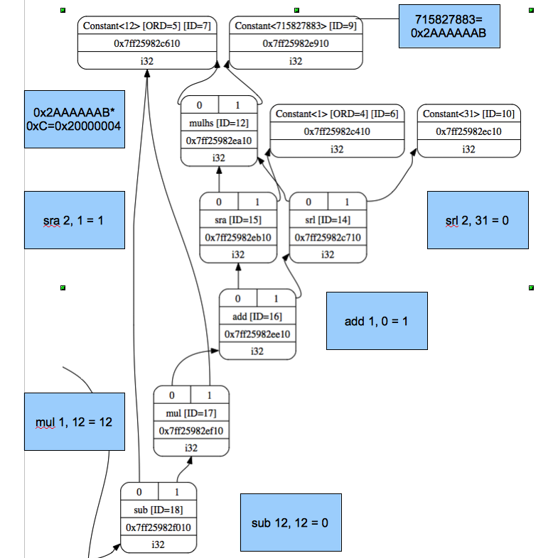
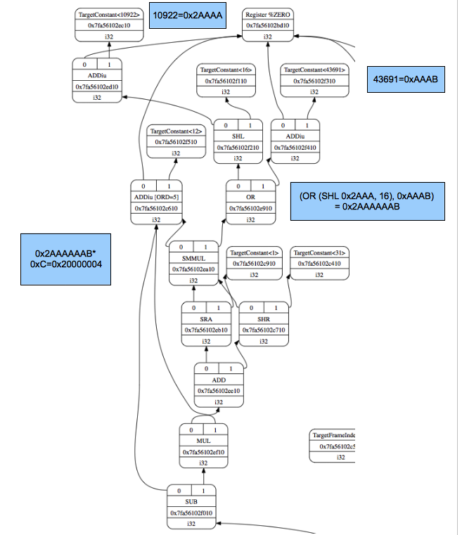

Global variable, struct and array
==================================

In the previous two chapters, we only access the local variables. 
This chapter begin from global variable access translation for cpu0 
instruction. 
After that, introducing struct and array type of variable access 
and their corresponding llvm IR statement, and introducing cpu0 how to 
translate these llvm IR statements in `section Array and struct support`_. 
The logic operation “not” support and translation in 
`section Operator “not” !`_. The `section Display llvm IR nodes with Graphviz`_ 
will show you the DAG optimization steps and their corresponding llc display 
options. 
These result of DAG optimization steps can be viewed by Graphviz graphic tool 
which display very useful information by graphic view. 
You will appreciate Graphviz support in debug, we think. 
In `section Adjust cpu0 instruction and support type of local variable pointer`_, 
we adjust cpu0 instructions to support data type for C language.
Finally, `section Operator mod, %`_ to take care the C operator %.

Global variable
----------------

5/1/Cpu0 support the global variable, let's compile ch5_1.cpp with this version 
first, and explain the code changes after that.

.. code-block:: c++

    // ch5_1.cpp
    int gI = 100; 
    int main() 
    { 
      int c = 0; 
    
      c = gI; 
    
      return c; 
    } 

.. code-block:: bash

    [Gamma@localhost InputFiles]$ llvm-dis ch5_1.bc -o ch5_1.ll 
    [Gamma@localhost InputFiles]$ cat ch5_1.ll 
    ; ModuleID = 'ch5_1.bc' 
    target datalayout = "e-p:64:64:64-i1:8:8-i8:8:8-i16:16:16-i32:32:32-i64:64:
    64-f32:32:32-f64:64:64-v64:64:64-v128:128:128-a0:0:64-s0:64:64-f80:128:128-
    n8:16:32:64-S128" 
    target triple = "x86_64-unknown-linux-gnu" 
    
    @gI = global i32 100, align 4 
    
    define i32 @main() nounwind uwtable { 
      %1 = alloca i32, align 4 
      %c = alloca i32, align 4 
      store i32 0, i32* %1 
      store i32 0, i32* %c, align 4 
      %2 = load i32* @gI, align 4 
      store i32 %2, i32* %c, align 4 
      %3 = load i32* %c, align 4 
      ret i32 %3 
    } 
    
    [Gamma@localhost InputFiles]$ /usr/local/llvm/3.1.test/cpu0/1/
    cmake_debug_build/bin/llc -march=cpu0 -relocation-model=pic -filetype=asm 
    ch5_1.bc -o ch5_1.cpu0.s 
    [Gamma@localhost InputFiles]$ cat ch5_1.cpu0.s 
        .section .mdebug.abi32
        .previous
        .file   "ch5_1.bc"
        .text
        .globl  main
        .align  2
        .type   main,@function
        .ent    main                    # @main
    main:
        .frame  $sp,8,$lr
        .mask   0x00000000,0
        .set    noreorder
        .cpload $t9
        .set    nomacro
    # BB#0:                                 # %entry
        addiu   $sp, $sp, -8
        addiu   $2, $zero, 0
        st  $2, 4($sp)
        st  $2, 0($sp)
        ld  $2, %got(gI)($gp)
        ld  $2, 0($2)
        st  $2, 0($sp)
        addiu   $sp, $sp, 8
        ret $lr
        .set    macro
        .set    reorder
        .end    main
    $tmp1:
        .size   main, ($tmp1)-main
    
        .type   gI,@object              # @gI
        .data
        .globl  gI
        .align  2
    gI:
        .4byte  100                     # 0x64
        .size   gI, 4

As above code, it translate “load i32* @gI, align 4” into “ld  $2, %got(gI)($gp)
” for  llc -march=cpu0 -relocation-model=pic, position-independent mode. 
It translate the global integer variable gI address into offset of register gp 
and load from $gp+(the offset) into register $2. 
We can translate it with absolute address mode by following command,

.. code-block:: bash

    [Gamma@localhost InputFiles]$ /usr/local/llvm/3.1.test/cpu0/1/
    cmake_debug_build/bin/llc -march=cpu0 -relocation-model=static -filetype=
    asm ch5_1.bc -o ch5_1.cpu0.static.s 
    [Gamma@localhost InputFiles]$ cat ch5_1.cpu0.static.s 
        ...
        ldi $2, %hi(gI) 
        shl $2, $2, 16 
        ldi $3, %lo(gI) 
        add $2, $2, $3 
        ld  $2, 0($2) 

Above code, it load the high address part of gI absolute address (16 bits) to 
register $2 and shift 16 bits. 
Now, the register $2 got it's high part of gI absolute address. 
Next, it load the low part of gI absolute address into register 3. 
Finally, add register $2 and $3 into $2, and load the content of address 
$2+offset 0 into register $2. 
The “llc -relocation-model=static “ is for static link mode which binding the 
address in static, compile/link time, not dynamic/run time. 
In this mode, you can also translate code with following command,

.. code-block:: bash

    [Gamma@localhost InputFiles]$ /usr/local/llvm/3.1.test/cpu0/1/cmake_debug_build/
    bin/llc -march=cpu0 -relocation-model=static -cpu0-islinux-format=false 
    -filetype=asm ch5_1.bc -o ch5_1.cpu0.islinux-format-false.s 
    [Gamma@localhost InputFiles]$ cat ch5_1.cpu0.islinux-format-false.s 
    ...
    st  $2, 0($sp) 
    ldi $2, %gp_rel(gI)
    add $2, $gp, $2
    ld  $2, 0($2) 
    ...
    .section    .sdata,"aw",@progbits 
    .globl  gI 

As above, it translate code with “llc -relocation-model=static 
-cpu0-islinux-format=false”. 
The -cpu0-islinux-format default is true which will allocate global variables 
in data section. 
With false, it will allocate global variables in sdata section. 
Section data and sdata are areas for global variable with initial value, 
int gI = 100 in this example. 
Section bss and sbss are areas for global variables without initial value 
(for example, int gI;). 
Allocate variables in sdata or sbss sections is addressable by 16 bits + $gp. 
The static mode with -cpu0-islinux-format=false is still static mode 
(variable is binding in compile/link time) even it's use $gp relative address. 
The $gp content is assigned in compile/link time, change only in program be 
loaded, and is fixed during running the program; while the -relocation-model=pic 
the $gp can be changed during program running. 
For example, if $gp is assigned to start of .sdata like this example, then 
%gp_rel(gI) = (the relative address distance between gI and $gp) (is 0 in this 
case). 
When sdata is loaded into address x, then the gI variable can be got from 
address x+0 where x is the address stored in $gp, 0 is $gp_rel(gI).

To support global variable, first add IsLinuxOpt command variable to 
Cpu0Subtarget.cpp. 
After that, user can run llc with argument “llc -cpu0-islinux-format=false” to 
specify IsLinuxOpt to false. 
The IsLinuxOpt is default to true if without specify it. 
About the cl command, you can refer to http://llvm.org/docs/CommandLine.html 
further.

.. code-block:: c++

    //  Cpu0Subtarget.cpp
    static cl::opt<bool>
    IsLinuxOpt("cpu0-islinux-format", cl::Hidden, cl::init(true),
                     cl::desc("Always use linux format."));
    
        Next add the following code to Cpu0ISelLowering.cpp.
    //  Cpu0ISelLowering.cpp
    Cpu0TargetLowering::
    Cpu0TargetLowering(Cpu0TargetMachine &TM)
      : TargetLowering(TM, new Cpu0TargetObjectFile()),
        Subtarget(&TM.getSubtarget<Cpu0Subtarget>()) {
       ...
      // Cpu0 Custom Operations
      setOperationAction(ISD::GlobalAddress,      MVT::i32,   Custom);
       ...
    }
    SDValue Cpu0TargetLowering::
    LowerOperation(SDValue Op, SelectionDAG &DAG) const
    {
      switch (Op.getOpcode())
      {
        case ISD::GlobalAddress:      return LowerGlobalAddress(Op, DAG);
      }
      return SDValue();
    }
    
    //===----------------------------------------------------------------------===//
    //  Lower helper functions
    //===----------------------------------------------------------------------===//
    
    //===----------------------------------------------------------------------===//
    //  Misc Lower Operation implementation
    //===----------------------------------------------------------------------===//
    
    SDValue Cpu0TargetLowering::LowerGlobalAddress(SDValue Op,
                                                   SelectionDAG &DAG) const {
      // FIXME there isn't actually debug info here
      DebugLoc dl = Op.getDebugLoc();
      const GlobalValue *GV = cast<GlobalAddressSDNode>(Op)->getGlobal();
    
      if (getTargetMachine().getRelocationModel() != Reloc::PIC_) {
        SDVTList VTs = DAG.getVTList(MVT::i32);
    
        Cpu0TargetObjectFile &TLOF = (Cpu0TargetObjectFile&)getObjFileLowering();
    
        // %gp_rel relocation
        if (TLOF.IsGlobalInSmallSection(GV, getTargetMachine())) {
          SDValue GA = DAG.getTargetGlobalAddress(GV, dl, MVT::i32, 0,
                                                  Cpu0II::MO_GPREL);
          SDValue GPRelNode = DAG.getNode(Cpu0ISD::GPRel, dl, VTs, &GA, 1);
          SDValue GOT = DAG.getGLOBAL_OFFSET_TABLE(MVT::i32);
          return DAG.getNode(ISD::ADD, dl, MVT::i32, GOT, GPRelNode);
        }
        // %hi/%lo relocation
        SDValue GAHi = DAG.getTargetGlobalAddress(GV, dl, MVT::i32, 0,
                                                  Cpu0II::MO_ABS_HI);
        SDValue GALo = DAG.getTargetGlobalAddress(GV, dl, MVT::i32, 0,
                                                  Cpu0II::MO_ABS_LO);
        SDValue HiPart = DAG.getNode(Cpu0ISD::Hi, dl, VTs, &GAHi, 1);
        SDValue Lo = DAG.getNode(Cpu0ISD::Lo, dl, MVT::i32, GALo);
        return DAG.getNode(ISD::ADD, dl, MVT::i32, HiPart, Lo);
      }
    
      EVT ValTy = Op.getValueType();
      bool HasGotOfst = (GV->hasInternalLinkage() ||
                         (GV->hasLocalLinkage() && !isa<Function>(GV)));
      unsigned GotFlag = (HasGotOfst ? Cpu0II::MO_GOT : Cpu0II::MO_GOT16);
      SDValue GA = DAG.getTargetGlobalAddress(GV, dl, ValTy, 0, GotFlag);
      GA = DAG.getNode(Cpu0ISD::Wrapper, dl, ValTy, GetGlobalReg(DAG, ValTy), GA);
      SDValue ResNode = DAG.getLoad(ValTy, dl, DAG.getEntryNode(), GA,
                                    MachinePointerInfo(), false, false, false, 0);
      // On functions and global targets not internal linked only
      // a load from got/GP is necessary for PIC to work.
      if (!HasGotOfst)
        return ResNode;
      SDValue GALo = DAG.getTargetGlobalAddress(GV, dl, ValTy, 0,
                                                            Cpu0II::MO_ABS_LO);
      SDValue Lo = DAG.getNode(Cpu0ISD::Lo, dl, ValTy, GALo);
      return DAG.getNode(ISD::ADD, dl, ValTy, ResNode, Lo);
    }

The setOperationAction(ISD::GlobalAddress, MVT::i32, Custom) tell llc that we 
implement global address operation in C++ function 
Cpu0TargetLowering::LowerOperation() and llvm will call this function only when 
llvm want to translate IR DAG of loading global variable into machine code. 
Since may have many Custom type of setOperationAction(ISD::XXX, MVT::XXX, 
Custom) in construction function Cpu0TargetLowering(), and llvm will call 
Cpu0TargetLowering::LowerOperation() for each ISD IR DAG node of Custom type 
translation. The global address access can be identified by check the DAG node of 
opcode is ISD::GlobalAddress. 
For static mode, LowerGlobalAddress() will check the translation is for 
IsGlobalInSmallSection() or not. 
When IsLinuxOpt is true and static mode, IsGlobalInSmallSection() always 
return false. 
LowerGlobalAddress() will translate global variable by create 2 DAG IR nodes 
ABS_HI and ABS_LO for high part and low part of address and one extra node ADD. 
List it again as follows.

.. code-block:: c++

    //  Cpu0ISelLowering.cpp
    ...
        // %hi/%lo relocation
        SDValue GAHi = DAG.getTargetGlobalAddress(GV, dl, MVT::i32, 0,
                                                  Cpu0II::MO_ABS_HI);
        SDValue GALo = DAG.getTargetGlobalAddress(GV, dl, MVT::i32, 0,
                                                  Cpu0II::MO_ABS_LO);
        SDValue HiPart = DAG.getNode(Cpu0ISD::Hi, dl, VTs, &GAHi, 1);
        SDValue Lo = DAG.getNode(Cpu0ISD::Lo, dl, MVT::i32, GALo);
        return DAG.getNode(ISD::ADD, dl, MVT::i32, HiPart, Lo);
    
The DAG list form for these three DAG nodes as above code created can be 
represented as (ADD (Hi(h1, h2), Lo (l1, l2)). 
Since some DAG nodes are not with two arguments, we will define the list as 
(ADD (Hi (...), Lo (...)) or (ADD (Hi, Lo)) sometimes in this book. 
The corresponding machine instructions of these three IR nodes are defined in 
Cpu0InstrInfo.td as follows,

.. code-block:: c++

    //  Cpu0InstrInfo.td
    // Hi and Lo nodes are used to handle global addresses. Used on
    // Cpu0ISelLowering to lower stuff like GlobalAddress, ExternalSymbol
    // static model. (nothing to do with Cpu0 Registers Hi and Lo)
    def Cpu0Hi    : SDNode<"Cpu0ISD::Hi", SDTIntUnaryOp>;
    def Cpu0Lo    : SDNode<"Cpu0ISD::Lo", SDTIntUnaryOp>;
    ...
    // hi/lo relocs
    def : Pat<(Cpu0Hi tglobaladdr:$in), (SHL (LDI ZERO, tglobaladdr:$in), 16)>;
    def : Pat<(Cpu0Lo tglobaladdr:$in), (LDI ZERO, tglobaladdr:$in)>;
    
    def : Pat<(add CPURegs:$hi, (Cpu0Lo tglobaladdr:$lo)),
              (ADD CPURegs:$hi, (LDI ZERO, tglobaladdr:$lo))>;

Above code meaning translate ABS_HI into LDI and SHL two instructions. 
Remember the DAG and Instruction Selection introduced in chapter "Back end 
structure", DAG list 
(SHL (LDI ...), 16) meaning DAG node LDI and it's parent DAG node SHL two 
instructions nodes is for list IR DAG ABS_HI. 
The Pat<> has two list DAG representation. 
The left is IR DAG and the right is machine instruction DAG. 
So after Instruction Selection and Register Allocation, it translate ABS_HI to,

.. code-block:: c++

        ldi $2, %hi(gI) 
        shl $2, $2, 16 

According above code, we know llvm allocate register $2 for the output operand 
of LDI instruction and $2 for SHL instruction in this example. 
Since (SHL (LDI), 16), the LDI output result will be the SHL first register. 
The result is “shl $2, 16”. 
Above Pat<> also define DAG list (add $hi, (ABS_LO)) will translate into 
(ADD $hi, (LDI ZERO, ...)) where ADD is machine instruction add and LDI is 
machine instruction ldi which defined in Cpu0InstrInfo.td too. 
Remember (add $hi, (ABS_LO)) meaning add DAG has two operands, first is $hi and 
second is the register which the ABS_LO output result register save to. 
So, the IR DAG pattern and it's corresponding machine instruction node as 
follows,

.. code-block:: c++

    ldi    $3, %lo(gI)  // def : Pat<(Cpu0Lo tglobaladdr:$in), (LDI ZERO, 
                        // tglobaladdr:$in)>;
    
    // def : Pat<(add CPURegs:$hi, (Cpu0Lo tglobaladdr:$lo)), (ADD CPURegs:$hi, 
    //  (LDI ZERO, tglobaladdr:$lo))>;
    // So, the second register for add is the output register of ABS_LO IR DAG 
    //  translation result saved to;
    // Since LowerGlobalAddress() create list (ADD (Hi, Lo)) with 3 DAG nodes, 
    //  the Hi output register $2 will be the first input register for add.
    add $2, $2, $3   
    
After translated as above, the register $2 is the global variable address, so 
get the global variable by IR DAG load will translate into machine instruction 
as follows,

.. code-block:: c++

    %2 = load i32* @gI, align 4 
    =>  ld  $2, 0($2) 

When IsLinuxOpt is false and static mode, LowerGlobalAddress() will run the 
following code to create a DAG list (ADD GOT, GPRel).

.. code-block:: c++

    // %gp_rel relocation
    if (TLOF.IsGlobalInSmallSection(GV, getTargetMachine())) {
      SDValue GA = DAG.getTargetGlobalAddress(GV, dl, MVT::i32, 0,
                                              Cpu0II::MO_GPREL);
      SDValue GPRelNode = DAG.getNode(Cpu0ISD::GPRel, dl, VTs, &GA, 1);
      SDValue GOT = DAG.getGLOBAL_OFFSET_TABLE(MVT::i32);
      return DAG.getNode(ISD::ADD, dl, MVT::i32, GOT, GPRelNode);
    }

As mentioned just before, all global variables allocated in sdata or sbss 
sections which is addressable by 16 bits + $gp in compile/link time (address 
binding in compile time). 
It's equal to offset+GOT where GOT is the base address for global variable and 
offset is 16 bits. 
Now, according the following Cpu0InstrInfo.td definition,

.. code-block:: c++

    //  Cpu0InstrInfo.td
    def Cpu0GPRel : SDNode<"Cpu0ISD::GPRel", SDTIntUnaryOp>;
    ...
    // gp_rel relocs
    def : Pat<(add CPURegs:$gp, (Cpu0GPRel tglobaladdr:$in)),
              (ADD CPURegs:$gp, (LDI ZERO, tglobaladdr:$in))>;

It translate global variable address of list (ADD GOT, GPRel) into machine 
instructions as follows,

.. code-block:: c++

    ldi $2, %gp_rel(gI) 
    add $2, $gp, $2 

Last, when PIC mode, LowerGlobalAddress() will create the DAG list (load 
DAG.getEntryNode(), (Wrapper GetGlobalReg(), GA)) by the following code and 
the code in Cpu0ISeleDAGToDAG.cpp as follows,

.. code-block:: c++

      bool HasGotOfst = (GV->hasInternalLinkage() || 
                         (GV->hasLocalLinkage() && !isa<Function>(GV))); 
      unsigned GotFlag = (HasGotOfst ? Cpu0II::MO_GOT : Cpu0II::MO_GOT16); 
      SDValue GA = DAG.getTargetGlobalAddress(GV, dl, ValTy, 0, GotFlag); 
      GA = DAG.getNode(Cpu0ISD::Wrapper, dl, ValTy, GetGlobalReg(DAG, ValTy), GA); 
      SDValue ResNode = DAG.getLoad(ValTy, dl, DAG.getEntryNode(), GA, 
                                    MachinePointerInfo(), false, false, false, 0); 
      // On functions and global targets not internal linked only 
      // a load from got/GP is necessary for PIC to work. 
      if (!HasGotOfst) 
        return ResNode;
    
    // Cpu0ISelDAGToDAG.cpp
    /// ComplexPattern used on Cpu0InstrInfo
    /// Used on Cpu0 Load/Store instructions
    bool Cpu0DAGToDAGISel::
    SelectAddr(SDNode *Parent, SDValue Addr, SDValue &Base, SDValue &Offset) {
      ...
      // on PIC code Load GA
      if (Addr.getOpcode() == Cpu0ISD::Wrapper) {
        Base   = Addr.getOperand(0);
        Offset = Addr.getOperand(1);
        return true;
      }
      ...
    }

Then it translate into the following code,

.. code-block:: c++

    ld  $2, %got(gI)($gp) 

Where DAG.getEntryNode() is the register $2 which decide by Register Allocator, 
and (Wrapper GetGlobalReg(), GA) translate into Base=$gp and the 16 bits Offset 
for $gp.

Beside above code, add the following code to Cpu0AsmPrinter.cpp and it will 
emit .cpload asm sudo instruction,

.. code-block:: c++

    // Cpu0AsmPrinter.cpp
    /// EmitFunctionBodyStart - Targets can override this to emit stuff before
    /// the first basic block in the function.
    void Cpu0AsmPrinter::EmitFunctionBodyStart() {
    ...
        // Emit .cpload directive if needed.
        if (EmitCPLoad)
        //- .cpload $t9
          OutStreamer.EmitRawText(StringRef("\t.cpload\t$t9"));
    ...
    }
    
    // ch5_1.cpu0.s
        .cpload $t9 
        .set    nomacro 
    # BB#0: 
        ldi $sp, -8

According Mips Application Binary Interface (ABI), $t9 ($25) is the register 
used in jalr $25 for long distance function pointer (far subroutine call). 
The jal %subroutine has 24 bits range of address offset relative to Program 
Counter (PC) while jalr has 32 bits address range in register size is 32 bits. 
One example of PIC mode is used in share library. 
Share library is re-entry code which can be loaded in different memory address 
decided on run time. 
The static mode (absolute address mode) is usually designed to load in specific 
memory address decided on compile time. Since share library can be loaded in 
different memory address, the global variable address cannot be decided in 
compile time. 
As above, the global variable address is translated into the relative address 
of $gp. 
In example code ch5_1.ll, .cpload is a asm pseudo instruction just before the 
first instruction of main(), ldi. 
When the share library main() function be loaded, the loader will assign the 
$t9 value to $gp when meet “.cpload $t9”. 
After that, the $gp value is $9 which point to main(), and the global variable 
address is the relative address to main().

Above code is for global address DAG translation. 
Next, add the following code to Cpu0MCInstLower.cpp and Cpu0InstPrinter.cpp 
for global variable printing operand function.

.. code-block:: c++

    // Cpu0MCInstLower.cpp
    MCOperand Cpu0MCInstLower::LowerSymbolOperand(const MachineOperand &MO,
                                                  MachineOperandType MOTy,
                                                  unsigned Offset) const {
      MCSymbolRefExpr::VariantKind Kind;
      const MCSymbol *Symbol;
    
      switch(MO.getTargetFlags()) {
      default:                   llvm_unreachable("Invalid target flag!"); 
    // Cpu0_GPREL is for llc -march=cpu0 -relocation-model=static 
    //  -cpu0-islinux-format=false (global var in .sdata) 
      case Cpu0II::MO_GPREL:     Kind = MCSymbolRefExpr::VK_Cpu0_GPREL; break; 
    
      case Cpu0II::MO_GOT16:     Kind = MCSymbolRefExpr::VK_Cpu0_GOT16; break; 
      case Cpu0II::MO_GOT:       Kind = MCSymbolRefExpr::VK_Cpu0_GOT; break; 
    // ABS_HI and ABS_LO is for llc -march=cpu0 -relocation-model=static 
    //  (global var in .data) 
      case Cpu0II::MO_ABS_HI:    Kind = MCSymbolRefExpr::VK_Cpu0_ABS_HI; break; 
      case Cpu0II::MO_ABS_LO:    Kind = MCSymbolRefExpr::VK_Cpu0_ABS_LO; break;
      }
    
      switch (MOTy) {
      case MachineOperand::MO_GlobalAddress:
        Symbol = Mang->getSymbol(MO.getGlobal());
        break;
    
      default:
        llvm_unreachable("<unknown operand type>");
      }
      ...
    }
    
    MCOperand Cpu0MCInstLower::LowerOperand(const MachineOperand& MO,
                                            unsigned offset) const {
      MachineOperandType MOTy = MO.getType();
    
      switch (MOTy) {
      ...
      case MachineOperand::MO_GlobalAddress:
        return LowerSymbolOperand(MO, MOTy, offset);
      ...
     }
    
    // Cpu0InstPrinter.cpp
    ...
    static void printExpr(const MCExpr *Expr, raw_ostream &OS) {
      ...
      switch (Kind) {
      default:                                 llvm_unreachable("Invalid kind!");
      case MCSymbolRefExpr::VK_None:           break;
    // Cpu0_GPREL is for llc -march=cpu0 -relocation-model=static
      case MCSymbolRefExpr::VK_Cpu0_GPREL:     OS << "%gp_rel("; break;
      case MCSymbolRefExpr::VK_Cpu0_GOT16:     OS << "%got(";    break;
      case MCSymbolRefExpr::VK_Cpu0_GOT:       OS << "%got(";    break;
      case MCSymbolRefExpr::VK_Cpu0_ABS_HI:    OS << "%hi(";     break;
      case MCSymbolRefExpr::VK_Cpu0_ABS_LO:    OS << "%lo(";     break;
      }
      ...
    }

OS is the output stream which output to the assembly file.

Summary the global variable translation as below.

The global variable Instruction Selection for DAG translation is not like the 
ordinary IR node translation, it has static (absolute address) and PIC mode. 
Backend deal this translation by create DAG nodes in function 
LowerGlobalAddress() which called by LowerOperation(). 
Function LowerOperation() take care all Custom type of operation. 
Backend set global address as Custom operation by 
”setOperationAction(ISD::GlobalAddress, MVT::i32, Custom);” in 
Cpu0TargetLowering() constructor. 
Different address mode has it's corresponding DAG list be created. 
By set the pattern Pat<> in Cpu0InstrInfo.td, the llvm can apply the compiler 
mechanism, pattern match, in the Instruction Selection stage.

There are three type for setXXXAction(), they are Promote, Expand and Custom. 
Except Custom, the other two usually no need to coding. 
The section "Instruction Selector" of 
http://llvm.org/docs/WritingAnLLVMBackend.html is the references.

Array and struct support
-------------------------

Shifting our work to iMac at this point. 
The Linux platform is fine. 
The reason we do the shift is for new platform using experience.

LLVM use getelementptr to represent the array and struct type in C. 
Please reference section getelementptr of http://llvm.org/docs/LangRef.html. 
For ch5_2.cpp, the llvm IR as follows,

.. code-block:: c++

    // ch5_2.cpp
    struct Date
    {
        int year;
        int month;
        int day;
    };
    
    Date date = {2012, 10, 12};
    int a[3] = {2012, 10, 12};
    
    int main()
    {
        int day = date.day;
        int i = a[1];
    
        return 0;
    }

.. code-block:: bash

    // ch5_2.ll
    ; ModuleID = 'ch5_2.bc'
    target datalayout = "e-p:32:32:32-i1:8:8-i8:8:8-i16:16:16-i32:32:32-i64:32:64-
    f32:32:32-f64:32:64-v64:64:64-v128:128:128-a0:0:64-f80:128:128-n8:16:32-S128"
    target triple = "i386-apple-macosx10.8.0"
    
    %struct.Date = type { i32, i32, i32 }
    
    @date = global %struct.Date { i32 2012, i32 10, i32 12 }, align 4
    @a = global [3 x i32] [i32 2012, i32 10, i32 12], align 4
    
    define i32 @main() nounwind ssp {
    entry:
      %retval = alloca i32, align 4
      %day = alloca i32, align 4
      %i = alloca i32, align 4
      store i32 0, i32* %retval
      %0 = load i32* getelementptr inbounds (%struct.Date* @date, i32 0, i32 2), 
      align 4
      store i32 %0, i32* %day, align 4
      %1 = load i32* getelementptr inbounds ([3 x i32]* @a, i32 0, i32 1), align 4
      store i32 %1, i32* %i, align 4
      ret i32 0
    }
    
Run 5/1/Cpu0 with ch5_2.bc on static mode will get the incorrect asm file as 
follows,

.. code-block:: bash

    jonathantekiimac:InputFiles Jonathan$ /Users/Jonathan/llvm/3.1.test/cpu0/1/
    cmake_debug_build/bin/Debug/llc -march=cpu0 -relocation-model=static -filetype=
    asm ch5_2.bc -o ch5_2.cpu0.static.s
    jonathantekiimac:InputFiles Jonathan$ cat ch5_2.cpu0.static.s 
        .section .mdebug.abi32
        .previous
        .file   "ch5_2.bc"
        .text
        .globl  main
        .align  2
        .type   main,@function
        .ent    main                    # @main
    main:
        .frame  $sp,16,$lr
        .mask   0x00000000,0
        .set    noreorder
        .set    nomacro
    # BB#0:                                 # %entry
        addiu   $sp, $sp, -16
        addiu   $2, $zero, 0
        st  $2, 12($sp)
        ldi $2, %hi(date)
        shl $2, $2, 16
        ldi $3, %lo(date)
        add $2, $2, $3
        ld  $2, 0($2)       // the correct one is   ld  $2, 8($2)
        st  $2, 8($sp)
        ldi $2, %hi(a)
        shl $2, $2, 16
        ldi $3, %lo(a)
        add $2, $2, $3
        ld  $2, 0($2)
        st  $2, 4($sp)
        addiu   $sp, $sp, 16
        ret $lr
        .set    macro
        .set    reorder
        .end    main
    $tmp1:
        .size   main, ($tmp1)-main
    
        .type   date,@object            # @date
        .data
        .globl  date
        .align  2
    date:
        .4byte  2012                    # 0x7dc
        .4byte  10                      # 0xa
        .4byte  12                      # 0xc
        .size   date, 12
    
        .type   a,@object               # @a
        .globl  a
        .align  2
    a:
        .4byte  2012                    # 0x7dc
        .4byte  10                      # 0xa
        .4byte  12                      # 0xc
        .size   a, 12

For “day = date.day”, the correct one is “ld $2, 8($2)”, not “ld $2, 0($2)”, 
since date.day is offset 8(date). 
Type int is 4 bytes in cpu0, and the date.day has fields year and month before 
it. 
Let use debug option in llc to see what's wrong,

.. code-block:: bash

    jonathantekiimac:InputFiles Jonathan$ /Users/Jonathan/llvm/3.1.test/cpu0/1/
    cmake_debug_build/bin/Debug/llc -march=cpu0 -debug -relocation-model=static 
    -filetype=asm ch5_2.bc -o ch5_2.cpu0.static.s
    ...
    === main
    Initial selection DAG: BB#0 'main:entry'
    SelectionDAG has 20 nodes:
      0x7f7f5b02d210: i32 = undef [ORD=1]
    
          0x7f7f5ac10590: ch = EntryToken [ORD=1]
    
          0x7f7f5b02d010: i32 = Constant<0> [ORD=1]
    
          0x7f7f5b02d110: i32 = FrameIndex<0> [ORD=1]
    
          0x7f7f5b02d210: <multiple use>
        0x7f7f5b02d310: ch = store 0x7f7f5ac10590, 0x7f7f5b02d010, 0x7f7f5b02d110, 
        0x7f7f5b02d210<ST4[%retval]> [ORD=1]
    
          0x7f7f5b02d410: i32 = GlobalAddress<%struct.Date* @date> 0 [ORD=2]
    
          0x7f7f5b02d510: i32 = Constant<8> [ORD=2]
    
        0x7f7f5b02d610: i32 = add 0x7f7f5b02d410, 0x7f7f5b02d510 [ORD=2]
    
        0x7f7f5b02d210: <multiple use>
      0x7f7f5b02d710: i32,ch = load 0x7f7f5b02d310, 0x7f7f5b02d610, 0x7f7f5b02d210
      <LD4[getelementptr inbounds (%struct.Date* @date, i32 0, i32 2)]> [ORD=3]
    
      0x7f7f5b02db10: i64 = Constant<4>
    
          0x7f7f5b02d710: <multiple use>
          0x7f7f5b02d710: <multiple use>
          0x7f7f5b02d810: i32 = FrameIndex<1> [ORD=4]
    
          0x7f7f5b02d210: <multiple use>
        0x7f7f5b02d910: ch = store 0x7f7f5b02d710:1, 0x7f7f5b02d710, 0x7f7f5b02d810,
         0x7f7f5b02d210<ST4[%day]> [ORD=4]
    
          0x7f7f5b02da10: i32 = GlobalAddress<[3 x i32]* @a> 0 [ORD=5]
    
          0x7f7f5b02dc10: i32 = Constant<4> [ORD=5]
    
        0x7f7f5b02dd10: i32 = add 0x7f7f5b02da10, 0x7f7f5b02dc10 [ORD=5]
    
        0x7f7f5b02d210: <multiple use>
      0x7f7f5b02de10: i32,ch = load 0x7f7f5b02d910, 0x7f7f5b02dd10, 0x7f7f5b02d210
      <LD4[getelementptr inbounds ([3 x i32]* @a, i32 0, i32 1)]> [ORD=6]
    
    ...
    
    
    Replacing.3 0x7f7f5b02dd10: i32 = add 0x7f7f5b02da10, 0x7f7f5b02dc10 [ORD=5]
    
    With: 0x7f7f5b030010: i32 = GlobalAddress<[3 x i32]* @a> + 4
    
    
    Replacing.3 0x7f7f5b02d610: i32 = add 0x7f7f5b02d410, 0x7f7f5b02d510 [ORD=2]
    
    With: 0x7f7f5b02db10: i32 = GlobalAddress<%struct.Date* @date> + 8
    
    Optimized lowered selection DAG: BB#0 'main:entry'
    SelectionDAG has 15 nodes:
      0x7f7f5b02d210: i32 = undef [ORD=1]
    
          0x7f7f5ac10590: ch = EntryToken [ORD=1]
    
          0x7f7f5b02d010: i32 = Constant<0> [ORD=1]
    
          0x7f7f5b02d110: i32 = FrameIndex<0> [ORD=1]
    
          0x7f7f5b02d210: <multiple use>
        0x7f7f5b02d310: ch = store 0x7f7f5ac10590, 0x7f7f5b02d010, 0x7f7f5b02d110, 
        0x7f7f5b02d210<ST4[%retval]> [ORD=1]
    
        0x7f7f5b02db10: i32 = GlobalAddress<%struct.Date* @date> + 8
    
        0x7f7f5b02d210: <multiple use>
      0x7f7f5b02d710: i32,ch = load 0x7f7f5b02d310, 0x7f7f5b02db10, 0x7f7f5b02d210
      <LD4[getelementptr inbounds (%struct.Date* @date, i32 0, i32 2)]> [ORD=3]
    
          0x7f7f5b02d710: <multiple use>
          0x7f7f5b02d710: <multiple use>
          0x7f7f5b02d810: i32 = FrameIndex<1> [ORD=4]
    
          0x7f7f5b02d210: <multiple use>
        0x7f7f5b02d910: ch = store 0x7f7f5b02d710:1, 0x7f7f5b02d710, 0x7f7f5b02d810,
         0x7f7f5b02d210<ST4[%day]> [ORD=4]
    
        0x7f7f5b030010: i32 = GlobalAddress<[3 x i32]* @a> + 4
    
        0x7f7f5b02d210: <multiple use>
      0x7f7f5b02de10: i32,ch = load 0x7f7f5b02d910, 0x7f7f5b030010, 0x7f7f5b02d210
      <LD4[getelementptr inbounds ([3 x i32]* @a, i32 0, i32 1)]> [ORD=6]
    
    …

By llc -debug, you can see the DAG translation process. As above, the DAG list 
for date.day (add GlobalAddress<[3 x i32]* @a> 0, Constant<8>) with 3 nodes is 
replaced by 1 node GlobalAddress<%struct.Date* @date> + 8. 
The DAG list for a[1] is same. 
The replacement occurs since TargetLowering.cpp::isOffsetFoldingLegal(...) 
return true in “llc -static” static addressing mode as below. 
In Cpu0 the ld instruction format is “ld $r1, offset($r2)” which meaning load 
$r2 address+offset to $r1. 
So, we just replace the isOffsetFoldingLegal(...) function by override 
mechanism as below.

.. code-block:: c++

    // TargetLowering.cpp
    bool
    TargetLowering::isOffsetFoldingLegal(const GlobalAddressSDNode *GA) const {
      // Assume that everything is safe in static mode.
      if (getTargetMachine().getRelocationModel() == Reloc::Static)
        return true;
    
      // In dynamic-no-pic mode, assume that known defined values are safe.
      if (getTargetMachine().getRelocationModel() == Reloc::DynamicNoPIC &&
         GA &&
         !GA->getGlobal()->isDeclaration() &&
         !GA->getGlobal()->isWeakForLinker())
      return true;
    
      // Otherwise assume nothing is safe.
      return false;
    }
    
    // Cpu0TargetLowering.cpp
    bool
    Cpu0TargetLowering::isOffsetFoldingLegal(const GlobalAddressSDNode *GA) const {
      // The Cpu0 target isn't yet aware of offsets.
      return false;
    }

Beyond that, we need to add the following code fragment to Cpu0ISelDAGToDAG.cpp,

.. code-block:: c++

    //  Cpu0ISelDAGToDAG.cpp
    /// ComplexPattern used on Cpu0InstrInfo
    /// Used on Cpu0 Load/Store instructions
    bool Cpu0DAGToDAGISel::
    SelectAddr(SDNode *Parent, SDValue Addr, SDValue &Base, SDValue &Offset) {
    ...
      // Addresses of the form FI+const or FI|const
      if (CurDAG->isBaseWithConstantOffset(Addr)) {
        ConstantSDNode *CN = dyn_cast<ConstantSDNode>(Addr.getOperand(1));
        if (isInt<16>(CN->getSExtValue())) {
    
          // If the first operand is a FI, get the TargetFI Node
          if (FrameIndexSDNode *FIN = dyn_cast<FrameIndexSDNode>
                                              (Addr.getOperand(0)))
            Base = CurDAG->getTargetFrameIndex(FIN->getIndex(), ValTy);
          else
            Base = Addr.getOperand(0);
    
          Offset = CurDAG->getTargetConstant(CN->getZExtValue(), ValTy);
          return true;
        }
      }
    }

Recall we have translated DAG list for date.day 
(add GlobalAddress<[3 x i32]* @a> 0, Constant<8>) into 
(add (add Cpu0ISD::Hi (Cpu0II::MO_ABS_HI), Cpu0ISD::Lo(Cpu0II::MO_ABS_LO)), 
Constant<8>) by the following code in Cpu0ISelLowering.cpp.

.. code-block:: c++

    // Cpu0ISelLowering.cpp
    SDValue Cpu0TargetLowering::LowerGlobalAddress(SDValue Op,
                                        SelectionDAG &DAG) const {
      ...
        // %hi/%lo relocation
        SDValue GAHi = DAG.getTargetGlobalAddress(GV, dl, MVT::i32, 0,
                                                  Cpu0II::MO_ABS_HI);
        SDValue GALo = DAG.getTargetGlobalAddress(GV, dl, MVT::i32, 0,
                                                  Cpu0II::MO_ABS_LO);
        SDValue HiPart = DAG.getNode(Cpu0ISD::Hi, dl, VTs, &GAHi, 1);
        SDValue Lo = DAG.getNode(Cpu0ISD::Lo, dl, MVT::i32, GALo);
        return DAG.getNode(ISD::ADD, dl, MVT::i32, HiPart, Lo);
      …
    }

So, when the SelectAddr(...) of Cpu0ISelDAGToDAG.cpp is called. 
The Addr SDValue in SelectAddr(..., Addr, ...) is DAG list for date.day 
(add (add Cpu0ISD::Hi (Cpu0II::MO_ABS_HI), Cpu0ISD::Lo(Cpu0II::MO_ABS_LO)), 
Constant<8>). 
Since Addr.getOpcode() = ISD:ADD, Addr.getOperand(0) = 
(add Cpu0ISD::Hi (Cpu0II::MO_ABS_HI), Cpu0ISD::Lo(Cpu0II::MO_ABS_LO)) and 
Addr.getOperand(1).getOpcode() = ISD::Constant, the Base = SDValue 
(add Cpu0ISD::Hi (Cpu0II::MO_ABS_HI), Cpu0ISD::Lo(Cpu0II::MO_ABS_LO)) and 
Offset = Constant<8>. 
After set Base and Offset, the load DAG will translate the global address 
date.day into machine instruction “ld $r1, 8($r2)” in Instruction Selection 
stage.

5/2/Cpu0 include these changes as above, you can run it with ch5_2.cpp to get 
the correct generated instruction “ld $r1, 8($r2)” for date.day access.

Operator “not” !
-----------------

Files ch5_3.cpp and ch5_3.bc are the C source code for “not” boolean operator 
and it's corresponding llvm IR. List them as follows,

.. code-block:: c++

    // ch5_3.cpp
    int main()
    {
        int a = 5;
        int b = 0;
        
        b = !a;
        
        return b;
    }

.. code-block:: bash

    ; ModuleID = 'ch5_3.bc'
    target datalayout = "e-p:32:32:32-i1:8:8-i8:8:8-i16:16:16-i32:32:32-i64:32:64-
    f32:32:32-f64:32:64-v64:64:64-v128:128:128-a0:0:64-f80:128:128-n8:16:32-S128"
    target triple = "i386-apple-macosx10.8.0"
    
    define i32 @main() nounwind ssp {
    entry:
      %retval = alloca i32, align 4
      %a = alloca i32, align 4
      %b = alloca i32, align 4
      store i32 0, i32* %retval
      store i32 5, i32* %a, align 4
      store i32 0, i32* %b, align 4
      %0 = load i32* %a, align 4        // a = %0
      %tobool = icmp ne i32 %0, 0   // ne: stand for not egual
      %lnot = xor i1 %tobool, true
      %conv = zext i1 %lnot to i32  
      store i32 %conv, i32* %b, align 4
      %1 = load i32* %b, align 4
      ret i32 %1
    }

As above comment, b = !a, translate to (xor (icmp ne i32 %0, 0), true). 
The %0 is the virtual register of variable **a** and the result of 
(icmp ne i32 %0, 0) is 1 bit size. 
To prove the translation is correct. 
Let's assume %0 != 0 first, then the (icmp ne i32 %0, 0) = 1 (or true), and 
(xor 1, 1) = 0. 
When %0 = 0, (icmp ne i32 %0, 0) = 0 (or false), and (xor 0, 1) = 1. 
So, the translation is correct. 
    
Now, let's run ch5_3.bc with 5/3/Cpu0 with llc -debug option to get result as 
follows,

.. code-block:: bash

    118-165-16-22:InputFiles Jonathan$ /Users/Jonathan/llvm/3.1.test/cpu0/1/
    cmake_debug_build/bin/Debug/llc -march=cpu0 -debug -relocation-model=pic 
    -filetype=asm ch5_3.bc -o ch5_3.cpu0.s
    ...
    
    === main
    Initial selection DAG: BB#0 'main:entry'
    SelectionDAG has 20 nodes:
    ...
        0x7fbfc282c510: <multiple use>
              0x7fbfc282c510: <multiple use>
              0x7fbfc282bc10: <multiple use>
              0x7fbfc282c610: ch = setne [ORD=5]
    
            0x7fbfc282c710: i1 = setcc 0x7fbfc282c510, 0x7fbfc282bc10, 
            0x7fbfc282c610 [ORD=5]
    
            0x7fbfc282c810: i1 = Constant<-1> [ORD=6]
    
          0x7fbfc282c910: i1 = xor 0x7fbfc282c710, 0x7fbfc282c810 [ORD=6]
    
        0x7fbfc282ca10: i32 = zero_extend 0x7fbfc282c910 [ORD=7]
    
    ...
    
    
    Replacing.3 0x7fbfc282c910: i1 = xor 0x7fbfc282c710, 0x7fbfc282c810 [ORD=6]
    
    With: 0x7fbfc282ec10: i1 = setcc 0x7fbfc282c510, 0x7fbfc282bc10, 
    0x7fbfc282e910
    
    Optimized lowered selection DAG: BB#0 'main:entry'
    SelectionDAG has 17 nodes:
    ...
          0x7fbfc282c510: <multiple use>
              0x7fbfc282c510: <multiple use>
              0x7fbfc282bc10: <multiple use>
              0x7fbfc282e910: ch = seteq
    
            0x7fbfc282ec10: i1 = setcc 0x7fbfc282c510, 0x7fbfc282bc10, 
            0x7fbfc282e910
    
          0x7fbfc282ca10: i32 = zero_extend 0x7fbfc282ec10 [ORD=7]
    …
    Type-legalized selection DAG: BB#0 'main:entry'
    SelectionDAG has 18 nodes:
    ...
          0x7fbfc282c510: <multiple use>
              0x7fbfc282c510: <multiple use>
              0x7fbfc282bc10: <multiple use>
              0x7fbfc282e910: ch = seteq [ID=-3]
    
            0x7fbfc282c610: i32 = setcc 0x7fbfc282c510, 0x7fbfc282bc10, 
            0x7fbfc282e910 [ID=-3]
    
            0x7fbfc282c710: i32 = Constant<1> [ID=-3]
    
          0x7fbfc282c810: i32 = and 0x7fbfc282c610, 0x7fbfc282c710 [ID=-3]
    
     ...

The (setcc %1, %2, setne) and (xor %3, -1) in “Initial selection DAG” stage 
corresponding (icmp %1, %2, ne) and (xor %3, 1) in ch5_3.bc. 
The argument in xor is 1 bit size (1 and -1 are same, they are all represented 
by 1). 
The (zero_extend %4) of “Initial selection DAG” corresponding (zext i1 %lnot 
to i32) of ch5_3.bc. 
As above it translate 2 DAG nodes (setcc %1, %2, setne) and (xor %3, -1) into 
1 DAG node (setcc %1, %2, seteq) in “Optimized lowered selection DAG” stage. 
This translation is right since for 1 bit size, (xor %3, 1) and (not %3) has 
same result, and (not (setcc %1, %2, setne)) is equal to (setcc %1, %2, seteq). 
In “Optimized lowered selection DAG” stage, it also translate (zero_extern i1 
%lnot to 32) into (and %lnot, 1). 
(zero_extern i1 %lnot to 32) just expand the %lnot to i32 32 bits result, so 
translate into (and %lnot, 1) is correct. 
Finally, translate (setcc %1, %2, seteq) into (xor (xor %1, %2), (ldi $0, 1) in 
“Instruction selection” stage by the rule defined in Cpu0InstrInfo.td as 
follows,

.. code-block:: c++

    //  Cpu0InstrInfo.td
    // setcc patterns
    multiclass SeteqPats<RegisterClass RC, Instruction XOROp,
                         Register ZEROReg> {
      def : Pat<(seteq RC:$lhs, RC:$rhs),
                (XOROp (XOROp RC:$lhs, RC:$rhs), (LDI ZERO, 1))>;
    }
    
    defm : SeteqPats<CPURegs, XOR, ZERO>;

After xor, the (and %4, 1) is translated into (and $2, (ldi $3, 1)) which is 
defined before already. 
List the asm file ch5_3.cpu0.s code fragment as below, you can check it with 
the final result. 

.. code-block:: bash

    118-165-16-22:InputFiles Jonathan$ cat ch5_3.cpu0.s
    ...
    # BB#0:                                 # %entry
        addiu   $sp, $sp, -16
        addiu   $2, $zero, 0
        st  $2, 12($sp)
        addiu   $3, $zero, 5
        st  $3, 8($sp)
        st  $2, 4($sp)
        ld  $3, 8($sp)
        xor $2, $3, $2
        ldi $3, 1
        xor $2, $2, $3
        addiu   $3, $zero, 1
        and $2, $2, $3
        st  $2, 4($sp)
        addiu   $sp, $sp, 16
        ret $lr
    ...

Display llvm IR nodes with Graphviz
------------------------------------

The previous section, display the DAG translation process in text on terminal 
by llc -debug option. 
The llc also support the graphic display. 
The `section Install other tools on iMac`_ mentioned the web for llc 
graphic display information. 
The llc graphic display with tool Graphviz is introduced in this section. 
The graphic display is more readable by eye than display text in terminal. 
It's not necessary, but it help a lot especially when you are tired in tracking 
the DAG translation process. 
List the llc graphic support options from the sub-section "SelectionDAG 
Instruction Selection Process" of web 
http://llvm.org/docs/CodeGenerator.html as follows,

.. note:: The llc Graphviz DAG display options

    -view-dag-combine1-dags displays the DAG after being built, before the 
    first optimization pass. 
    
    -view-legalize-dags displays the DAG before Legalization. 
    
    -view-dag-combine2-dags displays the DAG before the second optimization 
    pass. 
    
    -view-isel-dags displays the DAG before the Select phase. 
    
    -view-sched-dags displays the DAG before Scheduling. 
    
By tracking llc -debug, you can see the DAG translation steps as follows,

.. code-block:: bash

    Initial selection DAG
    Optimized lowered selection DAG
    Type-legalized selection DAG
    Optimized type-legalized selection DAG
    Legalized selection DAG
    Optimized legalized selection DAG
    Instruction selection
    Selected selection DAG
    Scheduling
    …

Let's run llc with option -view-dag-combine1-dags, and open the output result 
with Graphviz as follows,

.. code-block:: bash

    118-165-12-177:InputFiles Jonathan$ /Users/Jonathan/llvm/3.1.test/cpu0/1/
    cmake_debug_build/bin/Debug/llc -view-dag-combine1-dags -march=cpu0 
    -relocation-model=pic -filetype=asm ch5_3.bc -o ch5_3.cpu0.s
    Writing '/tmp/llvm_84ibpm/dag.main.dot'...  done. 
    118-165-12-177:InputFiles Jonathan$ Graphviz /tmp/llvm_84ibpm/dag.main.dot 

It will show the /tmp/llvm_84ibpm/dag.main.dot as :ref:`globalvar_f1`.

.. _globalvar_f1:
.. figure:: ../Fig/globalvar/1.png
    :height: 851 px
    :width: 687 px
    :scale: 100 %
    :align: center

    llc option -view-dag-combine1-dags graphic view
    
From :ref:`globalvar_f1`, we can see the -view-dag-combine1-dags option is for 
Initial selection DAG. 
We list the other view options and their corresponding DAG translation stage as 
follows,

.. code-block:: bash

    -view-dag-combine1-dags: Initial selection DAG
    -view-legalize-dags: Optimized type-legalized selection DAG
    -view-dag-combine2-dags: Legalized selection DAG
    -view-isel-dags: Optimized legalized selection DAG
    -view-sched-dags: Selected selection DAG

The -view-isel-dags is important and often used by an llvm backend writer 
because it is the DAG before instruction selection. 
The backend programmer need to know what is the DAG for writing the pattern 
match instruction in target description file .td.

Adjust cpu0 instruction and support type of local variable pointer
-------------------------------------------------------------------

We decide add instructions udiv and sra to avoid compiler errors for C language 
operators “/” in unsigned int and “>>” in signed int as 
`section Support arithmetic instructions`_ mentioned. 
To support these 2 operators, we only need to add these code in 
Cpu0InstsInfo.td as follows,

.. code-block:: c++

    //  Cpu0InstsInfo.td
    ...
    def UDIV    : ArithLogicR<0x17, "udiv", udiv, IIIdiv, CPURegs, 1>;
    …
    /// Shift Instructions
    // work, it's for ashr llvm IR instruction
    def SRA     : shift_rotate_imm32<0x1B, 0x00, "sra", sra>;

Run ch5_5_1.cpp with code 5/5/Cpu0 which support udiv, sra and addiu, will get 
the result as follows,

.. code-block:: c++
    
    // ch5_5_1.cpp
    int main()
    {
        int a = 1;
        int b = 2;
        int k = 0;
        unsigned int a1 = -5, f1 = 0;
        
        f1 = a1 / b;
        k = (a >> 2);
    
        return k;
    }

.. code-block:: bash

    118-165-13-40:InputFiles Jonathan$ clang -c ch5_5_1.cpp -emit-llvm -o ch5_5_1.bc
    118-165-13-40:InputFiles Jonathan$ /Users/Jonathan/llvm/3.1.test/cpu0/1/
    cmake_debug_build/bin/Debug/llc -march=cpu0 -relocation-model=pic -filetype=asm 
    ch5_5_1.bc -o ch5_5_1.cpu0.s
    118-165-13-40:InputFiles Jonathan$ cat ch5_5_1.cpu0.s
        …
        addiu   $sp, $sp, -24
        addiu   $2, $zero, 0
        ...
        udiv    $2, $3, $2
        st  $2, 0($sp)
        ld  $2, 16($sp)
        sra $2, $2, 2
        ...

To support pointer to local variable, add this code fragment in 
Cpu0InstrInfo.td and Cpu0InstPrinter.cpp as follows,

.. code-block:: c++

    // Cpu0InstrInfo.td
    ...
    def mem_ea : Operand<i32> {
      let PrintMethod = "printMemOperandEA";
      let MIOperandInfo = (ops CPURegs, simm16);
      let EncoderMethod = "getMemEncoding";
    }
    ...
    class EffectiveAddress<string instr_asm, RegisterClass RC, Operand Mem> :
      FMem<0x09, (outs RC:$ra), (ins Mem:$addr),
         instr_asm, [(set RC:$ra, addr:$addr)], IIAlu>;
    ...
    // FrameIndexes are legalized when they are operands from load/store
    // instructions. The same not happens for stack address copies, so an
    // add op with mem ComplexPattern is used and the stack address copy
    // can be matched. It's similar to Sparc LEA_ADDRi
    def LEA_ADDiu : EffectiveAddress<"addiu\t$ra, $addr", CPURegs, mem_ea> {
      let isCodeGenOnly = 1;
    }
    
    // Cpu0InstPrinter.cpp
    ...
    void Cpu0InstPrinter::
    printMemOperandEA(const MCInst *MI, int opNum, raw_ostream &O) {
      // when using stack locations for not load/store instructions
      // print the same way as all normal 3 operand instructions.
      printOperand(MI, opNum, O);
      O << ", ";
      printOperand(MI, opNum+1, O);
      return;
    }

Run ch5_5_2.cpp with code 5/5/Cpu0 which support pointer to local variable, 
will get result as follows,

.. code-block:: c++

    // ch5_5_2.cpp
    int main()
    {
        int b = 3;
        
        int* p = &b;
    
        return *p;
    }

.. code-block:: bash

    118-165-80-195:InputFiles Jonathan$ clang -c ch5_5_2.cpp -emit-llvm -o ch5_5_2.bc
    118-165-80-195:InputFiles Jonathan$ /Users/Jonathan/llvm/3.1.test/cpu0/1/
    cmake_debug_build/bin/Debug/llc -march=cpu0 -relocation-model=pic -filetype=asm 
    ch5_5_2.bc -o ch5_5_2.cpu0.s
    118-165-80-195:InputFiles Jonathan$ cat ch5_5_2.cpu0.s
        .section .mdebug.abi32
        .previous
        .file   "ch5_5_2.bc"
        .text
        .globl  main
        .align  2
        .type   main,@function
        .ent    main                    # @main
    main:
        .frame  $sp,16,$lr
        .mask   0x00000000,0
        .set    noreorder
        .set    nomacro
    # BB#0:                                 # %entry
        addiu   $sp, $sp, -16
        addiu   $2, $zero, 0
        st  $2, 12($sp)
        addiu   $2, $zero, 3
        st  $2, 8($sp)
        addiu   $2, $sp, 8
        st  $2, 4($sp)
        addiu   $sp, $sp, 16
        ret $lr
        .set    macro
        .set    reorder
        .end    main
    $tmp1:
        .size   main, ($tmp1)-main

According cpu0 web site instruction definition. 
There is no addiu instruction definition. 
We add addiu instruction because we find this instruction is more powerful and 
reasonable than ldi instruction. 
We highlight this change in `section CPU0 processor architecture`_. 
Even with that, we show you how to replace our addiu with ldi according the cpu0 
original design. 
5/5_2 is the code changes for use ldi instruction. 
The changes is replace addiu with ldi in Cpu0InstrInfo.td and modify 
Cpu0FrameLowering.cpp as follows,

.. code-block:: c++

    // Cpu0InstrInfo.td
    …
    
    /// Arithmetic Instructions (ALU Immediate)
    def LDI     : MoveImm<0x08, "ldi", add, simm16, immSExt16, CPURegs>;
    // add defined in include/llvm/Target/TargetSelectionDAG.td, line 315 (def add).
    //def ADDiu   : ArithLogicI<0x09, "addiu", add, simm16, immSExt16, CPURegs>;
    …
    
    // Small immediates
    
    def : Pat<(i32 immSExt16:$in),
              (LDI ZERO, imm:$in)>;
    
    // hi/lo relocs
    def : Pat<(Cpu0Hi tglobaladdr:$in), (SHL (LDI ZERO, tglobaladdr:$in), 16)>;
    // Expect cpu0 add LUi support, like Mips
    //def : Pat<(Cpu0Hi tglobaladdr:$in), (LUi tglobaladdr:$in)>;
    def : Pat<(Cpu0Lo tglobaladdr:$in), (LDI ZERO, tglobaladdr:$in)>;
    
    def : Pat<(add CPURegs:$hi, (Cpu0Lo tglobaladdr:$lo)),
              (ADD CPURegs:$hi, (LDI ZERO, tglobaladdr:$lo))>;
    
    // gp_rel relocs
    def : Pat<(add CPURegs:$gp, (Cpu0GPRel tglobaladdr:$in)),
              (ADD CPURegs:$gp, (LDI ZERO, tglobaladdr:$in))>;
    
    def : Pat<(not CPURegs:$in),
               (XOR CPURegs:$in, (LDI ZERO, 1))>;
    
    // Cpu0FrameLowering.cpp
    ...
    void Cpu0FrameLowering::emitPrologue(MachineFunction &MF) const {
      ...
      // Adjust stack.
      if (isInt<16>(-StackSize)) {
        // ldi fp, (-stacksize)
        // add sp, sp, fp
        BuildMI(MBB, MBBI, dl, TII.get(Cpu0::LDI), Cpu0::FP).addReg(Cpu0::FP)
                                                            .addImm(-StackSize);
        BuildMI(MBB, MBBI, dl, TII.get(Cpu0::ADD), SP).addReg(SP).addReg(Cpu0::FP);
      }
      …
    }
    
    void Cpu0FrameLowering::emitEpilogue(MachineFunction &MF,
                                     MachineBasicBlock &MBB) const {
      …
      // Adjust stack.
      if (isInt<16>(-StackSize)) {
        // ldi fp, (-stacksize)
        // add sp, sp, fp
        BuildMI(MBB, MBBI, dl, TII.get(Cpu0::LDI), Cpu0::FP).addReg(Cpu0::FP)
                                                            .addImm(-StackSize);
        BuildMI(MBB, MBBI, dl, TII.get(Cpu0::ADD), SP).addReg(SP).addReg(Cpu0::FP);
      }
      …
    }

As above code, we use **add** IR binary instruction (1 register operand and 1 
immediate operand, and the register operand is fixed with ZERO) in our solution 
since we didn't find the **move** IR unary instruction. 
This code is correct since all the immediate value is translated into 
“ldi Zero, imm/address”, and the IR **add** node with address, like 
(add CPURegs:$gp, (Cpu0GPRel tglobaladdr:$in)), …, is translated into 
(ADD CPURegs:$gp, (LDI ZERO, tglobaladdr:$in)). 
Let's run 5/5_2/Cpu0 with ch5_5_1.cpp and ch5_1.cpp to get the correct result 
below. 
As you will see, “addiu $sp, $sp, -24” will be replaced with the pair 
instructions of “ldi $fp, -24” and “add $sp, $sp, $fp”. 
Since the $sp pointer adjustment is so frequently occurs (it occurs in every 
function entry and exit point), 
we reserve the $fp to the pair of stack adjustment instructions “ldi” and 
“add”. 
If we didn't reserve the dedicate registers $fp and $sp, it need to save 
and restore them in the stack adjustment. 
It meaning more instructions running cost in this. 
Anyway, the pair of “ldi” and “add” to adjust stack pointer is double in cost 
compete to “addiu”, that's the benefit we mentioned in section 
“2.1 CPU0 processor architecture”.

.. code-block:: bash

    118-165-80-163:InputFiles Jonathan$ /Users/Jonathan/llvm/3.1.test/cpu0/1/
    cmake_debug_build/bin/Debug/llc -march=cpu0 -relocation-model=pic -filetype=asm 
    ch5_5_1.bc -o ch5_5_1.cpu0.s
    118-165-80-195:InputFiles Jonathan$ cat ch5_5_1.cpu0.s
        .section .mdebug.abi32
        .previous
        .file   "ch5_5_1.bc"
        .text
        .globl  main
        .align  2
        .type   main,@function
        .ent    main                    # @main
    main:
        .cfi_startproc
        .frame  $sp,24,$lr
        .mask   0x00000000,0
        .set    noreorder
        .set    nomacro
    # BB#0:
        ldi $fp, -24
        add $sp, $sp, $fp
    $tmp1:
        .cfi_def_cfa_offset 24
        ldi $2, 0
        st  $2, 20($sp)
        ldi $3, 1
        st  $3, 16($sp)
        ldi $3, 2
        st  $3, 12($sp)
        st  $2, 8($sp)
        ldi $3, -5
        st  $3, 4($sp)
        st  $2, 0($sp)
        ld  $2, 12($sp)
        ld  $3, 4($sp)
        udiv    $2, $3, $2
        st  $2, 0($sp)
        ld  $2, 16($sp)
        sra $2, $2, 2
        st  $2, 8($sp)
        ldi $fp, 24
        add $sp, $sp, $fp
        ret $lr
        .set    macro
        .set    reorder
        .end    main
    $tmp2:
        .size   main, ($tmp2)-main
        .cfi_endproc
    
    118-165-80-195:InputFiles Jonathan$ /Users/Jonathan/llvm/3.1.test/cpu0/1/
    cmake_debug_build/bin/Debug/llc -march=cpu0 -relocation-model=static 
    -cpu0-islinux-format=false -filetype=asm ch5_1.bc -o ch5_1.cpu0.islinux-format-
    false.s
    118-165-80-195:InputFiles Jonathan$ cat ch5_1.cpu0.islinux-format-false.s 
        .section .mdebug.abi32
        .previous
        .file   "ch5_1.bc"
        .text
        .globl  main
        .align  2
        .type   main,@function
        .ent    main                    # @main
    main:
        .cfi_startproc
        .frame  $sp,8,$lr
        .mask   0x00000000,0
        .set    noreorder
        .set    nomacro
    # BB#0:
        ldi $fp, -8
        add $sp, $sp, $fp
    $tmp1:
        .cfi_def_cfa_offset 8
        ldi $2, 0
        st  $2, 4($sp)
        st  $2, 0($sp)
        ldi $2, %gp_rel(gI)
        add $2, $gp, $2
        ld  $2, 0($2)
        st  $2, 0($sp)
        ldi $fp, 8
        add $sp, $sp, $fp
        ret $lr
        .set    macro
        .set    reorder
        .end    main
    $tmp2:
        .size   main, ($tmp2)-main
        .cfi_endproc
    
        .type   gI,@object              # @gI
        .section    .sdata,"aw",@progbits
        .globl  gI
        .align  2
    gI:
        .4byte  100                     # 0x64
        .size   gI, 4

Operator mod, %
-----------------

Example input code ch5_6.cpp which contains the C operator “%” and it's 
corresponding llvm IR, as follows,

.. code-block:: c++

    // ch5_6.cpp
    int main()
    {
        int b = 11;
        
        b = (b+1)%12;
        
        return b;
    }

.. code-block:: bash

    ; ModuleID = 'ch5_6.bc'
    target datalayout = "e-p:32:32:32-i1:8:8-i8:8:8-i16:16:16-i32:32:32-i64:32:64-
    f32:32:32-f64:32:64-v64:64:64-v128:128:128-a0:0:64-f80:128:128-n8:16:32-S128"
    target triple = "i386-apple-macosx10.8.0"
    
    define i32 @main() nounwind ssp {
    entry:
      %retval = alloca i32, align 4
      %b = alloca i32, align 4
      store i32 0, i32* %retval
      store i32 11, i32* %b, align 4
      %0 = load i32* %b, align 4
      %add = add nsw i32 %0, 1
      %rem = srem i32 %add, 12
      store i32 %rem, i32* %b, align 4
      %1 = load i32* %b, align 4
      ret i32 %1
    }

LLVM srem is the IR corresponding “%”, reference sub-section "srem instruction" 
of http://llvm.org/docs/LangRef.html. 
Copy the reference as follows,

.. note:: 'srem' Instruction 

    Syntax:
      <result> = srem <ty> <op1>, <op2>   ; yields {ty}:result
      
    Overview:
    The 'srem' instruction returns the remainder from the signed division of its 
    two operands. This instruction can also take vector versions of the values in 
    which case the elements must be integers.
    
    Arguments:
    The two arguments to the 'srem' instruction must be integer or vector of 
    integer values. Both arguments must have identical types.
    
    Semantics:
    This instruction returns the remainder of a division (where the result is 
    either zero or has the same sign as the dividend, op1), not the modulo operator 
    (where the result is either zero or has the same sign as the divisor, op2) of 
    a value. For more information about the difference, see The Math Forum. For a 
    table of how this is implemented in various languages, please see Wikipedia: 
    modulo operation.
    
    Note that signed integer remainder and unsigned integer remainder are distinct 
    operations; for unsigned integer remainder, use 'urem'.
    
    Taking the remainder of a division by zero leads to undefined behavior. 
    Overflow also leads to undefined behavior; this is a rare case, but can occur, 
    for example, by taking the remainder of a 32-bit division of -2147483648 by -1. 
    (The remainder doesn't actually overflow, but this rule lets srem be 
    implemented using instructions that return both the result of the division and 
    the remainder.)
    
    Example:
      <result> = srem i32 4, %var          ; yields {i32}:result = 4 % %var

Run 5/5/Cpu0 with input file ch5_6.bc and llc option –view-isel-dags as follows,
 will get the error message as follows and the llvm DAG of :ref:`globalvar_f2`.

.. code-block:: bash

    118-165-79-37:InputFiles Jonathan$ /Users/Jonathan/llvm/3.1.test/cpu0/2/
    cmake_debug_build/bin/Debug/llc -march=cpu0 -view-isel-dags -relocation-model=
    pic -filetype=asm ch5_6.bc -o ch5_6.cpu0.s
    ...
    LLVM ERROR: Cannot select: 0x7fa73a02ea10: i32 = mulhs 0x7fa73a02c610, 
    0x7fa73a02e910 [ID=12]
      0x7fa73a02c610: i32 = Constant<12> [ORD=5] [ID=7]
      0x7fa73a02e910: i32 = Constant<715827883> [ID=9]

.. _globalvar_f2:

    ch5_6.bc DAG

LLVM replace srem divide operation with multiply operation in DAG optimization 
because DIV operation cost more in time than MUL. 
For example code “int b = 11; b=(b+1)%12;”, it translate into :ref:`globalvar_f2`. 
We verify the result and explain by calculate the value in each node. 
The 0xC*0x2AAAAAAB=0x200000004, (mulhs 0xC, 0x2AAAAAAAB) meaning get the Signed 
mul high word (32bits). 
Multiply with 2 operands of 1 word size generate the 2 word size of result 
(0x2, 0xAAAAAAAB). 
The high word result, in this case is 0x2. 
The final result (sub 12, 12) is 0 which match the statement (11+1)%12. 

Let's run 5/6_1/Cpu0 with llc option  -view-sched-dags to get 
:ref:`globalvar_f3`. 
Similarly, SMMUL get the high word of multiply result.

.. _globalvar_f3:

    Translate ch5_6.bc into cpu0 backend DAG

Follows is the result of run 5/6_1/Cpu0 with ch5_6.bc.

.. code-block:: bash

    118-165-71-252:InputFiles Jonathan$ cat ch5_6.cpu0.s 
        .section .mdebug.abi32
        .previous
        .file   "ch5_6.bc"
        .text
        .globl  main
        .align  2
        .type   main,@function
        .ent    main                    # @main
    main:
        .frame  $sp,8,$lr
        .mask   0x00000000,0
        .set    noreorder
        .set    nomacro
    # BB#0:                                 # %entry
        addiu   $sp, $sp, -8
        addiu   $2, $zero, 0
        st  $2, 4($sp)
        addiu   $2, $zero, 11
        st  $2, 0($sp)
        addiu   $2, $zero, 10922
        shl $2, $2, 16
        addiu   $3, $zero, 43691
        or  $3, $2, $3
        addiu   $2, $zero, 12
        smmul   $3, $2, $3
        shr $4, $3, 31
        sra $3, $3, 1
        add $3, $3, $4
        mul $3, $3, $2
        sub $2, $2, $3
        st  $2, 0($sp)
        addiu   $sp, $sp, 8
        ret $lr
        .set    macro
        .set    reorder
        .end    main
    $tmp1:
        .size   main, ($tmp1)-main
    
The other instruction UMMUL and llvm IR mulhu are unsigned int type for 
operator %. 
You can check it by unmark the “unsigned int b = 11;” in ch5_6.cpp.

Use SMMUL instruction to get the high word of multiplication result is adopted 
in ARM. 
Mips use MULT instruction and save the high & low part to register HI and LO. 
After that, use mfhi/mflo to move register HI/LO to your general purpose 
register. 
ARM SMMUL is fast if you only need the HI part of result (it ignore the LO part 
of operation). 
Meanwhile Mips is fast if you need both the HI and LO result. 
If you need the LO part of result, you can use Cpu0 MUL instruction which only 
get the LO part of result. 
5/6_2/Cpu0 is implemented with Mips MULT style. 
We choose it as the implementation of this book. 
For Mips style implementation, we add the following code in 
Cpu0RegisterInfo.td, Cpu0InstrInfo.td and Cpu0ISelDAGToDAG.cpp. 
And list the related DAG nodes mulhs and mulhu which are used in 5/6_2/Cpu0 
from TargetSelectionDAG.td.

.. code-block:: c++

    // Cpu0RegisterInfo.td
    ...
      // Hi/Lo registers
      def HI  : Register<"hi">, DwarfRegNum<[18]>;
      def LO  : Register<"lo">, DwarfRegNum<[19]>;
    
    // Cpu0InstrInfo.td
    …
    // Mul, Div
    class Mult<bits<8> op, string instr_asm, InstrItinClass itin,
               RegisterClass RC, list<Register> DefRegs>:
      FL<op, (outs), (ins RC:$ra, RC:$rb),
         !strconcat(instr_asm, "\t$ra, $rb"), [], itin> {
      let imm16 = 0;
      let isCommutable = 1;
      let Defs = DefRegs;
      let neverHasSideEffects = 1;
    }
    
    class Mult32<bits<8> op, string instr_asm, InstrItinClass itin>:
      Mult<op, instr_asm, itin, CPURegs, [HI, LO]>;
    
    // Move from Hi/Lo
    class MoveFromLOHI<bits<8> op, string instr_asm, RegisterClass RC,
                       list<Register> UseRegs>:
      FL<op, (outs RC:$ra), (ins),
         !strconcat(instr_asm, "\t$ra"), [], IIHiLo> {
      let rb = 0;
      let imm16 = 0;
      let Uses = UseRegs;
      let neverHasSideEffects = 1;
    }
    ...
    def MULT    : Mult32<0x50, "mult", IIImul>;
    def MULTu   : Mult32<0x51, "multu", IIImul>;
    
    def MFHI : MoveFromLOHI<0x40, "mfhi", CPURegs, [HI]>;
    def MFLO : MoveFromLOHI<0x41, "mflo", CPURegs, [LO]>;
    
    // Cpu0ISelDAGToDAG.cpp
    …
    /// Select multiply instructions.
    std::pair<SDNode*, SDNode*>
    Cpu0DAGToDAGISel::SelectMULT(SDNode *N, unsigned Opc, DebugLoc dl, EVT Ty,
                                  bool HasLo, bool HasHi) {
      SDNode *Lo = 0, *Hi = 0;
      SDNode *Mul = CurDAG->getMachineNode(Opc, dl, MVT::Glue, N->getOperand(0),
                                           N->getOperand(1));
      SDValue InFlag = SDValue(Mul, 0);
    
      if (HasLo) {
        Lo = CurDAG->getMachineNode(Cpu0::MFLO, dl,
                                    Ty, MVT::Glue, InFlag);
        InFlag = SDValue(Lo, 1);
      }
      if (HasHi)
        Hi = CurDAG->getMachineNode(Cpu0::MFHI, dl,
                                    Ty, InFlag);
    
      return std::make_pair(Lo, Hi);
    }
    
    /// Select instructions not customized! Used for
    /// expanded, promoted and normal instructions
    SDNode* Cpu0DAGToDAGISel::Select(SDNode *Node) {
      unsigned Opcode = Node->getOpcode();
      ...
      switch(Opcode) {
      default: break;
    
      case ISD::MULHS:
      case ISD::MULHU: {
        MultOpc = (Opcode == ISD::MULHU ? Cpu0::MULTu : Cpu0::MULT);
        return SelectMULT(Node, MultOpc, dl, NodeTy, false, true).second;
      }
      …
    }
    
    // TargetSelectionDAG.td
    ...
    def mulhs      : SDNode<"ISD::MULHS"     , SDTIntBinOp, [SDNPCommutative]>;
    def mulhu      : SDNode<"ISD::MULHU"     , SDTIntBinOp, [SDNPCommutative]>;

    
Except the custom type, llvm IR operations of expand and promote type will call 
Cpu0DAGToDAGISel::Select() during instruction selection of DAG translation. 
In Select(), it return the HI part of multiplication result to HI register, 
for IR operations of mulhs or mulhu, and LO part to LO register. 
After that, MFHI instruction move the HI register to $ra register. 
MFHI instruction is FL format and only use $ra register, we set the $rb and 
imm16 to 0. :ref:`globalvar_f4` and ch5_6.cpu0.s are the result of compile 
ch5_6.bc.

.. _globalvar_f4:
.. figure:: ../Fig/globalvar/4.png
    :height: 807 px
    :width: 309 px
    :scale: 75 %
    :align: center

    DAG for ch5_6.bc with Mips style MULT

.. code-block:: bash

    118-165-71-252:InputFiles Jonathan$ cat ch5_6.cpu0.s 
        .section .mdebug.abi32
        .previous
        .file   "ch5_6.bc"
        .text
        .globl  main
        .align  2
        .type   main,@function
        .ent    main                    # @main
    main:
        .frame  $sp,8,$lr
        .mask   0x00000000,0
        .set    noreorder
        .set    nomacro
    # BB#0:                                 # %entry
        addiu   $sp, $sp, -8
        addiu   $2, $zero, 0
        st  $2, 4($sp)
        addiu   $2, $zero, 11
        st  $2, 0($sp)
        addiu   $2, $zero, 10922
        shl $2, $2, 16
        addiu   $3, $zero, 43691
        or  $3, $2, $3
        addiu   $2, $zero, 12
        mult    $2, $3
        mfhi    $3
        shr $4, $3, 31
        sra $3, $3, 1
        add $3, $3, $4
        mul $3, $3, $2
        sub $2, $2, $3
        st  $2, 0($sp)
        addiu   $sp, $sp, 8
        ret $lr
        .set    macro
        .set    reorder
        .end    main
    $tmp1:
        .size   main, ($tmp1)-main

Example input file ch5_6_2.cpp combine the pointer variable and operator % 
support. You can compile it and check the result.

.. _section Global variable:
    http://jonathan2251.github.com/lbd/globalvar.html#global-variable

.. _section Array and struct support:
    http://jonathan2251.github.com/lbd/globalvar.html#array-and-struct-support

.. _section Operator “not” !:
    http://jonathan2251.github.com/lbd/globalvar.html#operator-not

.. _section Display llvm IR nodes with Graphviz:
    http://jonathan2251.github.com/lbd/globalvar.html#display-llvm-ir-nodes-
    with-graphviz

.. _section Adjust cpu0 instruction and support type of local variable pointer:
    http://jonathan2251.github.com/lbd/globalvar.html#adjust-cpu0-instruction-
    and-support-type-of-local-variable-pointer

.. _section Operator mod, %:
    http://jonathan2251.github.com/lbd/globalvar.html#operator-mod

.. _section Install other tools on iMac:
    http://jonathan2251.github.com/lbd/install.html#install-other-tools-on-imac

.. _section CPU0 processor architecture:
    http://jonathan2251.github.com/lbd/llvmstructure.html#cpu0-processor-
    architecture

.. _section Support arithmetic instructions:
    http://jonathan2251.github.com/lbd/otherinst.html#support-arithmetic-
    instructions

