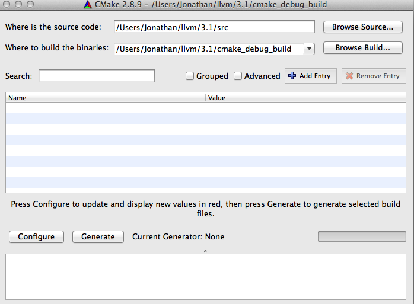
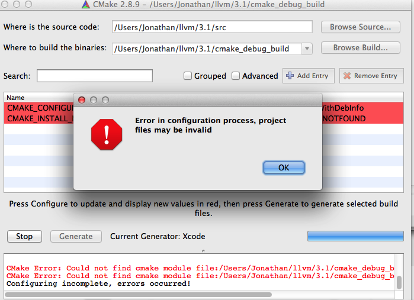
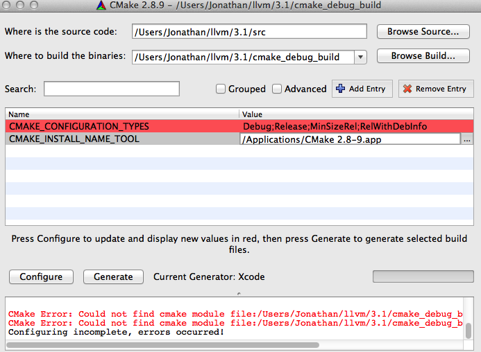
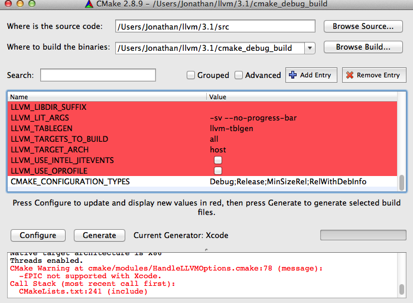
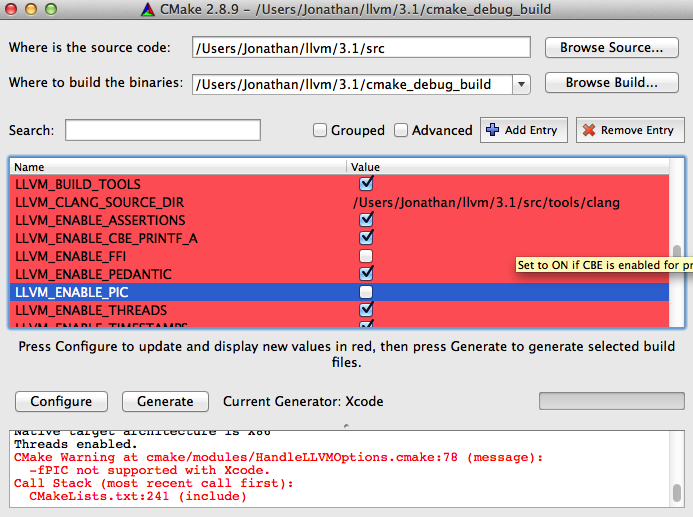
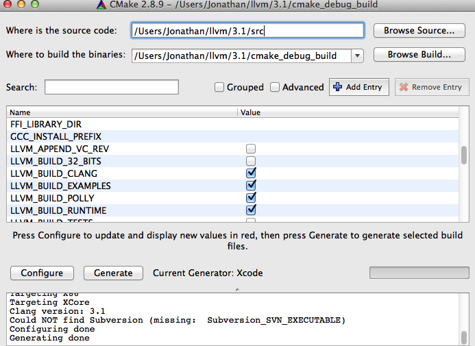
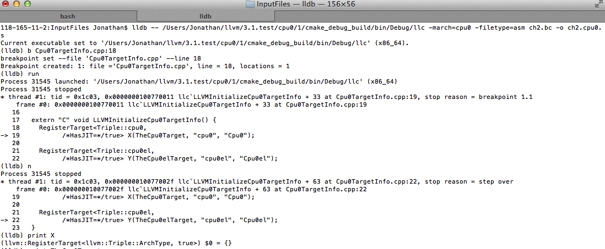
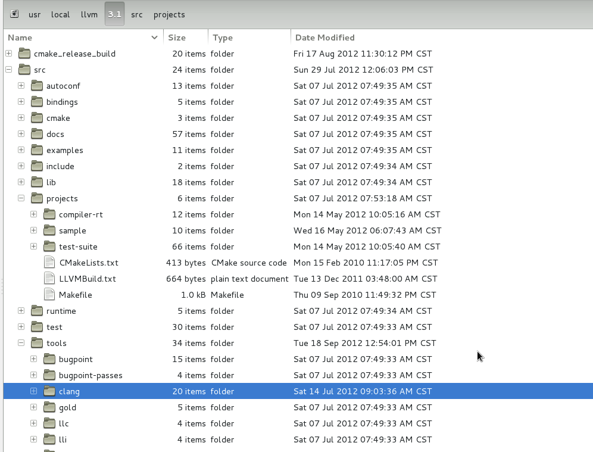
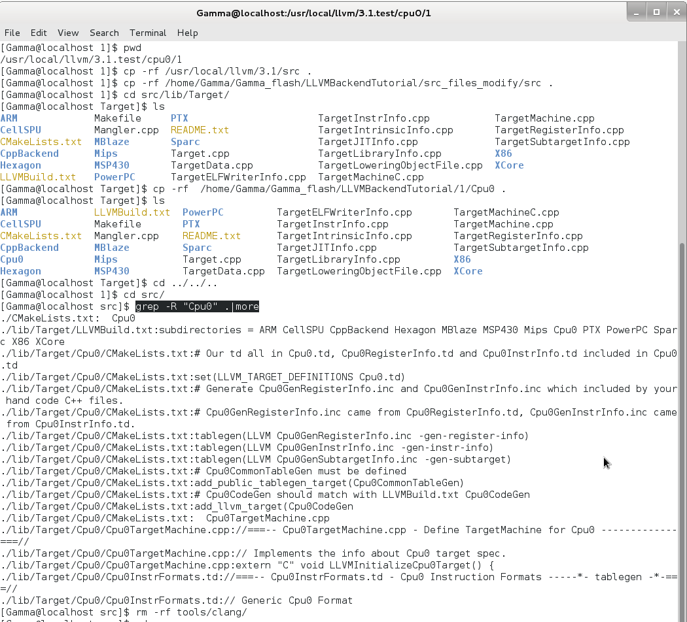

Getting Started: Installing LLVM and the Cpu0 example code
==========================================================

Before you start, you should know that you can always examine existing LLVM 
backend code and attempt to port what you find for your own target architecture
.  The majority of this code can be found in the /lib/Target directory of your 
root LLVM directory. As most major RISC instruction set architectures have some 
similarities, this may be the avenue you might try if you are both an 
experienced programmer and knowledgable of compiler backends. 
However, there is a steep learning curve and you may easily get held up 
debugging your new backend. You can easily spend a lot of time tracing which 
methods are callbacks of some function, or which are calling some overridden 
method deep in the LLVM codebase - and with a codebase as large as LLVM, this 
can easily become a headache. This tutorial will help you work through this 
process while learning the fundamentals of LLVM backend design. It will show 
you what is necessary to get your first backend functional and complete, and it 
should help you understand how to debug your backend when it does not produce 
desirable output using the output provided by LLVM.

In this chapter, we will run through how to set up LLVM using if you are using 
Mac OS X or Linux.  When discussing Mac OS X, we are using Apple's Xcode IDE 
(version 4.5.1) running on Mac OS X Mountain Lion (version 10.8) to modify and 
build LLVM from source, and we will be debugging using lldb.  
We cannot debug our LLVM builds within Xcode at the 
moment, but if you have experience with this, please contact us and help us 
build documentation that covers this.  For Linux machines, we are building and 
debugging (using gdb) our LLVM installations on a Fedora 17 system.  We will 
not be using an IDE for Linux, but once again, if you have experience building/
debugging LLVM using Eclipse or other major IDEs, please contact the authors. 
For information on using ``cmake`` to build LLVM, please refer to the `Building 
LLVM with CMake`_ documentation for further information.  We are using cmake 
version 2.8.9.

We will install two llvm directories in this chapter. One is the directory 
llvm/3.1/ which contains the clang, clang++ compiler we will use to translate 
the C/C++ input file into llvm IR. 
The other is the directory llvm/3.1.test/cpu0/1 which contains our cpu0 backend 
program and without clang and clang++.

.. _Building LLVM with CMake: http://llvm.org/docs/CMake.html?highlight=cmake

.. todo:: Find information on debugging LLVM within Xcode for Macs.
.. todo:: Find information on building/debugging LLVM within Eclipse for Linux.


Setting Up Your Mac
-------------------

Installing LLVM, Xcode and cmake
~~~~~~~~~~~~~~~~~~~~~~~~~~~~~~~~

.. todo:: Fix centering for figure captions.

Please download LLVM version 3.1 (llvm, clang, compiler-rf) from the 
`LLVM Download Page`_. Then extract them using 
``tar -zxvf {llvm-3.1.src.tar, clang-3.1.src.tar, compiler-rt-3.1.src.tar}``,
and change the llvm source code root directory into src. 
After that, move the clang source code to src/tools/clang, and move the 
compiler-rt source to src/project/compiler-rt as shown in :ref:`install_f1`.

.. todo:: Should we just write out commands in a terminal for people to execute?

.. _install_f1: 
.. figure:: ../Fig/install/1.png
	:align: center

	LLVM, clang, compiler-rt source code positions on Mac OS X

Next, copy the LLVM source to /Users/Jonathan/llvm/3.1/src by executing the 
terminal command ``cp -rf /Users/Jonathan/Documents/llvmSrc/src /Users/Jonathan/
llvm/3.1/.``.

Install Xcode from the Mac App Store. Then install cmake, which can be found 
here: http://www.cmake.org/cmake/resources/software.html. 
Before installing cmake, make sure you can install applications you download 
from the Internet. Open "System Preferences"->"Security & Privacy." Click the 
lock to make changes, and under "Allow applications downloaded from:" select 
the radio button next to "Anywhere." See :ref:`install_f2` below for an 
illustration. You may want to revert this setting after installing cmake.

.. _install_f2:
.. figure:: ../Fig/install/2.png
	:align: center

	Adjusting Mac OS X security settings to allow cmake installation.
	
Alternatively, you can mount the cmake .dmg image file you downloaded, right
-click (or 
control-click) the cmake .pkg package file and click "Open." Mac OS X will ask y
ou if you 
are sure you want to install this package, and you can click "Open" to start the 
installer.

.. stop 12/5/12 10PM (just a bookmark for me to continue from)

Create LLVM.xcodeproj by cmake Graphic UI
~~~~~~~~~~~~~~~~~~~~~~~~~~~~~~~~~~~~~~~~~

We install llvm source code with clang on directory /Users/Jonathan/llvm/3.1/ 
in last section.
Now, will generate the LLVM.xcodeproj in this chapter.

Currently, we cannot do debug by lldb with cmake graphic UI operations depicted 
in this section, but we can do debug by lldb with `section Create LLVM.xcodeproj 
of supporting cpu0 by terminal cmake command`_. 
Even with that, let's build LLVM project with cmake graphic UI since this LLVM 
directory contains the release version for clang and clang++ execution file. 
First, create LLVM.xcodeproj as 
:ref:`install_f3`, then click **configure** button to enter :ref:`install_f4`, 
and then click **Done** button on :ref:`install_f4` to get :ref:`install_f5`.

.. _install_f3:


	Start to create LLVM.xcodeproj by cmake

.. _install_f4:
.. figure:: ../Fig/install/4.png
	:align: center

	Create LLVM.xcodeproj by cmake – Set option to generate Xcode project

.. _install_f5:


	Create LLVM.xcodeproj by cmake – Before Adjust CMAKE_INSTALL_NAME_TOOL

.. todo:: The html will follow the appear order in \*.rst source context but latexpdf didn't. For example, the :ref:`install_f4` Figure 2.4 and :ref:`install_f5` Figure 2.5 appear after the below text "Click OK from ..." in pdf. If find the **NoReorder** or **newpage** directive, maybe can solve this problem.

Click OK from :ref:`install_f5` and select Cmake 2.8-9.app for CMAKE_INSTALL_NAM
E_TOOL by click the right side button **“...”** of that row in 
:ref:`install_f5` to get :ref:`install_f6`.

.. _install_f6:


	Select Cmake 2.8-9.app

Click Configure button in :ref:`install_f6` to get :ref:`install_f7`.

.. _install_f7:


	Click cmake Configure button first time

Check CLANG_BUILD_EXAMPLES, LLVM_BUILD_EXAMPLES, and uncheck LLVM_ENABLE_PIC as 
:ref:`install_f8`.

.. _install_f8:


	Check CLANG_BUILD_EXAMPLES, LLVM_BUILD_EXAMPLES, and uncheck 
	LLVM_ENABLE_PIC in cmake

Click Configure button again. If the output result message has no red color, 
then click Generate button to get :ref:`install_f9`.

.. _install_f9:


	Click cmake Generate button second time

Build llvm by Xcode
~~~~~~~~~~~~~~~~~~~

Now, LLVM.xcodeproj is created. Open the cmake_debug_build/LLVM.xcodeproj by 
Xcode and click menu “Product – Build” as :ref:`install_f10`.

.. _install_f10:
.. figure:: ../Fig/install/10.png
	:align: center

	Click Build button to build LLVM.xcodeproj by Xcode

After few minutes of build, the clang, llc, llvm-as, ..., can be found in 
cmake_debug_build/bin/Debug/ as :ref:`install_f11`.

.. _install_f11:
.. figure:: ../Fig/install/11.png
	:align: center
	
	Executable files built by Xcode

To access those execution files, edit .profile (if you .profile not exists, 
please create file .profile), save .profile to /Users/Jonathan/, and enable 
$PATH by command ``source .profile`` as :ref:`install_f12`. 
Please add path /Applications//Xcode.app/Contents/Developer/usr/bin to .profile 
if you didn't add it after Xcode download.

.. _install_f12:
.. figure:: ../Fig/install/12.png
	:height: 158 px
	:width: 1104 px
	:scale: 90 %
	:align: center

	Edit .profile and save .profile to /Users/Jonathan/

Create LLVM.xcodeproj of supporting cpu0 by terminal cmake command
~~~~~~~~~~~~~~~~~~~~~~~~~~~~~~~~~~~~~~~~~~~~~~~~~~~~~~~~~~~~~~~~~~~~~~

We have install llvm with clang on directory llvm/3.1/. 
Now, we want to install llvm with our cpu0 backend code on directory 
llvm/3.1.test/cpu0/1 in this section.

In `section Create LLVM.xcodeproj by cmake Graphic UI`_, we create 
LLVM.xcodeproj by cmake graphic UI. 
We can create LLVM.xcodeproj by ``cmake`` command on terminal also. 
Now, let's repeat above steps to create llvm/3.1.test with cpu0 modified code 
as :ref:`install_f13`.

.. _install_f13:
.. figure:: ../Fig/install/13.png
	:align: center

	Create llvm/3.1.test with cpu0 modified code

/Users/Jonathan/Documents/Gamma_flash/LLVMBackendTutorial/src_files_modify/src/ 
contains the files I modified for cpu0 architecture. 
Copy it as :ref:`install_f13` to replace the original 3.1 source code for cpu0 
backend support. 
After :ref:`install_f13`, copy cpu0 example code from LLVMBackendTutorial/1/Cpu0 
to src/lib/Target/ as :ref:`install_f14`.

.. _install_f14:
.. figure:: ../Fig/install/14.png
	:align: center

	Copy cpu0 example code from 1/Cpu0 to src/lib/Target/

Please remove src/tools/clang since it will waste time to build clang for our 
working Cpu0 changes. 
Now, it's ready for building 1/Cpu0 code by command 
``cmake -DCMAKE_CXX_COMPILER=clang++ -DCMAKE_C_COMPILER=clang -DCMAKE_BUILD_TYPE
=Debug -G "Xcode" ../src/`` as :ref:`install_f15`. 
Remind, currently, the ``cmake`` terminal command can work with lldb debug, but 
the `section Create LLVM.xcodeproj by cmake Graphic UI`_ cannot.

.. _install_f15:
.. figure:: ../Fig/install/15.png
	:height: 540 px
	:width: 1101 px
	:scale: 90 %
	:align: center

	Build llvm debug cpu0 working project by ``cmake`` terminal command

Since Xcode use clang compiler and lldb instead of gcc and gdb, we can run lldb 
debug as :ref:`install_f16`. 
About the lldb debug command, please reference 
http://lldb.llvm.org/lldb-gdb.html or lldb portal http://lldb.llvm.org/.

.. _install_f16:


	Run lldb debug


Install other tools on iMac
~~~~~~~~~~~~~~~~~~~~~~~~~~~

These tools mentioned in this section is for coding and debug. 
You can work even without these tools. 
Files compare tools Kdiff3 http://kdiff3.sourceforge.net. 
FileMerge is a part of Xcode, you can type FileMerge in Finder – Applications 
as :ref:`install_f17` and drag it into the Dock as :ref:`install_f18`.

.. _install_f17:
.. figure:: ../Fig/install/17.png
	:align: center

	Type FileMerge in Finder – Applications

.. _install_f18:
.. figure:: ../Fig/install/18.png
	:align: center

	Drag FileMege into the Dock

Download tool Graphviz for display llvm IR nodes in debugging, 
http://www.graphviz.org/Download_macos.php. 
We choose mountainlion as :ref:`install_f19` since our iMac is Mountain Lion.

.. _install_f19:
.. figure:: ../Fig/install/19.png
	:height: 738 px
	:width: 1181 px
	:scale: 80 %
	:align: center

	Download graphviz for llvm IR node display

After install Graphviz, please set the path to .profile. 
For example, we install the Graphviz in directory 
/Applications/Graphviz.app/Contents/MacOS/, so add this path to 
/User/Jonathan/.profile as follows,

.. code-block:: bash

	118-165-12-177:InputFiles Jonathan$ cat /Users/Jonathan/.profile
	export PATH=$PATH:/Applications/Xcode.app/Contents/Developer/usr/bin:
	/Applications/Graphviz.app/Contents/MacOS/:/Users/Jonathan/llvm/3.1/
	cmake_debug_build/bin/Debug

The Graphviz information for llvm is in 
the section "SelectionDAG Instruction Selection Process" of 
http://llvm.org/docs/CodeGenerator.html and 
the section "Viewing graphs while debugging code" of 
http://llvm.org/docs/ProgrammersManual.html.
TextWrangler is for edit file with line number display and dump binary file 
like the obj file, \*.o, that will be generated in chapter of Other 
instructions. 
You can download from App Store. 
To dump binary file, first, open the binary file, next, select menu 
“File – Hex Front Document” as :ref:`install_f20`. 
Then select “Front document's file” as :ref:`install_f21`.

.. _install_f20:
.. figure:: ../Fig/install/20.png
	:align: center

	Select Hex Dump menu

.. _install_f21:
.. figure:: ../Fig/install/21.png
	:align: center

	Select Front document's file in TextWrangler

Setting Up Your Linux Machine
-----------------------------

Install LLVM 3.1 release build on Linux
~~~~~~~~~~~~~~~~~~~~~~~~~~~~~~~~~~~~~~~

First, install the llvm release build by,

	1) Untar llvm source, rename llvm source with src.
	
	2) Untar clang and move it src/tools/clang.
	
	3) Untar compiler-rt and move it to src/project/compiler-rt as :ref:`install_f22`.

.. _install_f22:


	Create llvm release build

Next, build with cmake command, 
``cmake -DCMAKE_BUILD_TYPE=Release -DCLANG_BUILD_EXAMPLES=ON -DLLVM_BUILD_EXAMPL
ES=ON -G "Unix Makefiles" ../src/``, 
shown in :ref:`install_f23`.

.. _install_f23:
.. figure:: ../Fig/install/23.png
	:align: center

	Create llvm 3.1 release build

After cmake, run command ``make``, then you can get clang, llc, llvm-as, ..., 
in 
cmake_release_build/bin/ after a few tens minutes of build. Next, edit 
/home/Gamma/.bash_profile with adding /usr/local/llvm/3.1/cmake_release_build/
bin to PATH 
to enable the clang, llc, ..., command search path, as shown in :ref:`install_f24`.

.. _install_f24:
.. figure:: ../Fig/install/24.png
	:align: center

	Setup llvm command path


Install cpu0 debug build on Linux
~~~~~~~~~~~~~~~~~~~~~~~~~~~~~~~~~

Make another copy /usr/local/llvm/3.1.test/cpu0/1/src for cpu0 debug working 
project 
according the following list steps, the corresponding commands shown in 
:ref:`install_f25`:

1) Enter /usr/local/llvm/3.1.test/cpu0/1 and 
``cp -rf /usr/local/llvm/3.1/src .``.

2) Update my modified files to support cpu0 by command, 
``cp -rf /home/Gamma/Gamma_flash/LLVMBackendTutorial/src_files_modify/src .``.

3) Enter src/lib/Target and copy example code LLVMBackendTutorial/1/Cpu0 to the 
directory by command ``cd src/lib/Target/`` and 
``cp -rf /home/Gamma/Gamma_flash/LLVMBackendTutorial/1/Cpu0 .``.

4) Go into directory 3.1.test/cpu0/1/src and Check step 3 is effect by command 
``grep -R "Cpu0" . | more```. I add the Cpu0 backend support, so check with 
grep.

5) Remove clang from 3.1.test/cpu0/1/src/tools/clang, and mkdir 
3.1.test/cpu0/1/cmake_debug_build. Without this you will waste extra time for 
command 
``make`` in cpu0 example code build.

.. _install_f25:


	Create llvm 3.1 debug copy

Now, go into directory 3.1.test/cpu0/1, create directory cmake_debug_build and 
do cmake 
like build the 3.1 release, but we do Debug build and use clang as our compiler 
instead, 
as follows,

.. literalinclude:: ../terminal_io/install/1.txt

Then do make as follows,

.. literalinclude:: ../terminal_io/install/2.txt

Now, we are ready for the cpu0 backend development. We can run gdb debug as 
follows. 
If your setting has anything about gdb errors, please follow the errors indication 
(maybe need to download gdb again). 
Finally, try gdb as :ref:`install_f26`.

.. _install_f26:
.. figure:: ../Fig/install/26.png
	:align: center

	Debug llvm cpu0 backend by gdb


.. _LLVM Download Page:
	http://llvm.org/releases/download.html#3.1


.. _section Create LLVM.xcodeproj of supporting cpu0 by terminal cmake command:
    http://jonathan2251.github.com/lbd/install.html#create-llvm-xcodeproj-of-
    supporting-cpu0-by-terminal-cmake-command

.. _section Create LLVM.xcodeproj by cmake Graphic UI:
    http://jonathan2251.github.com/lbd/install.html#create-llvm-xcodeproj-by-
    cmake-graphic-ui
