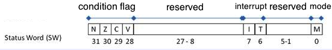

.. _sec-llvmstructure:

Cpu0 Instruction Set and LLVM Target Description
================================================

Before you begin this tutorial, you should know that you can always try to develop your 
own backend by porting code from existing backends.  The majority of the code you will 
want to investigate can be found in the /lib/Target directory of your root LLVM 
installation. As most major RISC instruction sets have some similarities, this may be the 
avenue you might try if you are an experienced programmer and knowledgable of compiler 
backends.

On the other hand, there is a steep learning curve and you may easily get stuck 
debugging your new backend. You can easily spend a lot of time tracing which 
methods are callbacks of some function, or which are calling some overridden 
method deep in the LLVM codebase - and with a codebase as large as LLVM, all of this 
can easily become difficult to keep track of. This tutorial will help you work through 
this process while learning the fundamentals of LLVM backend design. It will show 
you what is necessary to get your first backend functional and complete, and it 
should help you understand how to debug your backend when it produces incorrect machine 
code using output provided by the compiler.

This section details the Cpu0 instruction set and the structure of LLVM. 
The LLVM structure information is adapted from Chris Lattner's LLVM chapter of the 
Architecture of Open Source Applications book [#aosa-book]_. You can read 
the original article from the AOSA website if you prefer. Finally, you will begin to 
create a new LLVM backend by writing register and instruction definitions in the 
Target Description files which will be used in next section.

Cpu0 Processor Architecture Details
-----------------------------------

This subsection is based on materials available here [#cpu0-chinese]_ (Chinese)
and [#cpu0-english]_ (English).

Brief introduction
++++++++++++++++++

Cpu0 is a 32-bit architecture. It has 16 general purpose registers (R0, ..., R15), the 
Instruction Register (IR), the memory access registers MAR & MDR. Its structure is 
illustrated in :num:`Figure #llvmstructure-f1` below.

.. _llvmstructure-f1: 
.. figure:: ../Fig/llvmstructure/1.png
	:align: center

	Architectural block diagram of the Cpu0 processor

The registers are used for the following purposes:

============	===========
Register		Description
============	===========
IR				Instruction register
R0				Constant register, value is 0
R1-R11			General-purpose registers
R12				Status Word register (SW)
R13				Stack Pointer register (SP)
R14				Link Register (LR)
R15				Program Counter (PC)
MAR				Memory Address Register (MAR)
MDR				Memory Data Register (MDR)
============	===========

The Cpu0 Instruction Set
++++++++++++++++++++++++

The Cpu0 instruction set can be divided into three types: L-type instructions, which are 
generally associated with memory operations, A-type instructions for arithmetic 
operations, and J-type instructions that are typically used when altering control flow 
(i.e. jumps).  :num:`Figure #llvmstructure-f2` illustrates how the bitfields are broken 
down for each type of instruction.

.. _llvmstructure-f2: 
.. figure:: ../Fig/llvmstructure/2.png
	:align: center

	Cpu0's three instruction formats

The following table details the Cpu0 instruction set:

.. list-table::
	:widths: 5 5 5 12 7 10
	:header-rows: 1

	* - Format
	  - Mnemonic
	  - Opcode
	  - Meaning
	  - Syntax
	  - Operation
	* - L
	  - LD
	  - 00
	  - Load word
	  - LD Ra, [Rb+Cx]
	  - Ra <= [Rb+Cx]
	* - L
	  - ST
	  - 01
	  - Store word
	  - ST Ra, [Rb+Cx]
	  - [Rb+Cx] <= Ra
	* - L
	  - LDB
	  - 02
	  - Load byte
	  - LDB Ra, [Rb+Cx]
	  - Ra <= (byte)[Rb+Cx]
	* - L
	  - STB
	  - 03
	  - Store byte
	  - STB Ra, [Rb+Cx]
	  - [Rb+Cx] <= (byte)Ra
	* - A
	  - LDR
	  - 04
	  - Load word (w/ register index)
	  - LDR Ra, [Rb+Rc]
	  - Ra <= [Rb+Rc]
	* - A
	  - STR
	  - 05
	  - Store word (w/ register index)
	  - STR Ra, [Rb+Rc]
	  - [Rb+Rc] <= Ra
	* - A
	  - LBR
	  - 06
	  - Load byte (w/ register index)
	  - LBR Ra, [Rb+Rc]
	  - Ra <= (byte)[Rb+Rc]
	* - A
	  - SBR
	  - 07
	  - Store byte (w/ register index)
	  - SBR Ra, [Rb+Cx]
	  - [Rb+Rc] <= (byte)Ra
	* - L
	  - LDI
	  - 08
	  - Load immediate
	  - LDI Ra, Cx
	  - Ra <= Cx
	* - A
	  - CMP
	  - 10
	  - Compare
	  - CMP Ra, Rb
	  - SW <= (Ra >/>=/==/!=/<=/< Rb)
	* - A
	  - MOV
	  - 12
	  - Move
	  - MOV Ra, Rb
	  - Ra <= Rb
	* - A
	  - ADD
	  - 13
	  - Add
	  - ADD Ra, Rb, Rc
	  - Ra <= Rb + Rc
	* - A
	  - SUB
	  - 14
	  - Subtract
	  - SUB Ra, Rb, Rc
	  - Ra <= Rb - Rc
	* - A
	  - MUL
	  - 15
	  - Multiply
	  - MUL Ra, Rb, Rc
	  - Ra <= Rb * Rc
	* - A
	  - DIV
	  - 16
	  - Divide
	  - DIV Ra, Rb, Rc
	  - Ra <= Rb / Rc
	* - A
	  - AND
	  - 18
	  - Bitwise and
	  - AND Ra, Rb, Rc
	  - Ra <= Rb & Rc
	* - A
	  - OR
	  - 19
	  - Bitwise or
	  - OR Ra, Rb, Rc
	  - Ra <= Rb | Rc
	* - A
	  - XOR
	  - 1A
	  - Bitwise exclusive or
	  - XOR Ra, Rb, Rc
	  - Ra <= Rb ^ Rc
  	* - A
	  - ROL
	  - 1C
	  - Rotate left
	  - ROL Ra, Rb, Cx
	  - Ra <= Rb rol Cx
  	* - A
	  - ROR
	  - 1D
	  - Rotate right
	  - ROR Ra, Rb, Cx
	  - Ra <= Rb ror Cx
   	* - A
	  - SHL
	  - 1E
	  - Shift left
	  - SHL Ra, Rb, Cx
	  - Ra <= Rb << Cx
   	* - A
	  - SHR
	  - 1F
	  - Shift right
	  - SHR Ra, Rb, Cx
	  - Ra <= Rb >> Cx
	* - A
	  - FADD
	  - 41
	  - Floating-point addition
	  - FADD Ra, Rb, Rc
	  - Ra <= Rb + Rc
	* - A
	  - FSUB
	  - 42
	  - Floating-point subtraction
	  - FSUB Ra, Rb, Rc
	  - Ra <= Rb - Rc
	* - A
	  - FMUL
	  - 43
	  - Floating-point multiplication
	  - FMUL Ra, Rb, Rc
	  - Ra <= Rb * Rc
	* - A
	  - FDIV
	  - 44
	  - Floating-point division
	  - FDIV Ra, Rb, Rc
	  - Ra <= Rb / Rc
   	* - J
	  - JEQ
	  - 20
	  - Jump if equal (==)
	  - JEQ Cx
	  - if SW(==), PC <= PC + Cx
   	* - J
	  - JNE
	  - 21
	  - Jump if not equal (!=)
	  - JNE Cx
	  - if SW(!=), PC <= PC + Cx
   	* - J
	  - JLT
	  - 22
	  - Jump if less than (<)
	  - JLT Cx
	  - if SW(<), PC <= PC + Cx
   	* - J
	  - JGT
	  - 23
	  - Jump if greater than (>)
	  - JGT Cx
	  - if SW(>), PC <= PC + Cx
   	* - J
	  - JLE
	  - 24
	  - Jump if less than or equals (<=)
	  - JLE Cx
	  - if SW(<=), PC <= PC + Cx
   	* - J
	  - JGE
	  - 25
	  - Jump if greater than or equals (>=)
	  - JGE Cx
	  - if SW(>=), PC <= PC + Cx
   	* - J
	  - JMP
	  - 26
	  - Jump (unconditional)
	  - JMP Cx
	  - PC <= PC + Cx
   	* - J
	  - SWI
	  - 2A
	  - Software interrupt
	  - SWI Cx
	  - LR <= PC; PC <= Cx
   	* - J
	  - JSUB
	  - 2B
	  - Jump to subroutine
	  - JSUB Cx
	  - LR <= PC; PC <= PC + Cx
   	* - J
	  - RET
	  - 2C
	  - Return from subroutine
	  - RET Cx
	  - PC <= LR
   	* - J
	  - IRET
	  - 2D
	  - Return from interrupt handler
	  - IRET
	  - PC <= LR; INT 0
   	* - A
	  - PUSH
	  - 30
	  - Push word
	  - PUSH Ra
	  - [SP] <= Ra; SP -= 4
   	* - A
	  - POP
	  - 31
	  - Pop word
	  - POP Ra
	  - Ra <= [SP]; SP += 4
   	* - A
	  - PUSHB
	  - 32
	  - Push byte
	  - PUSHB Ra
	  - [SP] <= (byte)Ra; SP -= 4
   	* - A
	  - POPB
	  - 33
	  - Pop word
	  - POP Ra
	  - Ra <= (byte)[SP]; SP += 4

The Status Register
+++++++++++++++++++

The Cpu0 status word register (SW) contains the state of the Negative (N), Zero (Z), 
Carry (C), Overflow (V), and Interrupt (I), Trap (T), and Mode (M) boolean flags. 
The bit layout of the SW register is shown in :num:`Figure #llvmstructure-f3` below.

.. _llvmstructure-f3: 

	Cpu0 status word (SW) register

When a CMP Ra, Rb instruction executes, the condition flags will change. For example:

-	If Ra > Rb, then N = 0, Z = 0
-	If Ra < Rb, then N = 1, Z = 0
-	If Ra = Rb, then N = 0, Z = 1

The direction (i.e. taken/not taken) of the conditional jump instructions JGT, JLT, JGE, 
JLE, JEQ, JNE is determined by the N and Z flags in the SW register.

Cpu0's Stages of Instruction Execution
++++++++++++++++++++++++++++++++++++++

The Cpu0 architecture has a three-stage pipeline.  The stages are instruction fetch (IF), 
decode (D), and execute (EX), and they occur in that order.  Here is a description of 
what happens in the processor:

1) Instruction fetch

-	The Cpu0 fetches the instruction pointed to by the Program Counter (PC) into the 
	Instruction Register (IR): IR = [PC].
-	The PC is then updated to point to the next instruction: PC = PC + 4.

2) Decode

-	The control unit decodes the instruction stored in IR, which routes necessary data
	stored in registers to the ALU, and sets the ALU's operation mode based on the 
	current instruction's opcode.

3) Execute

-	The ALU executes the operation designated by the control unit upon data in registers. 
	After the ALU is done, the result is stored in the destination register. 

.. todo:: This is actually a question: Does the "Replace ldi instruction by addiu" section 
	really need to be here?  Maybe it should be a note up above with the Cpu0 ISA tables
	rather than a whole section?  If we aren't using ldi, I don't see much purpose 
	keeping it around/mentioning it.

Replace ldi instruction by addiu instruction
++++++++++++++++++++++++++++++++++++++++++++

We have recognized the ldi instruction is a bad design and replace it with mips 
instruction addiu. 
The reason we replace ldi with addiu is that ldi use only one register even 
though ldi is L type format and has two registers, as :ref:`llvmstructure_f4`. 
Mips addiu which allow programmer to do load constant to register like ldi, 
and add constant to a register. So, it's powerful and fully contains the ldi 
ability. 
These two instructions format as :ref:`llvmstructure_f4` and :ref:`llvmstructure_f5`.

.. _llvmstructure_f4: 
.. figure:: ../Fig/llvmstructure/4.png
	:align: center

	Cpu0 ldi instruction

.. _llvmstructure_f5: 
.. figure:: ../Fig/llvmstructure/5.png
	:align: center

	Mips addiu instruction format

From :ref:`llvmstructure_f4` and :ref:`llvmstructure_f5`, you can find ldi $Ra, 
5 can be replaced by addiu $Ra, $zero, 5. 
And more, addiu can do addiu $Ra, $Rb, 5 which add $Rb and 5 then save to $Ra, 
but ldi cannot. 
As a cpu design, it's common to redesign CPU instruction when find a better 
solution during design the compiler backend for that CPU. 
So, we add addiu instruction to cpu0. 
The cpu0 is my brother's work, I will find time to talk with him.

LLVM Structure
--------------

The text in this and the following section comes from the AOSA chapter on LLVM written 
by Chris Lattner [#aosa-book]_.

The most popular design for a traditional static compiler (like most C 
compilers) is the three phase design whose major components are the front end, 
the optimizer and the back end, as seen in :num:`Figure #llvmstructure-f6`. 
The front end parses source code, checking it for errors, and builds a 
language-specific Abstract Syntax Tree (AST) to represent the input code. 
The AST is optionally converted to a new representation for optimization, and 
the optimizer and back end are run on the code.

.. _llvmstructure-f6: 
.. figure:: ../Fig/llvmstructure/6.png
	:align: center

	Three Major Components of a Three Phase Compiler

The optimizer is responsible for doing a broad variety of transformations to 
try to improve the code's running time, such as eliminating redundant 
computations, and is usually more or less independent of language and target. 
The back end (also known as the code generator) then maps the code onto the 
target instruction set. 
In addition to making correct code, it is responsible for generating good code 
that takes advantage of unusual features of the supported architecture. 
Common parts of a compiler back end include instruction selection, register 
allocation, and instruction scheduling.

This model applies equally well to interpreters and JIT compilers. 
The Java Virtual Machine (JVM) is also an implementation of this model, which 
uses Java bytecode as the interface between the front end and optimizer.

The most important win of this classical design comes when a compiler decides 
to support multiple source languages or target architectures. 
If the compiler uses a common code representation in its optimizer, then a 
front end can be written for any language that can compile to it, and a back 
end can be written for any target that can compile from it, as shown in 
:num:`Figure #llvmstructure-f7`.

.. _llvmstructure-f7: 
.. figure:: ../Fig/llvmstructure/7.png
	:align: center
	:width: 600px

	Retargetablity

With this design, porting the compiler to support a new source language (e.g., 
Algol or BASIC) requires implementing a new front end, but the existing 
optimizer and back end can be reused. 
If these parts weren't separated, implementing a new source language would 
require starting over from scratch, so supporting N targets and M source 
languages would need N*M compilers.

Another advantage of the three-phase design (which follows directly from 
retargetability) is that the compiler serves a broader set of programmers than 
it would if it only supported one source language and one target. 
For an open source project, this means that there is a larger community of 
potential contributors to draw from, which naturally leads to more enhancements 
and improvements to the compiler. 
This is the reason why open source compilers that serve many communities (like 
GCC) tend to generate better optimized machine code than narrower compilers 
like FreePASCAL. 
This isn't the case for proprietary compilers, whose quality is directly 
related to the project's budget. 
For example, the Intel ICC Compiler is widely known for the quality of code it 
generates, even though it serves a narrow audience.

A final major win of the three-phase design is that the skills required to 
implement a front end are different than those required for the optimizer and 
back end. 
Separating these makes it easier for a "front-end person" to enhance and 
maintain their part of the compiler. 
While this is a social issue, not a technical one, it matters a lot in 
practice, particularly for open source projects that want to reduce the barrier 
to contributing as much as possible.

The most important aspect of its design is the LLVM Intermediate Representation 
(IR), which is the form it uses to represent code in the compiler. 
LLVM IR is designed to host mid-level analyses and transformations that you 
find in the optimizer section of a compiler. 
It was designed with many specific goals in mind, including supporting 
lightweight runtime optimizations, cross-function/interprocedural 
optimizations, whole program analysis, and aggressive restructuring 
transformations, etc. 
The most important aspect of it, though, is that it is itself defined as a 
first class language with well-defined semantics. 
To make this concrete, here is a simple example of a .ll file:

.. code-block:: c++

  define i32 @add1(i32 %a, i32 %b) {
  entry:
    %tmp1 = add i32 %a, %b
    ret i32 %tmp1
  }
  define i32 @add2(i32 %a, i32 %b) {
  entry:
    %tmp1 = icmp eq i32 %a, 0
    br i1 %tmp1, label %done, label %recurse
  recurse:
    %tmp2 = sub i32 %a, 1
    %tmp3 = add i32 %b, 1
    %tmp4 = call i32 @add2(i32 %tmp2, i32 %tmp3)
    ret i32 %tmp4
  done:
    ret i32 %b
  }
  // This LLVM IR corresponds to this C code, which provides two different ways to
  //  add integers:
  unsigned add1(unsigned a, unsigned b) {
    return a+b;
  }
  // Perhaps not the most efficient way to add two numbers.
  unsigned add2(unsigned a, unsigned b) {
    if (a == 0) return b;
    return add2(a-1, b+1);
  }

As you can see from this example, LLVM IR is a low-level RISC-like virtual 
instruction set. 
Like a real RISC instruction set, it supports linear sequences of simple 
instructions like add, subtract, compare, and branch. 
These instructions are in three address form, which means that they take some 
number of inputs and produce a result in a different register. 
LLVM IR supports labels and generally looks like a weird form of assembly 
language.

Unlike most RISC instruction sets, LLVM is strongly typed with a simple type 
system (e.g., i32 is a 32-bit integer, i32** is a pointer to pointer to 32-bit 
integer) and some details of the machine are abstracted away. 
For example, the calling convention is abstracted through call and ret 
instructions and explicit arguments. 
Another significant difference from machine code is that the LLVM IR doesn't 
use a fixed set of named registers, it uses an infinite set of temporaries 
named with a % character.

Beyond being implemented as a language, LLVM IR is actually defined in three 
isomorphic forms: the textual format above, an in-memory data structure 
inspected and modified by optimizations themselves, and an efficient and dense 
on-disk binary "bitcode" format. 
The LLVM Project also provides tools to convert the on-disk format from text to 
binary: llvm-as assembles the textual .ll file into a .bc file containing the 
bitcode goop and llvm-dis turns a .bc file into a .ll file.

The intermediate representation of a compiler is interesting because it can be 
a "perfect world" for the compiler optimizer: unlike the front end and back end 
of the compiler, the optimizer isn't constrained by either a specific source 
language or a specific target machine. 
On the other hand, it has to serve both well: it has to be designed to be easy 
for a front end to generate and be expressive enough to allow important 
optimizations to be performed for real targets.
	

.td: LLVM's Target Description Files
------------------------------------

The "mix and match" approach allows target authors to choose what makes sense 
for their architecture and permits a large amount of code reuse across 
different targets. 
This brings up another challenge: each shared component needs to be able to 
reason about target specific properties in a generic way. 
For example, a shared register allocator needs to know the register file of 
each target and the constraints that exist between instructions and their 
register operands. 
LLVM's solution to this is for each target to provide a target description 
in a declarative domain-specific language (a set of .td files) processed by the 
tblgen tool. 
The (simplified) build process for the x86 target is shown in 
:num:`Figure #llvmstructure-f8`.

.. _llvmstructure-f8: 
.. figure:: ../Fig/llvmstructure/8.png
	:align: center
	:width: 600px

	Simplified x86 Target Definition

The different subsystems supported by the .td files allow target authors to 
build up the different pieces of their target. 
For example, the x86 back end defines a register class that holds all of its 
32-bit registers named "GR32" (in the .td files, target specific definitions 
are all caps) like this:

.. code-block:: c++

  def GR32 : RegisterClass<[i32], 32,
    [EAX, ECX, EDX, ESI, EDI, EBX, EBP, ESP,
     R8D, R9D, R10D, R11D, R14D, R15D, R12D, R13D]> { ... }

Writing the First Cpu0 .td Files
--------------------------------

.. resume editing here (1/21)

The llvm using .td file (Target Description) to describe register and 
instruction format. 
After finish the .td files, llvm can generate C++ files (\*.inc) by llvm-tblgen 
tools. 
The \*.inc file is a text file (C++ file) with table driven in concept. 
[#tablegen]_ is the web site.

Every back end has a target td which define it's own target information. 
File td is like C++ in syntax. For example the Cpu0.td as follows,

.. code-block:: c++

  /===-- Cpu0.td - Describe the Cpu0 Target Machine ---------*- tablegen -*-===//
  // 
  //                     The LLVM Compiler Infrastructure 
  // 
  // This file is distributed under the University of Illinois Open Source 
  // License. See LICENSE.TXT for details. 
  // 
  //===----------------------------------------------------------------------===//
  // This is the top level entry point for the Cpu0 target. 
  //===----------------------------------------------------------------------===//
  
  //===----------------------------------------------------------------------===//
  // Target-independent interfaces 
  //===----------------------------------------------------------------------===//
  
  include "llvm/Target/Target.td" 
  //===----------------------------------------------------------------------===//
  // Register File, Calling Conv, Instruction Descriptions 
  //===----------------------------------------------------------------------===//
  
  include "Cpu0RegisterInfo.td" 
  include "Cpu0Schedule.td" 
  include "Cpu0InstrInfo.td" 
  
  def Cpu0InstrInfo : InstrInfo; 
  
  def Cpu0 : Target { 
  // def Cpu0InstrInfo : InstrInfo as before. 
    let InstructionSet = Cpu0InstrInfo; 
  }

The registers td named Cpu0RegisterInfo.td included by Cpu0.td is defined as 
follows,

.. code-block:: c++

  //  Cpu0RegisterInfo.td
  //===----------------------------------------------------------------------===//
  //  Declarations that describe the CPU0 register file 
  //===----------------------------------------------------------------------===//
  // We have banks of 16 registers each. 
  class Cpu0Reg<string n> : Register<n> { 
    field bits<4> Num; 
    let Namespace = "Cpu0"; 
  } 
  
  // Cpu0 CPU Registers 
  class Cpu0GPRReg<bits<4> num, string n> : Cpu0Reg<n> { 
    let Num = num; 
  } 
  //===----------------------------------------------------------------------===//
  //  Registers 
  //===----------------------------------------------------------------------===//
  let Namespace = "Cpu0" in { 
    // General Purpose Registers 
    def ZERO : Cpu0GPRReg< 0, "ZERO">, DwarfRegNum<[0]>; 
    def AT   : Cpu0GPRReg< 1, "AT">,   DwarfRegNum<[1]>; 
    def V0   : Cpu0GPRReg< 2, "2">,    DwarfRegNum<[2]>; 
    def V1   : Cpu0GPRReg< 3, "3">,    DwarfRegNum<[3]>; 
    def A0   : Cpu0GPRReg< 4, "4">,    DwarfRegNum<[6]>; 
    def A1   : Cpu0GPRReg< 5, "5">,    DwarfRegNum<[7]>; 
    def T9   : Cpu0GPRReg< 6, "6">,    DwarfRegNum<[6]>; 
    def S0   : Cpu0GPRReg< 7, "7">,    DwarfRegNum<[7]>; 
    def S1   : Cpu0GPRReg< 8, "8">,    DwarfRegNum<[8]>; 
    def S2   : Cpu0GPRReg< 9, "9">,    DwarfRegNum<[9]>; 
    def GP   : Cpu0GPRReg< 10, "GP">,  DwarfRegNum<[10]>; 
    def FP   : Cpu0GPRReg< 11, "FP">,  DwarfRegNum<[11]>; 
    def SW   : Cpu0GPRReg< 12, "SW">,   DwarfRegNum<[12]>; 
    def SP   : Cpu0GPRReg< 13, "SP">,   DwarfRegNum<[13]>; 
    def LR   : Cpu0GPRReg< 14, "LR">,   DwarfRegNum<[14]>; 
    def PC   : Cpu0GPRReg< 15, "PC">,   DwarfRegNum<[15]>; 
  //  def MAR  : Register< 16, "MAR">,  DwarfRegNum<[16]>; 
  //  def MDR  : Register< 17, "MDR">,  DwarfRegNum<[17]>; 
  } 
  //===----------------------------------------------------------------------===//
  // Register Classes 
  //===----------------------------------------------------------------------===//
  def CPURegs : RegisterClass<"Cpu0", [i32], 32, (add 
    // Return Values and Arguments 
    V0, V1, A0, A1, 
    // Not preserved across procedure calls 
    T9, 
    // Callee save 
    S0, S1, S2, 
    // Reserved 
    ZERO, AT, GP, FP, SW, SP, LR, PC)>; 

In C++ the data layout is declared by class. Declaration tells the variable 
layout; definition allocates memory for the variable. 
For example,

.. code-block:: c++

  class Date {  // declare Date
    int year, month, day;
  }; 
  Date date;  // define(instance) date

Just like C++ class, the keyword **“class”** is used for declaring data structure 
layout. 
``Cpu0Reg<string n>`` declare a derived class from ``Register<n>`` which is 
declared by llvm already, where n is the argument of type string. 
In addition to inherited from all the fields of Register class, Cpu0Reg add a 
new field "Num" of type 4 bits. 
Namespace is same with  C++ namespace. 
**“Def”** is used by define(instance) a concrete variable.

As above, we define a ZERO register which type is Cpu0GPRReg, it's field Num 
is 0 (4 bits) and field n is **“ZERO”** (declared in Register class). 
Note the use of **“let”** expressions to override values that are initially defined 
in a superclass. For example, let Namespace = **“Cpu0”** in class Cpu0Reg, will 
override Namespace declared in Register class. 
The Cpu0RegisterInfo.td also define that CPURegs is a variable for type of 
RegisterClass, where the RegisterClass is a llvm built-in class. 
The type of RegisterClass is a set/group of Register, so CPURegs variable is 
defined with a set of Register.

The cpu0 instructions td is named to Cpu0InstrInfo.td which contents as follows,

.. code-block:: c++

  /===- Cpu0InstrInfo.td - Target Description for Cpu0 Target -*- tablegen -*-=//
  // 
  //                     The LLVM Compiler Infrastructure 
  // 
  // This file is distributed under the University of Illinois Open Source 
  // License. See LICENSE.TXT for details. 
  // 

  //===----------------------------------------------------------------------===//
  // 
  // This file contains the Cpu0 implementation of the TargetInstrInfo class. 
  // 
  //===----------------------------------------------------------------------===//

  //===----------------------------------------------------------------------===//
  // Instruction format superclass 
  //===----------------------------------------------------------------------===//

   include "Cpu0InstrFormats.td" 

  //===----------------------------------------------------------------------===//
  // Cpu0 profiles and nodes 
  //===----------------------------------------------------------------------===//

  def SDT_Cpu0Ret          : SDTypeProfile<0, 1, [SDTCisInt<0>]>; 

  // Return 
  def Cpu0Ret : SDNode<"Cpu0ISD::Ret", SDT_Cpu0Ret, [SDNPHasChain, 
             SDNPOptInGlue]>; 

  //===----------------------------------------------------------------------===//
  // Cpu0 Operand, Complex Patterns and Transformations Definitions. 
  //===----------------------------------------------------------------------===//

  // Signed Operand
  def simm16      : Operand<i32> { 
    let DecoderMethod= "DecodeSimm16"; 
  } 

  // Address operand 
  def mem : Operand<i32> { 
    let PrintMethod = "printMemOperand"; 
    let MIOperandInfo = (ops CPURegs, simm16); 
    let EncoderMethod = "getMemEncoding"; 
  } 

  // Node immediate fits as 16-bit sign extended on target immediate. 
  // e.g. addiu 
  def immSExt16  : PatLeaf<(imm), [{ return isInt<16>(N->getSExtValue()); }]>; 
  
  // Cpu0 Address Mode! SDNode frameindex could possibily be a match 
  // since load and store instructions from stack used it. 
  def addr : ComplexPattern<iPTR, 2, "SelectAddr", [frameindex], [SDNPWantParent]>
  ; 
  
  //===----------------------------------------------------------------------===//
  // Pattern fragment for load/store 
  //===----------------------------------------------------------------------===//

  class AlignedLoad<PatFrag Node> : 
    PatFrag<(ops node:$ptr), (Node node:$ptr), [{ 
    LoadSDNode *LD = cast<LoadSDNode>(N); 
    return LD->getMemoryVT().getSizeInBits()/8 <= LD->getAlignment(); 
  }]>; 

  class AlignedStore<PatFrag Node> : 
    PatFrag<(ops node:$val, node:$ptr), (Node node:$val, node:$ptr), [{ 
    StoreSDNode *SD = cast<StoreSDNode>(N); 
    return SD->getMemoryVT().getSizeInBits()/8 <= SD->getAlignment(); 
  }]>; 

  // Load/Store PatFrags. 
  def load_a          : AlignedLoad<load>; 
  def store_a         : AlignedStore<store>; 

  //===----------------------------------------------------------------------===//
  // Instructions specific format 
  //===----------------------------------------------------------------------===//

  // Arithmetic and logical instructions with 2 register operands. 
  class ArithLogicI<bits<8> op, string instr_asm, SDNode OpNode, 
            Operand Od, PatLeaf imm_type, RegisterClass RC> : 
    FL<op, (outs RC:$ra), (ins RC:$rb, Od:$imm16), 
     !strconcat(instr_asm, "\t$ra, $rb, $imm16"), 
     [(set RC:$ra, (OpNode RC:$rb, imm_type:$imm16))], IIAlu> { 
    let isReMaterializable = 1; 
  } 
  
  // Move immediate imm16 to register ra. 
  class MoveImm<bits<8> op, string instr_asm, SDNode OpNode, 
            Operand Od, PatLeaf imm_type, RegisterClass RC> : 
    FL<op, (outs RC:$ra), (ins RC:$rb, Od:$imm16), 
     !strconcat(instr_asm, "\t$ra, $imm16"), 
     [(set RC:$ra, (OpNode RC:$rb, imm_type:$imm16))], IIAlu> { 
    let rb = 0; 
    let isReMaterializable = 1; 
  } 
  
  class FMem<bits<8> op, dag outs, dag ins, string asmstr, list<dag> pattern, 
        InstrItinClass itin>: FL<op, outs, ins, asmstr, pattern, itin> { 
    bits<20> addr; 
    let Inst{19-16} = addr{19-16}; 
    let Inst{15-0}  = addr{15-0}; 
    let DecoderMethod = "DecodeMem"; 
  } 
  
  // Memory Load/Store 
  let canFoldAsLoad = 1 in 
  class LoadM<bits<8> op, string instr_asm, PatFrag OpNode, RegisterClass RC, 
        Operand MemOpnd, bit Pseudo>: 
    FMem<op, (outs RC:$ra), (ins MemOpnd:$addr), 
     !strconcat(instr_asm, "\t$ra, $addr"), 
     [(set RC:$ra, (OpNode addr:$addr))], IILoad> { 
    let isPseudo = Pseudo; 
  } 

  class StoreM<bits<8> op, string instr_asm, PatFrag OpNode, RegisterClass RC, 
         Operand MemOpnd, bit Pseudo>: 
    FMem<op, (outs), (ins RC:$ra, MemOpnd:$addr), 
     !strconcat(instr_asm, "\t$ra, $addr"), 
     [(OpNode RC:$ra, addr:$addr)], IIStore> { 
    let isPseudo = Pseudo; 
  } 

  // 32-bit load. 
  multiclass LoadM32<bits<8> op, string instr_asm, PatFrag OpNode, 
             bit Pseudo = 0> { 
    def #NAME# : LoadM<op, instr_asm, OpNode, CPURegs, mem, Pseudo>; 
  } 

  // 32-bit store. 
  multiclass StoreM32<bits<8> op, string instr_asm, PatFrag OpNode, 
            bit Pseudo = 0> { 
    def #NAME# : StoreM<op, instr_asm, OpNode, CPURegs, mem, Pseudo>; 
  } 

  //===----------------------------------------------------------------------===//
  // Instruction definition 
  //===----------------------------------------------------------------------===//

  //===----------------------------------------------------------------------===//
  // Cpu0I Instructions 
  //===----------------------------------------------------------------------===//

  /// Load and Store Instructions 
  ///  aligned 
  defm LD      : LoadM32<0x00,  "ld",  load_a>; 
  defm ST      : StoreM32<0x01, "st",  store_a>; 
  
  /// Arithmetic Instructions (ALU Immediate)
  //def LDI     : MoveImm<0x08, "ldi", add, simm16, immSExt16, CPURegs>;
  // add defined in include/llvm/Target/TargetSelectionDAG.td, line 315 (def add).
  def ADDiu   : ArithLogicI<0x09, "addiu", add, simm16, immSExt16, CPURegs>;
  
  let isReturn=1, isTerminator=1, hasDelaySlot=1, isCodeGenOnly=1, 
    isBarrier=1, hasCtrlDep=1 in 
    def RET : FJ <0x2C, (outs), (ins CPURegs:$target), 
          "ret\t$target", [(Cpu0Ret CPURegs:$target)], IIBranch>; 
  
  //===----------------------------------------------------------------------===//
  //  Arbitrary patterns that map to one or more instructions 
  //===----------------------------------------------------------------------===//

  // Small immediates 
  
  def : Pat<(i32 immSExt16:$in), 
        (ADDiu ZERO, imm:$in)>;

The Cpu0InstrFormats.td is included by Cpu0InstInfo.td as follows,

.. code-block:: c++

  //===-- Cpu0InstrFormats.td - Cpu0 Instruction Formats -----*- tablegen -*-===//
  // 
  //                     The LLVM Compiler Infrastructure 
  // 
  // This file is distributed under the University of Illinois Open Source 
  // License. See LICENSE.TXT for details. 
  // 
  //===----------------------------------------------------------------------===//
  
  //===----------------------------------------------------------------------===//
  //  Describe CPU0 instructions format 
  // 
  //  CPU INSTRUCTION FORMATS 
  // 
  //  opcode  - operation code. 
  //  ra      - dst reg, only used on 3 regs instr. 
  //  rb      - src reg. 
  //  rc      - src reg (on a 3 reg instr). 
  //  cx      - immediate 
  // 
  //===----------------------------------------------------------------------===//
  
  // Format specifies the encoding used by the instruction.  This is part of the 
  // ad-hoc solution used to emit machine instruction encodings by our machine 
  // code emitter. 
  class Format<bits<4> val> { 
    bits<4> Value = val; 
  } 
  
  def Pseudo    : Format<0>; 
  def FrmA      : Format<1>; 
  def FrmL      : Format<2>; 
  def FrmJ      : Format<3>; 
  def FrmFR     : Format<4>; 
  def FrmFI     : Format<5>; 
  def FrmOther  : Format<6>; // Instruction w/ a custom format 
  
  // Generic Cpu0 Format 
  class Cpu0Inst<dag outs, dag ins, string asmstr, list<dag> pattern, 
           InstrItinClass itin, Format f>: Instruction 
  { 
    field bits<32> Inst; 
    Format Form = f; 
  
    let Namespace = "Cpu0"; 
  
    let Size = 4; 
  
    bits<8> Opcode = 0; 
  
    // Top 8 bits are the 'opcode' field 
    let Inst{31-24} = Opcode; 
  
    let OutOperandList = outs; 
    let InOperandList  = ins; 
  
    let AsmString   = asmstr; 
    let Pattern     = pattern; 
    let Itinerary   = itin; 
  
    // 
    // Attributes specific to Cpu0 instructions... 
    // 
    bits<4> FormBits = Form.Value; 
  
    // TSFlags layout should be kept in sync with Cpu0InstrInfo.h. 
    let TSFlags{3-0}   = FormBits; 
  
    let DecoderNamespace = "Cpu0"; 
  
    field bits<32> SoftFail = 0; 
  } 
  
  //===----------------------------------------------------------------------===//
  // Format A instruction class in Cpu0 : <|opcode|ra|rb|rc|cx|> 
  //===----------------------------------------------------------------------===//
  
  class FA<bits<8> op, dag outs, dag ins, string asmstr, 
       list<dag> pattern, InstrItinClass itin>: 
      Cpu0Inst<outs, ins, asmstr, pattern, itin, FrmA> 
  { 
    bits<4>  ra; 
    bits<4>  rb; 
    bits<4>  rc; 
    bits<12> shamt; 
  
    let Opcode = op; 
  
    let Inst{23-20} = ra; 
    let Inst{19-16} = rb; 
    let Inst{15-12} = rc; 
    let Inst{11-0}  = shamt; 
  } 
  
  //===----------------------------------------------------------------------===//
  // Format I instruction class in Cpu0 : <|opcode|ra|rb|cx|> 
  //===----------------------------------------------------------------------===//
  
  class FL<bits<8> op, dag outs, dag ins, string asmstr, list<dag> pattern, 
       InstrItinClass itin>: Cpu0Inst<outs, ins, asmstr, pattern, itin, FrmL> 
  { 
    bits<4>  ra; 
    bits<4>  rb; 
    bits<16> imm16; 
  
    let Opcode = op; 
  
    let Inst{23-20} = ra; 
    let Inst{19-16} = rb; 
    let Inst{15-0}  = imm16; 
  } 
  
  //===----------------------------------------------------------------------===//
  // Format J instruction class in Cpu0 : <|opcode|address|> 
  //===----------------------------------------------------------------------===//
  
  class FJ<bits<8> op, dag outs, dag ins, string asmstr, list<dag> pattern, 
       InstrItinClass itin>: Cpu0Inst<outs, ins, asmstr, pattern, itin, FrmJ>
  { 
    bits<24> addr; 
  
    let Opcode = op; 
  
    let Inst{23-0} = addr; 
  } 

ADDiu is class ArithLogicI inherited from FL, can expand and get member value 
as follows,

.. code-block:: c++

  def ADDiu   : ArithLogicI<0x09, "addiu", add, simm16, immSExt16, CPURegs>;
  
  /// Arithmetic and logical instructions with 2 register operands.
  class ArithLogicI<bits<8> op, string instr_asm, SDNode OpNode,
            Operand Od, PatLeaf imm_type, RegisterClass RC> :
    FL<op, (outs RC:$ra), (ins RC:$rb, Od:$imm16),
     !strconcat(instr_asm, "\t$ra, $rb, $imm16"),
     [(set RC:$ra, (OpNode RC:$rb, imm_type:$imm16))], IIAlu> {
    let isReMaterializable = 1;
  }
  
  So,
  op = 0x09
  instr_asm = “addiu”
  OpNode = add
  Od = simm16
  imm_type = immSExt16
  RC = CPURegs

Expand with FL further,

.. code-block:: c++

   :  FL<op, (outs RC:$ra), (ins RC:$rb, Od:$imm16),
     !strconcat(instr_asm, "\t$ra, $rb, $imm16"), 
     [(set RC:$ra, (OpNode RC:$rb, imm_type:$imm16))], IIAlu>
  
  class FL<bits<8> op, dag outs, dag ins, string asmstr, list<dag> pattern, 
       InstrItinClass itin>: Cpu0Inst<outs, ins, asmstr, pattern, itin, FrmL>
  { 
    bits<4>  ra; 
    bits<4>  rb; 
    bits<16> imm16; 
  
    let Opcode = op; 
  
    let Inst{23-20} = ra; 
    let Inst{19-16} = rb; 
    let Inst{15-0}  = imm16; 
  }
  
  So,
  op = 0x09
  outs = CPURegs:$ra
  ins = CPURegs:$rb,simm16:$imm16
  asmstr = "addiu\t$ra, $rb, $imm16"
  pattern = [(set CPURegs:$ra, (add RC:$rb, immSExt16:$imm16))]
  itin = IIAlu
  
  Members are,
  ra = CPURegs:$ra
  rb = CPURegs:$rb
  imm16 = simm16:$imm16
  Opcode = 0x09;
  Inst{23-20} = CPURegs:$ra; 
  Inst{19-16} = CPURegs:$rb; 
  Inst{15-0}  = simm16:$imm16; 

Expand with Cpu0Inst further,

.. code-block:: c++

  class FL<bits<8> op, dag outs, dag ins, string asmstr, list<dag> pattern, 
       InstrItinClass itin>: Cpu0Inst<outs, ins, asmstr, pattern, itin, FrmL>
  
  class Cpu0Inst<dag outs, dag ins, string asmstr, list<dag> pattern, 
           InstrItinClass itin, Format f>: Instruction 
  { 
    field bits<32> Inst; 
    Format Form = f; 
  
    let Namespace = "Cpu0"; 
  
    let Size = 4; 
  
    bits<8> Opcode = 0; 
  
    // Top 8 bits are the 'opcode' field 
    let Inst{31-24} = Opcode; 
  
    let OutOperandList = outs; 
    let InOperandList  = ins; 
  
    let AsmString   = asmstr; 
    let Pattern     = pattern; 
    let Itinerary   = itin; 
  
    // 
    // Attributes specific to Cpu0 instructions... 
    // 
    bits<4> FormBits = Form.Value; 
  
    // TSFlags layout should be kept in sync with Cpu0InstrInfo.h. 
    let TSFlags{3-0}   = FormBits; 
  
    let DecoderNamespace = "Cpu0"; 
  
    field bits<32> SoftFail = 0; 
  }
  
  So,
  outs = CPURegs:$ra
  ins = CPURegs:$rb,simm16:$imm16
  asmstr = "addiu\t$ra, $rb, $imm16"
  pattern = [(set CPURegs:$ra, (add RC:$rb, immSExt16:$imm16))]
  itin = IIAlu
  f =  FrmL
  
  Members are,
  Inst{31-24} = 0x09; 
  OutOperandList = CPURegs:$ra 
  InOperandList  = CPURegs:$rb,simm16:$imm16
  AsmString = "addiu\t$ra, $rb, $imm16"
  Pattern = [(set CPURegs:$ra, (add RC:$rb, immSExt16:$imm16))]
  Itinerary = IIAlu
  
  Summary with all members are, 
  // Inherited from parent like Instruction
  Namespace = "Cpu0";
  DecoderNamespace = "Cpu0";
  Inst{31-24} = 0x08; 
  Inst{23-20} = CPURegs:$ra; 
  Inst{19-16} = CPURegs:$rb; 
  Inst{15-0}  = simm16:$imm16; 
  OutOperandList = CPURegs:$ra 
  InOperandList  = CPURegs:$rb,simm16:$imm16
  AsmString = "addiu\t$ra, $rb, $imm16"
  Pattern = [(set CPURegs:$ra, (add RC:$rb, immSExt16:$imm16))]
  Itinerary = IIAlu
  // From Cpu0Inst
  Opcode = 0x09;
  // From FL
  ra = CPURegs:$ra
  rb = CPURegs:$rb
  imm16 = simm16:$imm16

It's a lousy process. 
Similarly, LD and ST instruction definition can be expanded in this way. 
Please notify the Pattern =  
[(set CPURegs:$ra, (add RC:$rb, immSExt16:$imm16))] which include keyword 
**“add”**. 
We will use it in DAG transformations later. 

Write cmake file
----------------

Target/Cpu0 directory has two files CMakeLists.txt and LLVMBuild.txt, 
contents as follows,

.. code-block:: c++

  # CMakeLists.txt 
  # Our td all in Cpu0.td, Cpu0RegisterInfo.td and Cpu0InstrInfo.td included in 
  #  Cpu0.td 
  set(LLVM_TARGET_DEFINITIONS Cpu0.td) 
  
  # Generate Cpu0GenRegisterInfo.inc and Cpu0GenInstrInfo.inc which included by
  #  your hand code C++ files. 
  # Cpu0GenRegisterInfo.inc came from Cpu0RegisterInfo.td, Cpu0GenInstrInfo.inc
  #  came from Cpu0InstrInfo.td. 
  tablegen(LLVM Cpu0GenRegisterInfo.inc -gen-register-info) 
  tablegen(LLVM Cpu0GenInstrInfo.inc -gen-instr-info) 
  
  # Used by llc 
  add_public_tablegen_target(Cpu0CommonTableGen) 
  
  # Cpu0CodeGen should match with LLVMBuild.txt Cpu0CodeGen 
  add_llvm_target(Cpu0CodeGen 
    Cpu0TargetMachine.cpp 
    ) 
  # Should match with "subdirectories =  MCTargetDesc TargetInfo" in LLVMBuild.txt
  add_subdirectory(TargetInfo) 
  add_subdirectory(MCTargetDesc)
  
  CMakeLists.txt is the make information for cmake, # is comment.
  
  ;===- ./lib/Target/Cpu0/LLVMBuild.txt --------------------------*- Conf -*--===;
  ; 
  ;                     The LLVM Compiler Infrastructure 
  ; 
  ; This file is distributed under the University of Illinois Open Source 
  ; License. See LICENSE.TXT for details. 
  ; 
  ;===------------------------------------------------------------------------===;
  ; 
  ; This is an LLVMBuild description file for the components in this subdirectory. 
  ; 
  ; For more information on the LLVMBuild system, please see: 
  ; 
  ;   http://llvm.org/docs/LLVMBuild.html 
  ; 
  ;===------------------------------------------------------------------------===;
  
  # Following comments extracted from http://llvm.org/docs/LLVMBuild.html 
  
  [common] 
  subdirectories =  MCTargetDesc TargetInfo 
  
  [component_0] 
  # TargetGroup components are an extension of LibraryGroups, specifically for
  #  defining LLVM targets (which are handled specially in a few places). 
  type = TargetGroup 
  # The name of the component should always be the name of the target. (should
  #  match "def Cpu0 : Target" in Cpu0.td) 
  name = Cpu0 
  # Cpu0 component is located in directory Target/ 
  parent = Target 
  # Whether this target defines an assembly parser, assembly printer, disassembler
  #  , and supports JIT compilation. They are optional. 
  #has_asmparser = 1 
  #has_asmprinter = 1 
  #has_disassembler = 1 
  #has_jit = 1 
  
  [component_1] 
  # component_1 is a Library type and name is Cpu0CodeGen. After build it will in
  #  lib/libLLVMCpu0CodeGen.a of your build command directory. 
  type = Library 
  name = Cpu0CodeGen 
  # Cpu0CodeGen component(Library) is located in directory Cpu0/ 
  parent = Cpu0 
  # If given, a list of the names of Library or LibraryGroup components which must
  #  also be linked in whenever this library is used. That is, the link time 
  #  dependencies for this component. When tools are built, the build system will
  #  include the transitive closure of all required_libraries for the components 
  #  the tool needs. 
  required_libraries = CodeGen Core MC Cpu0Desc Cpu0Info SelectionDAG Support 
                       Target 
  # All LLVMBuild.txt in Target/Cpu0 and subdirectory use 'add_to_library_groups =
  #  Cpu0' 
  add_to_library_groups = Cpu0 

LLVMBuild.txt files are written in a simple variant of the INI or configuration 
file format. 
Comments are prefixed by ``#`` in both files. 
We explain the setting for these 2 files in comments. 
Please spend a little time to read it.

Both CMakeLists.txt and LLVMBuild.txt coexist in sub-directories 
``MCTargetDesc`` and ``TargetInfo``. 
Their contents indicate they will generate Cpu0Desc and Cpu0Info libraries. 
After building, you will find three libraries: ``libLLVMCpu0CodeGen.a``, 
``libLLVMCpu0Desc.a`` and ``libLLVMCpu0Info.a`` in lib/ of your build 
directory. 
For more details please see 
"Building LLVM with CMake" [#cmake]_ and 
"LLVMBuild Guide" [#llvmbuild]_.

Target Registration
-------------------

You must also register your target with the TargetRegistry, which is what other 
LLVM tools use to be able to lookup and use your target at runtime. 
The TargetRegistry can be used directly, but for most targets there are helper 
templates which should take care of the work for you.

All targets should declare a global Target object which is used to represent 
the target during registration. 
Then, in the target's TargetInfo library, the target should define that object 
and use the RegisterTarget template to register the target. 
For example, the file TargetInfo/Cpu0TargetInfo.cpp register TheCpu0Target for 
big endian and TheCpu0elTarget for little endian, as follows.

.. code-block:: c++

  // TargetInfo/Cpu0TargetInfo.cpp
  ...
  Target llvm::TheCpu0Target, llvm::TheCpu0elTarget; 
  extern "C" void LLVMInitializeCpu0TargetInfo() { 
    RegisterTarget<Triple::cpu0, 
      /*HasJIT=*/true> X(TheCpu0Target, "cpu0", "Cpu0"); 
  
    RegisterTarget<Triple::cpu0el, 
      /*HasJIT=*/true> Y(TheCpu0elTarget, "cpu0el", "Cpu0el"); 
  }

Files Cpu0TargetMachine.cpp and MCTargetDesc/Cpu0MCTargetDesc.cpp just define 
the empty initialize function since we register nothing in them for this moment.

.. code-block:: c++

  //===-- Cpu0TargetMachine.cpp - Define TargetMachine for Cpu0 -------------===//
  ...
  
  extern "C" void LLVMInitializeCpu0Target() { 
  } 
  ...
  
  //===-- Cpu0MCTargetDesc.cpp - Cpu0 Target Descriptions -------------------===//
  ...
  extern "C" void LLVMInitializeCpu0TargetMC() { 
  }

Please see "Target Registration" [#target-reg]_ for reference.

Build libraries and td
----------------------

The llvm source code is put in /Users/Jonathan/llvm/release/src and have llvm 
release-build in /Users/Jonathan/llvm/release/configure_release_build. 
About how to build llvm, please refer [#clang]_. 
We made a copy from /Users/Jonathan/llvm/release/src to 
/Users/Jonathan/llvm/test/src for working with my Cpu0 target back end.
Sub-directories src is for source code and cmake_debug_build is for debug 
build directory.

Except directory src/lib/Target/Cpu0, there are a couple of files modified to 
support cpu0 new Target. 
Please check files in src_files_modify/src_files_modified/src/. 

You can update your llvm working copy and find the modified files by 
command,

.. code-block:: bash

  cp -rf LLVMBackendTutorialExampleCode/src_files_modified/src_files_modified/src/
  * yourllvm/workingcopy/sourcedir/.
  
  118-165-78-230:test Jonathan$ pwd
  /Users/Jonathan/test
  118-165-78-230:test Jonathan$ grep -R "cpu0" src/
  src//cmake/config-ix.cmake:elseif (LLVM_NATIVE_ARCH MATCHES "cpu0")
  src//include/llvm/ADT/Triple.h:#undef cpu0
  src//include/llvm/ADT/Triple.h:    cpu0,    // Gamma add
  src//include/llvm/ADT/Triple.h:    cpu0el,
  src//include/llvm/ADT/Triple.h:    cpu064,
  src//include/llvm/ADT/Triple.h:    cpu064el,
  src//include/llvm/Support/ELF.h:  EF_CPU0_ARCH_32R2 = 0x70000000, // cpu032r2
  src//include/llvm/Support/ELF.h:  EF_CPU0_ARCH_64R2 = 0x80000000, // cpu064r2
  src//lib/Support/Triple.cpp:  case cpu0:    return "cpu0";
  ...

Now, run the ``cmake`` command and Xcode to build td (the following cmake command is 
for my setting),

.. code-block:: bash

  118-165-78-230:test Jonathan$ cmake -DCMAKE_CXX_COMPILER=clang++ -DCMAKE_
  C_COMPILER=clang -DCMAKE_BUILD_TYPE=Debug  -G "Unix Makefiles" ../src/
  
  -- Targeting Cpu0 
  ...
  -- Targeting XCore 
  -- Configuring done 
  -- Generating done 
  -- Build files have been written to: /Users/Jonathan/llvm/test/cmake_debug
  _build 
  
  118-165-78-230:test Jonathan$

After build, you can type command ``llc –version`` to find the cpu0 backend,

.. code-block:: bash

  118-165-78-230:test Jonathan$ /Users/Jonathan/llvm/test/cmake_debug_build/bin/
  Debug/llc --version
  LLVM (http://llvm.org/):
  ...
    Registered Targets: 
    arm      - ARM 
    cellspu  - STI CBEA Cell SPU [experimental] 
    cpp      - C++ backend 
    cpu0     - Cpu0 
    cpu0el   - Cpu0el 
  ...

The ``llc -version`` can display **“cpu0”** and **“cpu0el”** message, because 
the following code from file TargetInfo/Cpu0TargetInfo.cpp what in 
"section Target Registration" [#asadasd]_ we made. 
List them as follows again,

.. code-block:: c++

  // Cpu0TargetInfo.cpp
  Target llvm::TheCpu0Target, llvm::TheCpu0elTarget; 
  
  extern "C" void LLVMInitializeCpu0TargetInfo() { 
    RegisterTarget<Triple::cpu0, 
      /*HasJIT=*/true> X(TheCpu0Target, "cpu0", "Cpu0"); 
  
    RegisterTarget<Triple::cpu0el, 
      /*HasJIT=*/true> Y(TheCpu0elTarget, "cpu0el", "Cpu0el"); 
  }

Now try to do ``llc`` command to compile input file ch3.cpp as follows,

.. code-block:: c++

  // ch3.cpp
  int main() 
  { 
    return 0; 
  } 

First step, compile it with clang and get output ch3.bc as follows,

.. code-block:: bash

  [Gamma@localhost InputFiles]$ clang -c ch3.cpp -emit-llvm -o ch3.bc

Next step, transfer bitcode .bc to human readable text format as follows,

.. code-block:: bash

  118-165-78-230:test Jonathan$ llvm-dis ch3.bc -o ch3.ll 
  
  // ch3.ll
  ; ModuleID = 'ch3.bc' 
  target datalayout = "e-p:64:64:64-i1:8:8-i8:8:8-i16:16:16-i32:32:32-i64:64:64-f3
  2:32:32-f64:64:64-v64:64:64-v128:128:128-a0:0:64-s0:64:64-f80:128:128-n8:16:32:6
  4-S128" 
  target triple = "x86_64-unknown-linux-gnu" 
  
  define i32 @main() nounwind uwtable { 
    %1 = alloca i32, align 4 
    store i32 0, i32* %1 
    ret i32 0 
  }

Now, compile ch3.bc into ch3.cpu0.s, we get the error message as follows,

.. code-block:: c++

  118-165-78-230:InputFiles Jonathan$ /Users/Jonathan/llvm/test/cmake_debug_build/
  bin/Debug/llc -march=cpu0 -relocation-model=pic -filetype=asm ch3.bc -o 
  ch3.cpu0.s
  Assertion failed: (target.get() && "Could not allocate target machine!"), 
  function main, file /Users/Jonathan/llvm/test/src/tools/llc/llc.cpp, 
  line 271.
  ...

Currently we just define target td files (Cpu0.td, Cpu0RegisterInfo.td, ...). 
According to LLVM structure, we need to define our target machine and include 
those td related files. 
The error message say we didn't define our target machine.

.. [#cpu0-chinese] Original Cpu0 architecture and ISA details (Chinese). http://ccckmit.wikidot.com/ocs:cpu0

.. [#cpu0-english] English translation of Cpu0 description. http://translate.google.com.tw/translate?js=n&prev=_t&hl=zh-TW&ie=UTF-8&layout=2&eotf=1&sl=zh-CN&tl=en&u=http://ccckmit.wikidot.com/ocs:cpu0

.. [#aosa-book] Chris Lattner, **LLVM**. Published in The Architecture of Open Source Applications. http://www.aosabook.org/en/llvm.html

.. [#tablegen] http://llvm.org/docs/TableGenFundamentals.html

.. [#cmake] http://llvm.org/docs/CMake.html

.. [#llvmbuild] http://llvm.org/docs/LLVMBuild.html

.. [#target-reg] http://llvm.org/docs/WritingAnLLVMBackend.html#target-registration

.. [#clang] http://clang.llvm.org/get_started.html

.. [#asadasd] http://jonathan2251.github.com/lbd/llvmstructure.html#target-registration
