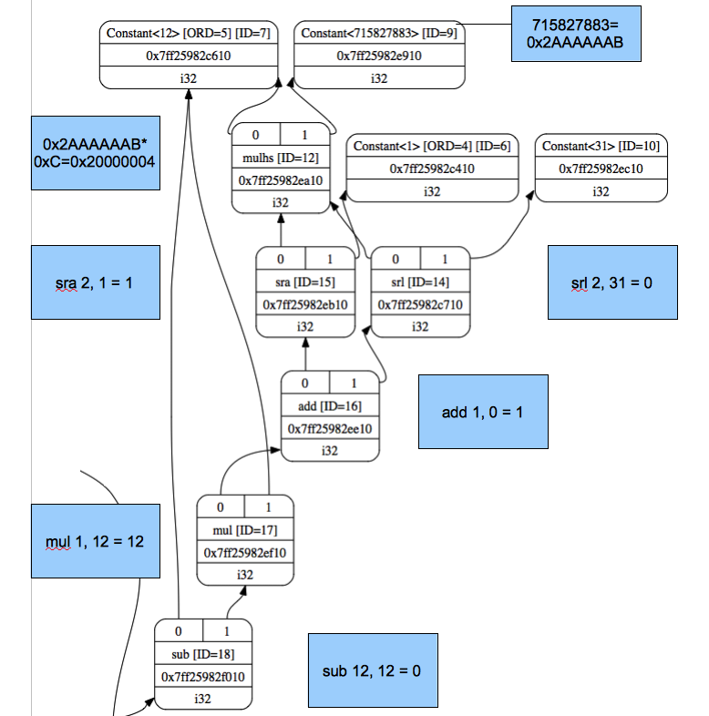
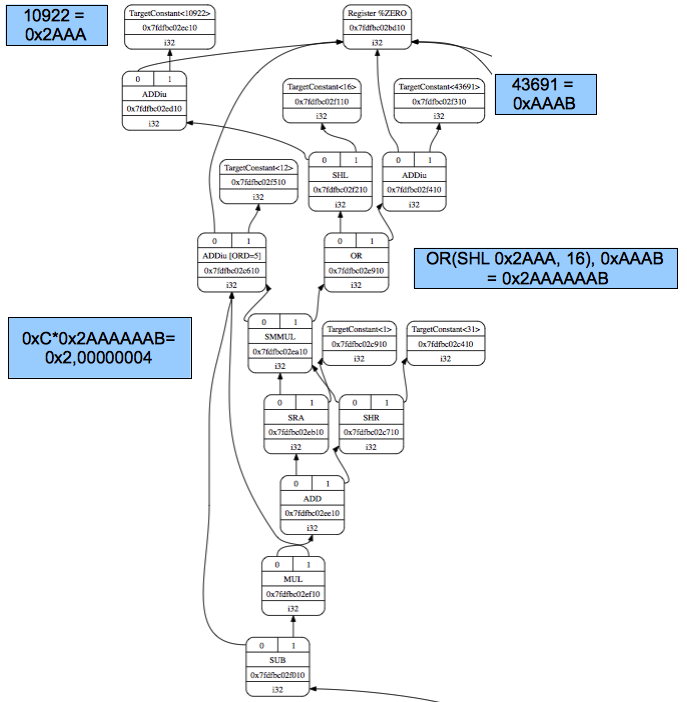

Other instructions
===================

This chapter add more cpu0 arithmetic instructions support first.
The logic operation **“not”** support and translation in 
`section Operator “not” !`_. The `section Display llvm IR nodes with Graphviz`_ 
will show you the DAG optimization steps and their corresponding ``llc`` 
display options. 
These DAG optimization steps result can be displayed by the graphic tool of 
Graphviz which supply very useful information with graphic view. 
You will appreciate Graphviz support in debug, we think. 
In `section Adjust cpu0 instructions`_, 
we adjust cpu0 instructions to support some data type for C language. 
The `section Local variable pointer`_ introduce you the local variable pointer 
translation.
Finally, `section Operator mod, %`_ take care the C operator %.

Support arithmetic instructions
--------------------------------

Run the 3/5/Cpu0 ``llc`` with input file ch4_1_1.bc will get the error as 
follows,

.. code-block:: c++

	// ch4_1_1.cpp
	int main() 
	{ 
		int a = 5; 
		int b = 2; 
		int c = 0; 

		c = a + b; 

		return c; 
	} 

.. code-block:: bash

	[Gamma@localhost 3]$ clang -c ch4_1_1.cpp -emit-llvm -o ch4_1_1.bc 
	[Gamma@localhost 3]$ llvm-dis ch4_1_1.bc -o ch4_1_1.ll 
	[Gamma@localhost 3]$ cat ch4_1.ll 
	; ModuleID = 'ch4_1_1.bc' 
	target datalayout = "e-p:64:64:64-i1:8:8-i8:8:8-i16:16:16-i32:32:32-i64:64:
	64-f32:32:32-f64:64:64-v64:64:64-v128:128:128-a0:0:64-s0:64:64-f80:128:128-
	n8:16:32:64-S128" 
	target triple = "x86_64-unknown-linux-gnu" 
	
	define i32 @main() nounwind uwtable { 
	  %1 = alloca i32, align 4 
	  %a = alloca i32, align 4 
	  %b = alloca i32, align 4 
	  %c = alloca i32, align 4 
	  store i32 0, i32* %1 
	  store i32 5, i32* %a, align 4 
	  store i32 2, i32* %b, align 4 
	  store i32 0, i32* %c, align 4 
	  %2 = load i32* %a, align 4 
	  %3 = load i32* %b, align 4 
	  %4 = add nsw i32 %2, %3 
	  store i32 %4, i32* %c, align 4 
	  %5 = load i32* %c, align 4 
	  ret i32 %5 
	} 
	[Gamma@localhost 3]$ /usr/local/llvm/3.1.test/cpu0/1/cmake_debug_build/bin/
	llc -march=cpu0 -relocation-model=pic -filetype=asm ch4_1_1.bc -o ch4_1_1.
	cpu0.s 
	LLVM ERROR: Cannot select: 0x30da480: i32 = add 0x30da280, 0x30da380 
	[ORD=7] [ID=17] 
	  0x30da280: i32,ch = load 0x30da180, 0x30d9b80, 0x30d9880<LD4[%a]> [ORD=5] 
	  [ID=15] 
		0x30d9b80: i32 = FrameIndex<1> [ORD=2] [ID=5] 
		0x30d9880: i32 = undef [ORD=1] [ID=3] 
	  0x30da380: i32,ch = load 0x30da180, 0x30d9e80, 0x30d9880<LD4[%b]> [ORD=6] 
	  [ID=14] 
		0x30d9e80: i32 = FrameIndex<2> [ORD=3] [ID=7] 
		0x30d9880: i32 = undef [ORD=1] [ID=3] 

This error says we have not instructions to translate IR DAG node **add**. 
The ADDiu instruction is defined for node **add** with operands of 1 register 
and 1 immediate. 
This node **add** is for 2 registers. 
So, appending the following code to Cpu0InstrInfo.td and Cpu0Schedule.td in 
4/1/Cpu0,

.. code-block:: c++

	// Cpu0InstrInfo.td
	/// Arithmetic Instructions (3-Operand, R-Type)
	def CMP	   : CmpInstr<0x10, "cmp", IIAlu, CPURegs, 1>;
	def ADD     : ArithLogicR<0x13, "add", add, IIAlu, CPURegs, 1>;
	def SUB     : ArithLogicR<0x14, "sub", sub, IIAlu, CPURegs, 1>;
	def MUL     : ArithLogicR<0x15, "mul", mul, IIImul, CPURegs, 1>;
	def DIV     : ArithLogicR<0x16, "div", sdiv, IIIdiv, CPURegs, 1>;
	def AND     : ArithLogicR<0x18, "and", and, IIAlu, CPURegs, 1>;
	def OR      : ArithLogicR<0x19, "or", or, IIAlu, CPURegs, 1>;
	def XOR     : ArithLogicR<0x1A, "xor", xor, IIAlu, CPURegs, 1>;
	
	/// Shift Instructions
	def ROL     : ArithLogicR<0x1C, "rol", rotl, IIAlu, CPURegs, 1>;
	def ROR     : ArithLogicR<0x1D, "ror", rotr, IIAlu, CPURegs, 1>;
	def SHL     : ArithLogicR<0x1E, "shl", shl, IIAlu, CPURegs, 1>;
	def SHR     : ArithLogicR<0x1F, "shr", sra, IIAlu, CPURegs, 1>;
	
	// Cpu0Schedule.td
	...
	def ALU     : FuncUnit;
	def IMULDIV : FuncUnit;
	
	//===------------------------------------------------------------------===//
	// Instruction Itinerary classes used for Cpu0
	//===------------------------------------------------------------------===//
	...
	def IIImul             : InstrItinClass;
	def IIIdiv             : InstrItinClass;
	
	def IIPseudo           : InstrItinClass;
	
	//===------------------------------------------------------------------===//
	// Cpu0 Generic instruction itineraries.
	//===------------------------------------------------------------------===//
	// http://llvm.org/docs/doxygen/html/structllvm_1_1InstrStage.html 
	def Cpu0GenericItineraries : ProcessorItineraries<[ALU, IMULDIV], [], [
	...
	  InstrItinData<IIImul             , [InstrStage<17, [IMULDIV]>]>,
	  InstrItinData<IIIdiv             , [InstrStage<38, [IMULDIV]>]>
	]>;

In RISC CPU like Mips, the multiply/divide function unit and add/sub/logic unit 
are designed from two different hardware circuits, and more, their data path is 
separate. We think the cpu0 is the same even though no explanation in it's web 
site.
So, these two function units can be executed at same time (instruction level 
parallelism). Reference [#]_ for instruction itineraries.

Now, let's build 4/1/Cpu0 and run with input file ch4_1_2.cpp. 
This version can process **+, -, \*, /, &, |, ^, <<,** and **>>** operators in C 
language. 
The corresponding llvm IR instructions are **add, sub, mul, sdiv, and, or, xor, 
shl, ashr**. 
IR instruction **sdiv** stand for signed div while **udiv** is for unsigned div. 
The **'ashr'** instruction (arithmetic shift right) returns the first operand 
shifted to the right a specified number of bits with sign extension. 
In brief, we call **ashr** is “shift with sign extension fill”.

.. code:: 

	Example:
	  <result> = ashr i32 4, 1   ; yields {i32}:result = 2
	  <result> = ashr i8 -2, 1   ; yields {i8}:result = -1
	  <result> = ashr i32 1, 32  ; undefined

The C operator **>>** for negative operand is dependent on implementation. 
Most compiler translate it into “shift with sign extension fill”, for example, 
Mips **sra** is the instruction. 
Following is the Micosoft web site explanation,

.. note:: **>>**, Microsoft Specific

	The result of a right shift of a signed negative quantity is implementation 
	dependent. 
	Although Microsoft C++ propagates the most-significant bit to fill vacated 
	bit positions, there is no guarantee that other implementations will do 
	likewise.

In addition to **ashr**, the other instruction “shift with zero filled” 
**lshr** in llvm (Mips implement lshr with instruction **srl**) has the 
following meaning. 

.. code:: 

	Example:
	<result> = lshr i8 -2, 1   ; yields {i8}:result = 0x7FFFFFFF 
	
In llvm, IR node **sra** is defined for ashr IR instruction, node **srl** is 
defined for lshr instruction (I don't know why don't use ashr and lshr as the 
IR node name directly). 
We assume Cpu0 shr instruction is “shift with zero filled”, and define it with 
IR DAG node srl. 
But at that way, Cpu0 will fail to compile x >> 1 in case of x is signed 
integer because clang and most compilers translate it into ashr, which meaning 
“shift with sign extension fill”. 
Similarly, Cpu0 div instruction, has the same problem. We assume Cpu0 div 
instruction is for sdiv which can take care both positive and negative integer, 
but it will fail for divide operation “/ “on unsigned integer operand in C.

If we consider the x >> 1 definition is x = x/2. 
In case of x is unsigned int, range x is 0 ~ 4G-1 (0 ~ 0xFFFFFFFF) in 32 bits 
register, implement shift >> 1 by “shift with zero filled” is correct and 
satisfy the definition x = x/2, but “shift with sign extension fill” is not 
correct for range 2G ~ 4G-1. 
In case of x is signed int, range x is -2G ~ 2G-1, implement x >> 1 by “shift 
with sign extension fill” is correct for the definition, 
but “shift with zero filled” is not correct for range x is -2G ~ -1. 
So, if x = x/2 is definition for x >> 1, in order to satisfy the definition in 
both unsigned and signed integer of x, we need those two instructions, 
“shift with zero filled” and “shift with sign extension fill”.

Again, consider the x << 1 definition is x = x*2. 
We apply the x << 1 with “shift 1 bit to left and fill the least bit with 0”. 
In case of x is unsigned int, x << 1 satisfy the definition in range 0 ~ 2G-1, 
and x is overflow when x > 2G-1 (no need to care what the register value is 
because overflow). In case of x is signed int, x << 1 is correct for -1G ~ 
1G-1; and x is overflow for -2G ~ -1G-1 or 1G ~ 2G-1. 
So, implementation by “shift 1bit to left and fill the least bit with 0” 
satisfy the definition x = x*2 for x << 1, no matter operand x is signed or 
unsigned int.

Micorsoft implementation references as [#]_.

The sub-section "‘ashr‘ Instruction" and sub-section "‘lshr‘ Instruction" of 
[#]_.

The 4/1 version just add 40 lines code in td files. 
With these 40 lines code, it process 9 operators more for C language and their 
corresponding llvm IR instructions. 
The arithmetic instructions are easy to implement by add the definition in td 
file only.

Operator “not” !
-----------------

Files ch4_2.cpp and ch4_2.bc are the C source code for **“not”** boolean operator 
and it's corresponding llvm IR. List them as follows,

.. code-block:: c++

    // ch4_2.cpp
    int main()
    {
      int a = 5;
      int b = 0;
        
      b = !a;
        
      return b;
    }

.. code-block:: bash

    ; ModuleID = 'ch4_2.bc'
    target datalayout = "e-p:32:32:32-i1:8:8-i8:8:8-i16:16:16-i32:32:32-i64:32:64-
    f32:32:32-f64:32:64-v64:64:64-v128:128:128-a0:0:64-f80:128:128-n8:16:32-S128"
    target triple = "i386-apple-macosx10.8.0"
    
    define i32 @main() nounwind ssp {
    entry:
      %retval = alloca i32, align 4
      %a = alloca i32, align 4
      %b = alloca i32, align 4
      store i32 0, i32* %retval
      store i32 5, i32* %a, align 4
      store i32 0, i32* %b, align 4
      %0 = load i32* %a, align 4        // a = %0
      %tobool = icmp ne i32 %0, 0   // ne: stand for not egual
      %lnot = xor i1 %tobool, true
      %conv = zext i1 %lnot to i32  
      store i32 %conv, i32* %b, align 4
      %1 = load i32* %b, align 4
      ret i32 %1
    }

As above comment, b = !a, translate to (xor (icmp ne i32 %0, 0), true). 
The %0 is the virtual register of variable **a** and the result of 
(icmp ne i32 %0, 0) is 1 bit size. 
To prove the translation is correct. 
Let's assume %0 != 0 first, then the (icmp ne i32 %0, 0) = 1 (or true), and 
(xor 1, 1) = 0. 
When %0 = 0, (icmp ne i32 %0, 0) = 0 (or false), and (xor 0, 1) = 1. 
So, the translation is correct. 
    
Now, let's run ch4_2.bc with 4/2/Cpu0 with ``llc -debug`` option to get result 
as follows,

.. code-block:: bash

    118-165-16-22:InputFiles Jonathan$ /Users/Jonathan/llvm/3.1.test/cpu0/1/
    cmake_debug_build/bin/Debug/llc -march=cpu0 -debug -relocation-model=pic 
    -filetype=asm ch4_3.bc -o ch4_3.cpu0.s
    ...
    
    === main
    Initial selection DAG: BB#0 'main:entry'
    SelectionDAG has 20 nodes:
    ...
        0x7fbfc282c510: <multiple use>
              0x7fbfc282c510: <multiple use>
              0x7fbfc282bc10: <multiple use>
              0x7fbfc282c610: ch = setne [ORD=5]
    
            0x7fbfc282c710: i1 = setcc 0x7fbfc282c510, 0x7fbfc282bc10, 
            0x7fbfc282c610 [ORD=5]
    
            0x7fbfc282c810: i1 = Constant<-1> [ORD=6]
    
          0x7fbfc282c910: i1 = xor 0x7fbfc282c710, 0x7fbfc282c810 [ORD=6]
    
        0x7fbfc282ca10: i32 = zero_extend 0x7fbfc282c910 [ORD=7]
    
    ...
    
    
    Replacing.3 0x7fbfc282c910: i1 = xor 0x7fbfc282c710, 0x7fbfc282c810 [ORD=6]
    
    With: 0x7fbfc282ec10: i1 = setcc 0x7fbfc282c510, 0x7fbfc282bc10, 
    0x7fbfc282e910
    
    Optimized lowered selection DAG: BB#0 'main:entry'
    SelectionDAG has 17 nodes:
    ...
          0x7fbfc282c510: <multiple use>
              0x7fbfc282c510: <multiple use>
              0x7fbfc282bc10: <multiple use>
              0x7fbfc282e910: ch = seteq
    
            0x7fbfc282ec10: i1 = setcc 0x7fbfc282c510, 0x7fbfc282bc10, 
            0x7fbfc282e910
    
          0x7fbfc282ca10: i32 = zero_extend 0x7fbfc282ec10 [ORD=7]
    …
    Type-legalized selection DAG: BB#0 'main:entry'
    SelectionDAG has 18 nodes:
    ...
          0x7fbfc282c510: <multiple use>
              0x7fbfc282c510: <multiple use>
              0x7fbfc282bc10: <multiple use>
              0x7fbfc282e910: ch = seteq [ID=-3]
    
            0x7fbfc282c610: i32 = setcc 0x7fbfc282c510, 0x7fbfc282bc10, 
            0x7fbfc282e910 [ID=-3]
    
            0x7fbfc282c710: i32 = Constant<1> [ID=-3]
    
          0x7fbfc282c810: i32 = and 0x7fbfc282c610, 0x7fbfc282c710 [ID=-3]
    
     ...

The (setcc %1, %2, setne) and (xor %3, -1) in “Initial selection DAG” stage 
corresponding (icmp %1, %2, ne) and (xor %3, 1) in ch4_2.bc. 
The argument in xor is 1 bit size (1 and -1 are same, they are all represented 
by 1). 
The (zero_extend %4) of “Initial selection DAG” corresponding (zext i1 %lnot 
to i32) of ch4_2.bc. 
As above it translate 2 DAG nodes (setcc %1, %2, setne) and (xor %3, -1) into 
1 DAG node (setcc %1, %2, seteq) in “Optimized lowered selection DAG” stage. 
This translation is right since for 1 bit size, (xor %3, 1) and (not %3) has 
same result, and (not (setcc %1, %2, setne)) is equal to (setcc %1, %2, seteq). 
In “Optimized lowered selection DAG” stage, it also translate (zero_extern i1 
%lnot to 32) into (and %lnot, 1). 
(zero_extern i1 %lnot to 32) just expand the %lnot to i32 32 bits result, so 
translate into (and %lnot, 1) is correct. 
Finally, translate (setcc %1, %2, seteq) into (xor (xor %1, %2), (ldi $0, 1) in 
“Instruction selection” stage by the rule defined in Cpu0InstrInfo.td as 
follows,

.. code-block:: c++

  //  Cpu0InstrInfo.td
  ...
    
  def : Pat<(not CPURegs:$in),
        (XOR CPURegs:$in, (LDI ZERO, 1))>;

  // setcc patterns
  multiclass SeteqPats<RegisterClass RC, Instruction XOROp,
                       Register ZEROReg> {
    def : Pat<(seteq RC:$lhs, RC:$rhs),
              (XOROp (XOROp RC:$lhs, RC:$rhs), (LDI ZERO, 1))>;
  }
    
  defm : SeteqPats<CPURegs, XOR, ZERO>;

After xor, the (and %4, 1) is translated into (and $2, (ldi $3, 1)) which is 
defined before already. 
List the asm file ch4_3.cpu0.s code fragment as below, you can check it with 
the final result. 

.. code-block:: bash

    118-165-16-22:InputFiles Jonathan$ cat ch4_2.cpu0.s
    ...
    # BB#0:                                 # %entry
        addiu   $sp, $sp, -16
	$tmp1:
		.cfi_def_cfa_offset 16
        addiu   $2, $zero, 0
        st  $2, 12($sp)
        addiu   $3, $zero, 5
        st  $3, 8($sp)
        st  $2, 4($sp)
        ld  $3, 8($sp)
        xor $2, $3, $2
        ldi $3, 1
        xor $2, $2, $3
        addiu   $3, $zero, 1
        and $2, $2, $3
        st  $2, 4($sp)
        addiu   $sp, $sp, 16
        ret $lr
    ...

Display llvm IR nodes with Graphviz
------------------------------------

The previous section, display the DAG translation process in text on terminal 
by ``llc -debug`` option. 
The ``llc`` also support the graphic display. 
The `section Install other tools on iMac`_ mentioned the web for ``llc`` 
graphic display information. 
The ``llc`` graphic display with tool Graphviz is introduced in this section. 
The graphic display is more readable by eye than display text in terminal. 
It's not necessary, but it help a lot especially when you are tired in tracking 
the DAG translation process. 
List the ``llc`` graphic support options from the sub-section "SelectionDAG 
Instruction Selection Process" of web [#]_ as follows,

.. note:: The ``llc`` Graphviz DAG display options

    -view-dag-combine1-dags displays the DAG after being built, before the 
    first optimization pass. 
    
    -view-legalize-dags displays the DAG before Legalization. 
    
    -view-dag-combine2-dags displays the DAG before the second optimization 
    pass. 
    
    -view-isel-dags displays the DAG before the Select phase. 
    
    -view-sched-dags displays the DAG before Scheduling. 
    
By tracking ``llc -debug``, you can see the DAG translation steps as follows,

.. code-block:: bash

    Initial selection DAG
    Optimized lowered selection DAG
    Type-legalized selection DAG
    Optimized type-legalized selection DAG
    Legalized selection DAG
    Optimized legalized selection DAG
    Instruction selection
    Selected selection DAG
    Scheduling
    …

Let's run ``llc`` with option -view-dag-combine1-dags, and open the output 
result with Graphviz as follows,

.. code-block:: bash

    118-165-12-177:InputFiles Jonathan$ /Users/Jonathan/llvm/3.1.test/cpu0/1/
    cmake_debug_build/bin/Debug/llc -view-dag-combine1-dags -march=cpu0 
    -relocation-model=pic -filetype=asm ch4_2.bc -o ch4_2.cpu0.s
    Writing '/tmp/llvm_84ibpm/dag.main.dot'...  done. 
    118-165-12-177:InputFiles Jonathan$ Graphviz /tmp/llvm_84ibpm/dag.main.dot 

It will show the /tmp/llvm_84ibpm/dag.main.dot as :ref:`otherinst_f1`.

.. _otherinst_f1:
.. figure:: ../Fig/otherinst/1.png
    :height: 851 px
    :width: 687 px
    :scale: 100 %
    :align: center

    llc option -view-dag-combine1-dags graphic view
    
From :ref:`otherinst_f1`, we can see the -view-dag-combine1-dags option is for 
Initial selection DAG. 
We list the other view options and their corresponding DAG translation stage as 
follows,

.. code-block:: bash

    -view-dag-combine1-dags: Initial selection DAG
    -view-legalize-dags: Optimized type-legalized selection DAG
    -view-dag-combine2-dags: Legalized selection DAG
    -view-isel-dags: Optimized legalized selection DAG
    -view-sched-dags: Selected selection DAG

The -view-isel-dags is important and often used by an llvm backend writer 
because it is the DAG before instruction selection. 
The backend programmer need to know what is the DAG for writing the pattern 
match instruction in target description file .td.

Adjust cpu0 instructions 
-------------------------

We decide add instructions udiv and sra to avoid compiler errors for C language 
operators **“/”** in unsigned int and **“>>”** in signed int as 
`section Support arithmetic instructions`_ mentioned. 
To support these 2 operators, we only need to add these code in 
Cpu0InstrInfo.td as follows,

.. code-block:: c++

    //  Cpu0InstsInfo.td
    ...
    def UDIV    : ArithLogicR<0x17, "udiv", udiv, IIIdiv, CPURegs, 1>;
    …
    /// Shift Instructions
    // work, it's for ashr llvm IR instruction
    def SRA     : shift_rotate_imm32<0x1B, 0x00, "sra", sra>;

To use addiu only instead of ldi, change Cpu0InstrInfo.td as follows,

.. code-block:: c++

  //  Cpu0InstsInfo.td
  ...
  //def LDI     : MoveImm<0x08, "ldi", add, simm16, immSExt16, CPURegs>;
  ...
  // setcc patterns
  multiclass SeteqPats<RegisterClass RC, Instruction XOROp> {
    def : Pat<(seteq RC:$lhs, RC:$rhs),
        (XOROp (XOROp RC:$lhs, RC:$rhs), (ADDiu ZERO, 1))>;
  }
  
  defm : SeteqPats<CPURegs, XOR>;

Run ch4_4.cpp with code 4/4/Cpu0 which support udiv, sra, and use addiu only 
instead of ldi, will get the result as follows,

.. code-block:: c++
    
    // ch4_4.cpp
    int main()
    {
        int a = 1;
        int b = 2;
        int k = 0;
        unsigned int a1 = -5, f1 = 0;
        
        f1 = a1 / b;
        k = (a >> 2);
    
        return k;
    }

.. code-block:: bash

    118-165-13-40:InputFiles Jonathan$ clang -c ch4_4.cpp -emit-llvm -o ch4_4.bc
    118-165-13-40:InputFiles Jonathan$ /Users/Jonathan/llvm/3.1.test/cpu0/1/
    cmake_debug_build/bin/Debug/llc -march=cpu0 -relocation-model=pic -filetype=asm 
    ch4_4.bc -o ch4_4.cpu0.s
    118-165-13-40:InputFiles Jonathan$ cat ch4_4.cpu0.s
        …
        addiu   $sp, $sp, -24
        addiu   $2, $zero, 0
        ...
        udiv    $2, $3, $2
        st  $2, 0($sp)
        ld  $2, 16($sp)
        sra $2, $2, 2
        ...

Use cpu0 official LDI instead of ADDiu
~~~~~~~~~~~~~~~~~~~~~~~~~~~~~~~~~~~~~~~

According cpu0 web site instruction definition. 
There is no addiu instruction definition. 
We add **addiu** instruction because we find this instruction is more powerful 
and reasonable than **ldi** instruction. 
We highlight this change in `section CPU0 processor architecture`_. 
Even with that, we show you how to replace our **addiu** with **ldi** according 
the cpu0 original design. 
4/5_2/Cpu0 is the code changes for use **ldi** instruction. 
This changes replace **addiu** with **ldi** in Cpu0InstrInfo.td and modify 
Cpu0FrameLowering.cpp as follows,

.. code-block:: c++

    // Cpu0InstrInfo.td
    …
    
    /// Arithmetic Instructions (ALU Immediate)
    def LDI     : MoveImm<0x08, "ldi", add, simm16, immSExt16, CPURegs>;
    // add defined in include/llvm/Target/TargetSelectionDAG.td, line 315 (def add).
    //def ADDiu   : ArithLogicI<0x09, "addiu", add, simm16, immSExt16, CPURegs>;
    …
    
    // Small immediates
    
    def : Pat<(i32 immSExt16:$in),
              (LDI ZERO, imm:$in)>;
    
    // hi/lo relocs
    def : Pat<(Cpu0Hi tglobaladdr:$in), (SHL (LDI ZERO, tglobaladdr:$in), 16)>;
    // Expect cpu0 add LUi support, like Mips
    //def : Pat<(Cpu0Hi tglobaladdr:$in), (LUi tglobaladdr:$in)>;
    def : Pat<(Cpu0Lo tglobaladdr:$in), (LDI ZERO, tglobaladdr:$in)>;
    
    def : Pat<(add CPURegs:$hi, (Cpu0Lo tglobaladdr:$lo)),
              (ADD CPURegs:$hi, (LDI ZERO, tglobaladdr:$lo))>;
    
    // gp_rel relocs
    def : Pat<(add CPURegs:$gp, (Cpu0GPRel tglobaladdr:$in)),
              (ADD CPURegs:$gp, (LDI ZERO, tglobaladdr:$in))>;
    
    def : Pat<(not CPURegs:$in),
               (XOR CPURegs:$in, (LDI ZERO, 1))>;
    
    // Cpu0FrameLowering.cpp
    ...
    void Cpu0FrameLowering::emitPrologue(MachineFunction &MF) const {
      ...
      // Adjust stack.
      if (isInt<16>(-StackSize)) {
        // ldi fp, (-stacksize)
        // add sp, sp, fp
        BuildMI(MBB, MBBI, dl, TII.get(Cpu0::LDI), Cpu0::FP).addReg(Cpu0::FP)
                                                            .addImm(-StackSize);
        BuildMI(MBB, MBBI, dl, TII.get(Cpu0::ADD), SP).addReg(SP).addReg(Cpu0::FP);
      }
      …
    }
    
    void Cpu0FrameLowering::emitEpilogue(MachineFunction &MF,
                                     MachineBasicBlock &MBB) const {
      …
      // Adjust stack.
      if (isInt<16>(-StackSize)) {
        // ldi fp, (-stacksize)
        // add sp, sp, fp
        BuildMI(MBB, MBBI, dl, TII.get(Cpu0::LDI), Cpu0::FP).addReg(Cpu0::FP)
                                                            .addImm(-StackSize);
        BuildMI(MBB, MBBI, dl, TII.get(Cpu0::ADD), SP).addReg(SP).addReg(Cpu0::FP);
      }
      …
    }

As above code, we use **add** IR binary instruction (1 register operand and 1 
immediate operand, and the register operand is fixed with ZERO) in our solution 
since we didn't find the **move** IR unary instruction. 
This code is correct since all the immediate value is translated into 
**“ldi Zero, imm/address”**. 
And **(add CPURegs:$gp, $imm16)** is translated into 
**(ADD CPURegs:$gp, (LDI ZERO, $imm16))**. 
Let's run 4/4_2/Cpu0 with ch4_4.cpp to get the correct result 
below. 
As you will see, **“addiu $sp, $sp, -24”** will be replaced with the pair 
instructions of **“ldi $fp, -24”** and **“add $sp, $sp, $fp”**. 
Since the $sp pointer adjustment is so frequently occurs (it occurs in every 
function entry and exit point), 
we reserve the $fp to the pair of stack adjustment instructions **“ldi”** and 
**“add”**. 
If we didn't reserve the dedicate registers $fp and $sp, it need to save 
and restore them in the stack adjustment. 
It meaning more instructions running cost in this. 
Anyway, the pair of **“ldi”** and **“add”** to adjust stack pointer is double 
in cost compete to **“addiu”**, that's the benefit we mentioned in 
`section CPU0 processor architecture`_.

.. code-block:: bash

  118-165-66-82:InputFiles Jonathan$ /Users/Jonathan/llvm/3.1.test/cpu0/1/cmake_
  debug_build/bin/Debug/llc -march=cpu0 -relocation-model=pic -filetype=asm 
  ch4_4.bc -o ch4_4.cpu0.s
  118-165-66-82:InputFiles Jonathan$ cat ch4_4.cpu0.s 
    .section .mdebug.abi32
    .previous
    .file "ch4_4.bc"
    .text
    .globl  main
    .align  2
    .type main,@function
    .ent  main                    # @main
  main:
    .cfi_startproc
    .frame  $sp,24,$lr
    .mask   0x00000000,0
    .set  noreorder
    .set  nomacro
  # BB#0:
    ldi $fp, -24
    add $sp, $sp, $fp
  $tmp1:
    .cfi_def_cfa_offset 24
    ldi $2, 0
    st  $2, 20($sp)
    ldi $3, 1
    st  $3, 16($sp)
    ldi $3, 2
    st  $3, 12($sp)
    st  $2, 8($sp)
    ldi $3, -5
    st  $3, 4($sp)
    st  $2, 0($sp)
    ld  $2, 12($sp)
    ld  $3, 4($sp)
    udiv  $2, $3, $2
    st  $2, 0($sp)
    ld  $2, 16($sp)
    sra $2, $2, 2
    st  $2, 8($sp)
    ldi $fp, 24
    add $sp, $sp, $fp
    ret $lr
    .set  macro
    .set  reorder
    .end  main
  $tmp2:
    .size main, ($tmp2)-main
    .cfi_endproc

Local variable pointer
-----------------------

To support pointer to local variable, add this code fragment in 
Cpu0InstrInfo.td and Cpu0InstPrinter.cpp as follows,

.. code-block:: c++

    // Cpu0InstrInfo.td
    ...
    def mem_ea : Operand<i32> {
      let PrintMethod = "printMemOperandEA";
      let MIOperandInfo = (ops CPURegs, simm16);
      let EncoderMethod = "getMemEncoding";
    }
    ...
    class EffectiveAddress<string instr_asm, RegisterClass RC, Operand Mem> :
      FMem<0x09, (outs RC:$ra), (ins Mem:$addr),
         instr_asm, [(set RC:$ra, addr:$addr)], IIAlu>;
    ...
    // FrameIndexes are legalized when they are operands from load/store
    // instructions. The same not happens for stack address copies, so an
    // add op with mem ComplexPattern is used and the stack address copy
    // can be matched. It's similar to Sparc LEA_ADDRi
    def LEA_ADDiu : EffectiveAddress<"addiu\t$ra, $addr", CPURegs, mem_ea> {
      let isCodeGenOnly = 1;
    }
    
    // Cpu0InstPrinter.cpp
    ...
    void Cpu0InstPrinter::
    printMemOperandEA(const MCInst *MI, int opNum, raw_ostream &O) {
      // when using stack locations for not load/store instructions
      // print the same way as all normal 3 operand instructions.
      printOperand(MI, opNum, O);
      O << ", ";
      printOperand(MI, opNum+1, O);
      return;
    }

Run ch4_5.cpp with code 4/5/Cpu0 which support pointer to local variable, 
will get result as follows,

.. code-block:: c++

  // ch4_5.cpp
  int main()
  {
    int b = 3;
    
    int* p = &b;
  
    return *p;
  }

.. code-block:: bash

  118-165-66-82:InputFiles Jonathan$ clang -c ch4_5.cpp -emit-llvm -o ch4_5.bc
  118-165-66-82:InputFiles Jonathan$ /Users/Jonathan/llvm/3.1.test/cpu0/1/cmake_
  debug_build/bin/Debug/llc -march=cpu0 -relocation-model=pic -filetype=asm 
  ch4_5.bc -o ch4_5.cpu0.s
  118-165-66-82:InputFiles Jonathan$ cat ch4_5.cpu0.s 
    .section .mdebug.abi32
    .previous
    .file "ch4_5.bc"
    .text
    .globl  main
    .align  2
    .type main,@function
    .ent  main                    # @main
  main:
    .cfi_startproc
    .frame  $sp,16,$lr
    .mask   0x00000000,0
    .set  noreorder
    .set  nomacro
  # BB#0:
    addiu $sp, $sp, -16
  $tmp1:
    .cfi_def_cfa_offset 16
    addiu $2, $zero, 0
    st  $2, 12($sp)
    addiu $2, $zero, 3
    st  $2, 8($sp)
    addiu $2, $sp, 8
    st  $2, 0($sp)
    addiu $sp, $sp, 16
    ret $lr
    .set  macro
    .set  reorder
    .end  main
  $tmp2:
    .size main, ($tmp2)-main
    .cfi_endproc

Operator mod, %
-----------------

The DAG of %
~~~~~~~~~~~~~

Example input code ch4_6.cpp which contains the C operator **“%”** and it's 
corresponding llvm IR, as follows,

.. code-block:: c++

  // ch4_6.cpp
  int main()
  {
    int b = 11;
    //  unsigned int b = 11;
        
    b = (b+1)%12;
        
    return b;
  }

.. code-block:: bash

  ; ModuleID = 'ch4_6.bc'
   target datalayout = "e-p:32:32:32-i1:8:8-i8:8:8-i16:16:16-i32:32:32-i64:32:64-
   f32:32:32-f64:32:64-v64:64:64-v128:128:128-a0:0:64-f80:128:128-n8:16:32-S128"
  target triple = "i386-apple-macosx10.8.0"
    
  define i32 @main() nounwind ssp {
  entry:
    %retval = alloca i32, align 4
    %b = alloca i32, align 4
    store i32 0, i32* %retval
    store i32 11, i32* %b, align 4
    %0 = load i32* %b, align 4
    %add = add nsw i32 %0, 1
    %rem = srem i32 %add, 12
    store i32 %rem, i32* %b, align 4
    %1 = load i32* %b, align 4
    ret i32 %1
  }

LLVM **srem** is the IR corresponding **“%”**, reference sub-section "srem instruction" 
of [#]_. 
Copy the reference as follows,

.. note:: **'srem'** Instruction 

    Syntax:
      **<result> = srem <ty> <op1>, <op2>   ; yields {ty}:result**
      
    Overview:
    The **'srem'** instruction returns the remainder from the signed division of its 
    two operands. This instruction can also take vector versions of the values in 
    which case the elements must be integers.
    
    Arguments:
    The two arguments to the **'srem'** instruction must be integer or vector of 
    integer values. Both arguments must have identical types.
    
    Semantics:
    This instruction returns the remainder of a division (where the result is 
    either zero or has the same sign as the dividend, op1), not the modulo operator 
    (where the result is either zero or has the same sign as the divisor, op2) of 
    a value. For more information about the difference, see The Math Forum. For a 
    table of how this is implemented in various languages, please see Wikipedia: 
    modulo operation.
    
    Note that signed integer remainder and unsigned integer remainder are distinct 
    operations; for unsigned integer remainder, use **'urem'**.
    
    Taking the remainder of a division by zero leads to undefined behavior. 
    Overflow also leads to undefined behavior; this is a rare case, but can occur, 
    for example, by taking the remainder of a 32-bit division of -2147483648 by -1. 
    (The remainder doesn't actually overflow, but this rule lets srem be 
    implemented using instructions that return both the result of the division and 
    the remainder.)
    
    Example:
      <result> = **srem i32 4, %var**          ; yields {i32}:result = 4 % %var

Run 4/5/Cpu0 with input file ch4_6.bc and ``llc`` option –view-isel-dags as 
follows, will get the error message as follows and the llvm DAG of 
:ref:`otherinst_f2`.

.. code-block:: bash

    118-165-79-37:InputFiles Jonathan$ /Users/Jonathan/llvm/3.1.test/cpu0/1/
    cmake_debug_build/bin/Debug/llc -march=cpu0 -view-isel-dags -relocation-model=
    pic -filetype=asm ch4_6.bc -o ch4_6.cpu0.s
    ...
    LLVM ERROR: Cannot select: 0x7fa73a02ea10: i32 = mulhs 0x7fa73a02c610, 
    0x7fa73a02e910 [ID=12]
      0x7fa73a02c610: i32 = Constant<12> [ORD=5] [ID=7]
      0x7fa73a02e910: i32 = Constant<715827883> [ID=9]

.. _otherinst_f2:

    ch4_6.bc DAG

LLVM replace srem divide operation with multiply operation in DAG optimization 
because DIV operation cost more in time than MUL. 
For example code **“int b = 11; b=(b+1)%12;”**, it translate into :ref:`otherinst_f2`. 
We verify the result and explain by calculate the value in each node. 
The 0xC*0x2AAAAAAB=0x2,00000004, (mulhs 0xC, 0x2AAAAAAAB) meaning get the Signed 
mul high word (32bits). 
Multiply with 2 operands of 1 word size generate the 2 word size of result 
(0x2, 0xAAAAAAAB). 
The high word result, in this case is 0x2. 
The final result (sub 12, 12) is 0 which match the statement (11+1)%12.

 
Arm solution
~~~~~~~~~~~~~

Let's run 4/6_1/Cpu0 with ch4_6.cpp as well as ``llc -view-sched-dags`` option 
to get :ref:`otherinst_f3`. 
Similarly, SMMUL get the high word of multiply result.

.. _otherinst_f3:

    Translate ch4_6.bc into cpu0 backend DAG

Follows is the result of run 4/6_1/Cpu0 with ch4_6.bc.

.. code-block:: bash

    118-165-66-82:InputFiles Jonathan$ /Users/Jonathan/llvm/3.1.test/cpu0/1/cmake_
    debug_build/bin/Debug/llc -march=cpu0 -relocation-model=pic -filetype=asm 
    ch4_6.bc -o ch4_6.cpu0.s
    118-165-71-252:InputFiles Jonathan$ cat ch4_6.cpu0.s 
        .section .mdebug.abi32
        .previous
        .file   "ch4_6.bc"
        .text
        .globl  main
        .align  2
        .type   main,@function
        .ent    main                    # @main
    main:
        .frame  $sp,8,$lr
        .mask   0x00000000,0
        .set    noreorder
        .set    nomacro
    # BB#0:                                 # %entry
        addiu   $sp, $sp, -8
        addiu   $2, $zero, 0
        st  $2, 4($sp)
        addiu   $2, $zero, 11
        st  $2, 0($sp)
        addiu   $2, $zero, 10922
        shl $2, $2, 16
        addiu   $3, $zero, 43691
        or  $3, $2, $3
        addiu   $2, $zero, 12
        smmul   $3, $2, $3
        shr $4, $3, 31
        sra $3, $3, 1
        add $3, $3, $4
        mul $3, $3, $2
        sub $2, $2, $3
        st  $2, 0($sp)
        addiu   $sp, $sp, 8
        ret $lr
        .set    macro
        .set    reorder
        .end    main
    $tmp1:
        .size   main, ($tmp1)-main
    
The other instruction UMMUL and llvm IR mulhu are unsigned int type for 
operator %. 
You can check it by unmark the **“unsigned int b = 11;”** in ch4_6.cpp.

Use SMMUL instruction to get the high word of multiplication result is adopted 
in ARM. 
The 4/6_1/Cpu0 use the ARM solution. 
With this solution, the following code is needed.

.. code-block:: c++

  // Cpu0InstrInfo.td
  …
  // Transformation Function - get the lower 16 bits.
  def LO16 : SDNodeXForm<imm, [{
    return getImm(N, N->getZExtValue() & 0xFFFF);
  }]>;
  
  // Transformation Function - get the higher 16 bits.
  def HI16 : SDNodeXForm<imm, [{
    return getImm(N, (N->getZExtValue() >> 16) & 0xFFFF);
  }]>;
  …
  def SMMUL   : ArithLogicR<0x50, "smmul", mulhs, IIImul, CPURegs, 1>;
  def UMMUL   : ArithLogicR<0x51, "ummul", mulhu, IIImul, CPURegs, 1>;
  …
  // Arbitrary immediates
  def : Pat<(i32 imm:$imm),
        (OR (SHL (ADDiu ZERO, (HI16 imm:$imm)), 16), (ADDiu ZERO, (LO16 imm:$imm)))>;

Mips solution
~~~~~~~~~~~~~~

Mips use MULT instruction and save the high & low part to register HI and LO. 
After that, use mfhi/mflo to move register HI/LO to your general purpose 
register. 
ARM SMMUL is fast if you only need the HI part of result (it ignore the LO part 
of operation). 
Meanwhile Mips is fast if you need both the HI and LO result. 
If you need the LO part of result, you can use Cpu0 MUL instruction which only 
get the LO part of result. 
4/6_2/Cpu0 is implemented with Mips MULT style. 
We choose it as the implementation of this book. 
For Mips style implementation, we add the following code in 
Cpu0RegisterInfo.td, Cpu0InstrInfo.td and Cpu0ISelDAGToDAG.cpp. 
And list the related DAG nodes mulhs and mulhu which are used in 4/6_2/Cpu0 
from TargetSelectionDAG.td.

.. code-block:: c++

  // Cpu0RegisterInfo.td
    ...
    // Hi/Lo registers
    def HI  : Register<"hi">, DwarfRegNum<[18]>;
      def LO  : Register<"lo">, DwarfRegNum<[19]>;
    
  // Cpu0Schedule.td
  ...
  def IIHiLo             : InstrItinClass;
  ...
  def Cpu0GenericItineraries : ProcessorItineraries<[ALU, IMULDIV], [], [
    ...
    InstrItinData<IIHiLo             , [InstrStage<1,  [IMULDIV]>]>,
    …
  ]>;

  // Cpu0InstrInfo.td
  ...
  // Mul, Div
  class Mult<bits<8> op, string instr_asm, InstrItinClass itin,
             RegisterClass RC, list<Register> DefRegs>:
    FL<op, (outs), (ins RC:$ra, RC:$rb),
        !strconcat(instr_asm, "\t$ra, $rb"), [], itin> {
    let imm16 = 0;
    let isCommutable = 1;
    let Defs = DefRegs;
    let neverHasSideEffects = 1;
  }
    
  class Mult32<bits<8> op, string instr_asm, InstrItinClass itin>:
    Mult<op, instr_asm, itin, CPURegs, [HI, LO]>;
    
  // Move from Hi/Lo
  class MoveFromLOHI<bits<8> op, string instr_asm, RegisterClass RC,
                   list<Register> UseRegs>:
    FL<op, (outs RC:$ra), (ins),
       !strconcat(instr_asm, "\t$ra"), [], IIHiLo> {
    let rb = 0;
    let imm16 = 0;
    let Uses = UseRegs;
    let neverHasSideEffects = 1;
  }
  ...
  def MULT    : Mult32<0x50, "mult", IIImul>;
  def MULTu   : Mult32<0x51, "multu", IIImul>;
    
  def MFHI : MoveFromLOHI<0x40, "mfhi", CPURegs, [HI]>;
  def MFLO : MoveFromLOHI<0x41, "mflo", CPURegs, [LO]>;
    
  // Cpu0ISelDAGToDAG.cpp
  ...
  /// Select multiply instructions.
  std::pair<SDNode*, SDNode*>
  Cpu0DAGToDAGISel::SelectMULT(SDNode *N, unsigned Opc, DebugLoc dl, EVT Ty,
                                bool HasLo, bool HasHi) {
    SDNode *Lo = 0, *Hi = 0;
    SDNode *Mul = CurDAG->getMachineNode(Opc, dl, MVT::Glue, N->getOperand(0),
                                          N->getOperand(1));
    SDValue InFlag = SDValue(Mul, 0);
    
    if (HasLo) {
      Lo = CurDAG->getMachineNode(Cpu0::MFLO, dl,
                                  Ty, MVT::Glue, InFlag);
      InFlag = SDValue(Lo, 1);
    }
    if (HasHi)
      Hi = CurDAG->getMachineNode(Cpu0::MFHI, dl,
                                    Ty, InFlag);
    
    return std::make_pair(Lo, Hi);
  }
    
  /// Select instructions not customized! Used for
  /// expanded, promoted and normal instructions
  SDNode* Cpu0DAGToDAGISel::Select(SDNode *Node) {
    unsigned Opcode = Node->getOpcode();
    ...
    switch(Opcode) {
    default: break;
    
    case ISD::MULHS:
    case ISD::MULHU: {
      MultOpc = (Opcode == ISD::MULHU ? Cpu0::MULTu : Cpu0::MULT);
      return SelectMULT(Node, MultOpc, dl, NodeTy, false, true).second;
    }
    ...
  }
    
  // TargetSelectionDAG.td
  ...
  def mulhs      : SDNode<"ISD::MULHS"     , SDTIntBinOp, [SDNPCommutative]>;
  def mulhu      : SDNode<"ISD::MULHU"     , SDTIntBinOp, [SDNPCommutative]>;

    
Except the custom type, llvm IR operations of expand and promote type will call 
Cpu0DAGToDAGISel::Select() during instruction selection of DAG translation. 
In Select(), it return the HI part of multiplication result to HI register, 
for IR operations of mulhs or mulhu, and LO part to LO register. 
After that, MFHI instruction move the HI register to $ra register. 
MFHI instruction is FL format and only use $ra register, we set the $rb and 
imm16 to 0. :ref:`otherinst_f4` and ch4_6.cpu0.s are the result of compile 
ch4_6.bc.

.. _otherinst_f4:
.. figure:: ../Fig/otherinst/4.png
    :height: 807 px
    :width: 309 px
    :scale: 75 %
    :align: center

    DAG for ch4_6.bc with Mips style MULT

.. code-block:: bash

  118-165-66-82:InputFiles Jonathan$ cat ch4_6.cpu0.s 
    .section .mdebug.abi32
    .previous
    .file "ch4_6.bc"
    .text
    .globl  main
    .align  2
    .type main,@function
    .ent  main                    # @main
  main:
    .cfi_startproc
    .frame  $sp,8,$lr
    .mask   0x00000000,0
    .set  noreorder
    .set  nomacro
  # BB#0:
    addiu $sp, $sp, -8
  $tmp1:
    .cfi_def_cfa_offset 8
    addiu $2, $zero, 0
    st  $2, 4($sp)
    addiu $2, $zero, 11
    st  $2, 0($sp)
    addiu $2, $zero, 10922
    shl $2, $2, 16
    addiu $3, $zero, 43691
    or  $3, $2, $3
    addiu $2, $zero, 12
    mult  $2, $3
    mfhi  $3
    shr $4, $3, 31
    sra $3, $3, 1
    add $3, $3, $4
    mul $3, $3, $2
    sub $2, $2, $3
    st  $2, 0($sp)
    addiu $sp, $sp, 8
    ret $lr
    .set  macro
    .set  reorder
    .end  main
  $tmp2:
    .size main, ($tmp2)-main
    .cfi_endproc

Summary
--------
We support most of C operators in this chapter. 
Until now, we have 3226 lines of source code with comments. 
With these 199 lines of source code added, it support the number of operators 
from three to over ten.

.. _section Operator “not” !:
    http://jonathan2251.github.com/lbd/otherinst.html#operator-not

.. _section Display llvm IR nodes with Graphviz:
    http://jonathan2251.github.com/lbd/otherinst.html#display-llvm-ir-nodes-
    with-graphviz

.. _section Adjust cpu0 instructions:
    http://jonathan2251.github.com/lbd/otherinst.html#adjust-cpu0-instructions

.. _section Local variable pointer:
    http://jonathan2251.github.com/lbd/otherinst.html#local-variable-pointer

.. _section Operator mod, %:
    http://jonathan2251.github.com/lbd/otherinst.html#operator-mod

.. _section Install other tools on iMac:
    http://jonathan2251.github.com/lbd/install.html#install-other-tools-on-imac

.. _section CPU0 processor architecture:
    http://jonathan2251.github.com/lbd/llvmstructure.html#cpu0-processor-
    architecture

.. _section Support arithmetic instructions:
    http://jonathan2251.github.com/lbd/otherinst.html#support-arithmetic-
    instructions

.. [#] http://llvm.org/docs/doxygen/html/structllvm_1_1InstrStage.html

.. [#] http://msdn.microsoft.com/en-us/library/336xbhcz%28v=vs.80%29.aspx

.. [#] http://llvm.org/docs/LangRef.html.

.. [#] http://llvm.org/docs/CodeGenerator.html

.. [#] http://llvm.org/docs/LangRef.html
