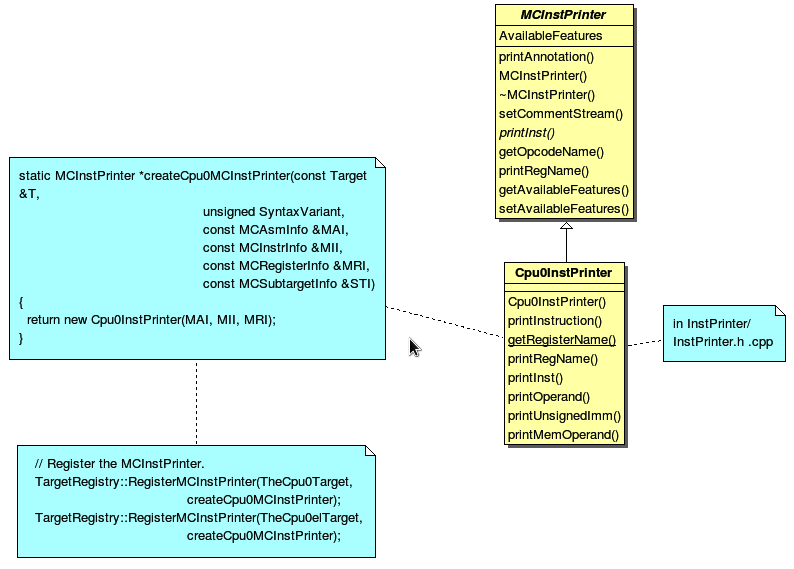

Other instructions
===================

I will add more cpu0 instructions support in this chapter. Begin from 
arithmetic instructions. 
Next, beyond assembly code generated which finished in last chapter, I add the 
obj file generated support in this chapter.

Support arithmetic instructions
--------------------------------

Run the 3/5/Cpu0 llc with input file ch4_1.bc will get the error as follows,

.. code-block:: c++

	// ch4_1.cpp
	int main() 
	{ 
		int a = 5; 
		int b = 2; 
		int c = 0; 

		c = a + b; 

		return c; 
	} 

.. code-block:: bash

	[Gamma@localhost 3]$ clang -c ch4_1.cpp -emit-llvm -o ch4_1.bc 
	[Gamma@localhost 3]$ llvm-dis ch4_1.bc -o ch4_1.ll 
	[Gamma@localhost 3]$ cat ch4_1.ll 
	; ModuleID = 'ch4_1.bc' 
	target datalayout = "e-p:64:64:64-i1:8:8-i8:8:8-i16:16:16-i32:32:32-i64:64:
	64-f32:32:32-f64:64:64-v64:64:64-v128:128:128-a0:0:64-s0:64:64-f80:128:128-
	n8:16:32:64-S128" 
	target triple = "x86_64-unknown-linux-gnu" 
	
	define i32 @main() nounwind uwtable { 
	  %1 = alloca i32, align 4 
	  %a = alloca i32, align 4 
	  %b = alloca i32, align 4 
	  %c = alloca i32, align 4 
	  store i32 0, i32* %1 
	  store i32 5, i32* %a, align 4 
	  store i32 2, i32* %b, align 4 
	  store i32 0, i32* %c, align 4 
	  %2 = load i32* %a, align 4 
	  %3 = load i32* %b, align 4 
	  %4 = add nsw i32 %2, %3 
	  store i32 %4, i32* %c, align 4 
	  %5 = load i32* %c, align 4 
	  ret i32 %5 
	} 
	[Gamma@localhost 3]$ /usr/local/llvm/3.1.test/cpu0/1/cmake_debug_build/bin/
	llc -march=cpu0 -relocation-model=pic -filetype=asm ch4_1.bc -o ch4_1.cpu0.s 
	LLVM ERROR: Cannot select: 0x30da480: i32 = add 0x30da280, 0x30da380 
	[ORD=7] [ID=17] 
	  0x30da280: i32,ch = load 0x30da180, 0x30d9b80, 0x30d9880<LD4[%a]> [ORD=5] 
	  [ID=15] 
		0x30d9b80: i32 = FrameIndex<1> [ORD=2] [ID=5] 
		0x30d9880: i32 = undef [ORD=1] [ID=3] 
	  0x30da380: i32,ch = load 0x30da180, 0x30d9e80, 0x30d9880<LD4[%b]> [ORD=6] 
	  [ID=14] 
		0x30d9e80: i32 = FrameIndex<2> [ORD=3] [ID=7] 
		0x30d9880: i32 = undef [ORD=1] [ID=3] 

This error say we have not instructions to translate IR DAG node add. 
The ADDiu instruction is defined for node add with operands of 1 register and 1 
immediate. 
This node add is for 2 registers. 
So, we append the following code to Cpu0InstrInfo.td and Cpu0Schedule.td in 
4/1/Cpu0,

.. code-block:: c++

	// Cpu0InstrInfo.td
	/// Arithmetic Instructions (3-Operand, R-Type)
	def CMP	   : CmpInstr<0x10, "cmp", IIAlu, CPURegs, 1>;
	def ADD     : ArithLogicR<0x13, "add", add, IIAlu, CPURegs, 1>;
	def SUB     : ArithLogicR<0x14, "sub", sub, IIAlu, CPURegs, 1>;
	def MUL     : ArithLogicR<0x15, "mul", mul, IIImul, CPURegs, 1>;
	def DIV     : ArithLogicR<0x16, "div", sdiv, IIIdiv, CPURegs, 1>;
	def AND     : ArithLogicR<0x18, "and", and, IIAlu, CPURegs, 1>;
	def OR      : ArithLogicR<0x19, "or", or, IIAlu, CPURegs, 1>;
	def XOR     : ArithLogicR<0x1A, "xor", xor, IIAlu, CPURegs, 1>;
	
	/// Shift Instructions
	def ROL     : ArithLogicR<0x1C, "rol", rotl, IIAlu, CPURegs, 1>;
	def ROR     : ArithLogicR<0x1D, "ror", rotr, IIAlu, CPURegs, 1>;
	def SHL     : ArithLogicR<0x1E, "shl", shl, IIAlu, CPURegs, 1>;
	def SHR     : ArithLogicR<0x1F, "shr", sra, IIAlu, CPURegs, 1>;
	
	// Cpu0Schedule.td
	...
	def ALU     : FuncUnit;
	def IMULDIV : FuncUnit;
	
	//===------------------------------------------------------------------===//
	// Instruction Itinerary classes used for Cpu0
	//===------------------------------------------------------------------===//
	...
	def IIImul             : InstrItinClass;
	def IIIdiv             : InstrItinClass;
	
	def IIPseudo           : InstrItinClass;
	
	//===------------------------------------------------------------------===//
	// Cpu0 Generic instruction itineraries.
	//===------------------------------------------------------------------===//
	// http://llvm.org/docs/doxygen/html/structllvm_1_1InstrStage.html
	def Cpu0GenericItineraries : ProcessorItineraries<[ALU, IMULDIV], [], [
	...
	  InstrItinData<IIImul             , [InstrStage<17, [IMULDIV]>]>,
	  InstrItinData<IIIdiv             , [InstrStage<38, [IMULDIV]>]>
	]>;

In RISC CPU like Mips, the multiply/divide function unit and add/sub/logic unit 
are designed from two different hardware circuits, and more, their data path is 
separate. 
So, these two function units can be executed at same time (instruction level 
parallelism).

Now, let's build 4/1/Cpu0 and run with input file ch4_2.cpp. 
This version can process **+, -, \*, /, &, |, ^, <<,** and **>>** operators in C 
language. 
The corresponding llvm IR instructions are **add, sub, mul, sdiv, and, or, xor, 
shl, ashr**. 
IR instruction **sdiv** stand for signed div while **udiv** is for unsigned div. 
The **'ashr'** instruction (arithmetic shift right) returns the first operand 
shifted to the right a specified number of bits with sign extension. 
In brief, we call *ashr** is “shift with sign extension fill”.

.. code:: 

	Example:
	  <result> = ashr i32 4, 1   ; yields {i32}:result = 2
	  <result> = ashr i8 -2, 1   ; yields {i8}:result = -1
	  <result> = ashr i32 1, 32  ; undefined

The C operator >> for negative operand is dependent on implementation. 
Most compiler translate it into “shift with sign extension fill”, for example, 
Mips **sra** is the instruction. 
Following is the Micosoft web site explanation,

.. note:: >>, Microsoft Specific

	The result of a right shift of a signed negative quantity is implementation 
	dependent. 
	Although Microsoft C++ propagates the most-significant bit to fill vacated 
	bit positions, there is no guarantee that other implementations will do 
	likewise.

In addition to **ashr**, the other instruction “shift with zero filled” 
**lshr** in llvm (Mips implement lshr with instruction **srl**) has the 
following meaning. 

.. code:: 

	Example:
	<result> = lshr i8 -2, 1   ; yields {i8}:result = 0x7FFFFFFF 
	
In llvm, IR node **sra** is defined for ashr IR instruction, node **srl** is 
defined for lshr instruction (I don't know why don't use ashr and lshr as the 
IR node name directly). 
I assume Cpu0 shr instruction is “shift with zero filled”, and define it with 
IR DAG node srl. 
But at that way, Cpu0 will fail to compile x >> 1 in case of x is signed 
integer because clang and most compilers translate it into ashr, which meaning 
“shift with sign extension fill”. 
Similarly, Cpu0 div instruction, has the same problem. I assume Cpu0 div 
instruction is for sdiv which can take care both positive and negative integer, 
but it will fail for divide operation “/ “on unsigned integer operand in C.

If we consider the x >> 1 definition is x = x/2. 
In case of x is unsigned int, range x is 0 ~ 4G-1 (0 ~ 0xFFFFFFFF) in 32 bits 
register, implement shift >> 1 by “shift with zero filled” is correct and 
satisfy the definition x = x/2, but “shift with sign extension fill” is not 
correct for range 2G ~ 4G-1. 
In case of x is signed int, range x is -2G ~ 2G-1, implement x >> 1 by “shift 
with sign extension fill” is correct for the definition, 
but “shift with zero filled” is not correct for range x is -2G ~ -1. 
So, if x = x/2 is definition for x >> 1, in order to satisfy the definition in 
both unsigned and signed integer of x, we need those two instructions, 
“shift with zero filled” and “shift with sign extension fill”.

Again, consider the x << 1 definition is x = x*2. 
We apply the x << 1 with “shift 1 bit to left and fill the least bit with 0”. 
In case of x is unsigned int, x << 1 satisfy the definition in range 0 ~ 2G-1, 
and x is overflow when x > 2G-1 (no need to care what the register value is 
because overflow). In case of x is signed int, x << 1 is correct for -1G ~ 
1G-1; and x is overflow for -2G ~ -1G-1 or 1G ~ 2G-1. 
So, implementation by “shift 1bit to left and fill the least bit with 0” 
satisfy the definition x = x*2 for x << 1, no matter operand x is signed or 
unsigned int.

References as follows,

http://msdn.microsoft.com/en-us/library/336xbhcz%28v=vs.80%29.aspx

http://llvm.org/docs/LangRef.html#i_ashr

http://llvm.org/docs/LangRef.html#i_lshr

The 4/1 version just add 40 lines code in td files. 
With these 40 lines code, it process 9 operators more for C language and their 
corresponding llvm IR instructions. 
The arithmetic instructions are easy to implement by add the definition in td 
file only.

Translate into obj file
------------------------

Currently, we only support translate llvm IR code into assembly code. 
If you try to run 4/1/Cpu0 to translate obj code will get the error message as 
follows,

.. code-block:: bash

	[Gamma@localhost 3]$ /usr/local/llvm/3.1.test/cpu0/1/cmake_debug_build/bin/
	llc -march=cpu0 -relocation-model=pic -filetype=obj ch4_2.bc -o ch4_2.cpu0.o
	/usr/local/llvm/3.1.test/cpu0/1/cmake_debug_build/bin/llc: target does not 
	support generation of this file type! 
	
The 4/2/Cpu0 support obj file generated. 
It can get result for big endian and little endian with command 
“llc -march=cpu0” and “llc -march=cpu0el”. 
Run it will get the obj files as follows,

.. code-block:: bash

	[Gamma@localhost InputFiles]$ cat ch3_2.cpu0.s 
	...
		.set	nomacro 
	# BB#0: 
		addiu	$sp, $sp, -72
		addiu	$2, $zero, 0
		st	$2, 68($sp)
		addiu	$3, $zero, 5
		st	$3, 64($sp)
	...
	
	[Gamma@localhost 3]$ /usr/local/llvm/3.1.test/cpu0/1/cmake_debug_build/bin/
	llc -march=cpu0 -relocation-model=pic -filetype=obj ch4_2.bc -o ch4_2.cpu0.o
	[Gamma@localhost InputFiles]$ objdump -s ch4_2.cpu0.o 
	
	ch4_2.cpu0.o:     file format elf32-big 
	
	Contents of section .text: 
	 0000 09d0ffb8 09200000 012d0044 09300005  ..... ...-.D.0.. 
	 0010 013d0040 09300002 013d003c 012d0038  .=.@.0...=.<.-.8 
	 0020 012d0034 012d0014 0930fffb 013d0010  .-.4.-...0...=.. 
	 0030 012d000c 012d0008 002d003c 003d0040  .-...-...-.<.=.@ 
	 0040 13232000 012d0038 002d003c 003d0040  .# ..-.8.-.<.=.@ 
	 0050 14232000 012d0034 002d003c 003d0040  .# ..-.4.-.<.=.@ 
	 0060 15232000 012d0030 002d003c 003d0040  .# ..-.0.-.<.=.@ 
	 0070 16232000 012d002c 002d003c 003d0040  .# ..-.,.-.<.=.@ 
	 0080 18232000 012d0028 002d003c 003d0040  .# ..-.(.-.<.=.@ 
	 0090 19232000 012d0024 002d003c 003d0040  .# ..-.$.-.<.=.@ 
	 00a0 1a232000 012d0020 002d0040 1e220002  .# ..-. .-.@.".. 
	 00b0 012d001c 002d0010 1e220002 012d0004  .-...-..."...-.. 
	 00c0 002d0010 1f220002 012d000c 09d00048  .-..."...-.....H 
	 00d0 2c00000e                                                     ,...            
	Contents of section .eh_frame: 
	 0000 00000010 00000000 017a5200 017c0e01  .........zR..|.. 
	 0010 000c0d00 00000010 00000018 00000000  ................ 
	 0020 000000d4 00440e48                                    .....D.H        
	[Gamma@localhost InputFiles]$ /usr/local/llvm/3.1.test/cpu0/1/
	cmake_debug_build/bin/llc -march=cpu0el -relocation-model=pic -filetype=obj 
	ch4_2.bc -o ch4_2.cpu0el.o 
	[Gamma@localhost InputFiles]$ objdump -s ch4_2.cpu0el.o 
	
	ch4_2.cpu0el.o:     file format elf32-little 
	
	Contents of section .text: 
	 0000 b8ffd009 00002009 44002d01 05003009  ...... .D.-...0. 
	 0010 40003d01 02003009 3c003d01 38002d01  @.=...0.<.=.8.-. 
	 0020 34002d01 14002d01 fbff3009 10003d01  4.-...-...0...=. 
	 0030 0c002d01 08002d01 3c002d00 40003d00  ..-...-.<.-.@.=. 
	 0040 00202313 38002d01 3c002d00 40003d00  . #.8.-.<.-.@.=. 
	 0050 00202314 34002d01 3c002d00 40003d00  . #.4.-.<.-.@.=. 
	 0060 00202315 30002d01 3c002d00 40003d00  . #.0.-.<.-.@.=. 
	 0070 00202316 2c002d01 3c002d00 40003d00  . #.,.-.<.-.@.=. 
	 0080 00202318 28002d01 3c002d00 40003d00  . #.(.-.<.-.@.=. 
	 0090 00202319 24002d01 3c002d00 40003d00  . #.$.-.<.-.@.=. 
	 00a0 0020231a 20002d01 40002d00 0200221e  . #. .-.@.-...". 
	 00b0 1c002d01 10002d00 0200221e 04002d01  ..-...-..."...-. 
	 00c0 10002d00 0200221f 0c002d01 4800d009  ..-..."...-.H... 
	 00d0 0e00002c                                                     ...,            
	Contents of section .eh_frame: 
	 0000 10000000 00000000 017a5200 017c0e01  .........zR..|.. 
	 0010 000c0d00 10000000 18000000 00000000  ................ 
	 0020 d4000000 00440e48                                    .....D.H        

The first instruction is “addiu  $sp, -72” and it's corresponding obj is 
0x09d0ffb8. 
The addiu opcode is 0x09, 8 bits, $sp register number is 13(0xd), 4bits, second 
register is useless, so assign it to 0x0, and the immediate is 16 bits 
-72(=0xffb8), so it's correct. 
The third instruction “st  $2, 68($sp) ”  and it's and it's corresponding obj 
is 0x012d0044. The st opcode is 0x0a, $2 is 0x2, $sp is 0xd and immediate is 
68(0x0044). 
Thanks to cpu0 instruction format which opcode, register operand and 
offset(imediate value) size are multiple of 4 bits. 
The obj format is easy to check by eye. 
The big endian (B0, B1, B2, B3) = (09, d0, ff, b8), objdump from B0 to B3 as 
0x09d0ffb8 and the little endian is (B3, B2, B1, B0) = (09, d0, ff, b8), 
objdump from B0 to B3 as 0xb8ffd009. 
Now, let's examine Cpu0MCTargetDesc.cpp.

.. code-block:: c++

	// Cpu0MCTargetDesc.cpp
	...
	extern "C" void LLVMInitializeCpu0TargetMC() { 
	  // Register the MC asm info. 
	  RegisterMCAsmInfoFn X(TheCpu0Target, createCpu0MCAsmInfo); 
	  RegisterMCAsmInfoFn Y(TheCpu0elTarget, createCpu0MCAsmInfo); 
	
	  // Register the MC codegen info. 
	  TargetRegistry::RegisterMCCodeGenInfo(TheCpu0Target, 
                                            createCpu0MCCodeGenInfo); 
	  TargetRegistry::RegisterMCCodeGenInfo(TheCpu0elTarget, 
                                            createCpu0MCCodeGenInfo); 
	  // Register the MC instruction info. 
	  TargetRegistry::RegisterMCInstrInfo(TheCpu0Target, createCpu0MCInstrInfo); 
	  TargetRegistry::RegisterMCInstrInfo(TheCpu0elTarget, createCpu0MCInstrInfo); 
	
	  // Register the MC register info. 
	  TargetRegistry::RegisterMCRegInfo(TheCpu0Target, createCpu0MCRegisterInfo); 
	  TargetRegistry::RegisterMCRegInfo(TheCpu0elTarget, createCpu0MCRegisterInfo); 
	  // Register the MC Code Emitter 
	  TargetRegistry::RegisterMCCodeEmitter(TheCpu0Target, 
                                            createCpu0MCCodeEmitterEB); 
	  TargetRegistry::RegisterMCCodeEmitter(TheCpu0elTarget, 
                                            createCpu0MCCodeEmitterEL); 

	  // Register the object streamer. 
	  TargetRegistry::RegisterMCObjectStreamer(TheCpu0Target, createMCStreamer); 
	  TargetRegistry::RegisterMCObjectStreamer(TheCpu0elTarget, createMCStreamer); 
	  // Register the asm backend. 
	  TargetRegistry::RegisterMCAsmBackend(TheCpu0Target, 
                                           createCpu0AsmBackendEB32); 
	  TargetRegistry::RegisterMCAsmBackend(TheCpu0elTarget, 
                                           createCpu0AsmBackendEL32); 
	  // Register the MC subtarget info. 
	  TargetRegistry::RegisterMCSubtargetInfo(TheCpu0Target, 
                                              createCpu0MCSubtargetInfo); 
	  TargetRegistry::RegisterMCSubtargetInfo(TheCpu0elTarget, 
                                              createCpu0MCSubtargetInfo); 
	  // Register the MCInstPrinter. 
	  TargetRegistry::RegisterMCInstPrinter(TheCpu0Target, 
                                            createCpu0MCInstPrinter); 
	  TargetRegistry::RegisterMCInstPrinter(TheCpu0elTarget, 
                                            createCpu0MCInstPrinter); 
	}

Cpu0MCTargetDesc.cpp do the target registration as mentioned in section Target 
Registration of the last chapter. 
I draw the register function and those class it registered in 
:ref:`otherinst_f1` to :ref:`otherinst_f9` for explanation.

.. _otherinst_f1:
.. figure:: ../Fig/otherinst/1.png
	:height: 634 px
	:width: 731 px
	:scale: 100 %
	:align: center

	Register Cpu0MCAsmInfo

.. _otherinst_f2:
.. figure:: ../Fig/otherinst/2.png
	:height: 450 px
	:width: 685 px
	:scale: 100 %
	:align: center

	Register MCCodeGenInfo

.. _otherinst_f3:
.. figure:: ../Fig/otherinst/3.png
	:height: 313 px
	:width: 606 px
	:scale: 100 %
	:align: center

	Register MCInstrInfo

.. _otherinst_f4:
.. figure:: ../Fig/otherinst/4.png
	:height: 678 px
	:width: 615 px
	:scale: 100 %
	:align: center

	Register MCRegisterInfo

.. _otherinst_f5:
.. figure:: ../Fig/otherinst/5.png
	:height: 635 px
	:width: 750 px
	:scale: 100 %
	:align: center

	Register Cpu0MCCodeEmitter

.. _otherinst_f6:
.. figure:: ../Fig/otherinst/6.png
	:height: 617 px
	:width: 776 px
	:scale: 100 %
	:align: center

	Register MCELFStreamer

.. _otherinst_f7:
.. figure:: ../Fig/otherinst/7.png
	:height: 570 px
	:width: 810 px
	:scale: 100 %
	:align: center

	Register Cpu0AsmBackend

.. _otherinst_f8:
.. figure:: ../Fig/otherinst/8.png
	:height: 483 px
	:width: 621 px
	:scale: 100 %
	:align: center

	Register Cpu0MCSubtargetInfo

.. _otherinst_f9:

	Register Cpu0InstPrinter

.. _otherinst_f10:
.. figure:: ../Fig/otherinst/10.png
	:height: 596 px
	:width: 783 px
	:scale: 100 %
	:align: center

	MCELFStreamer inherit tree

In :ref:`otherinst_f1`, we register the object of class Cpu0AsmInfo for target 
TheCpu0Target and TheCpu0elTarget. 
TheCpu0Target is for big endian and TheCpu0elTarget is for little endian. 
Cpu0AsmInfo is derived from MCAsmInfo which is llvm built-in class. 
Most code is implemented in it's parent, back end reuse those code by inherit.

In :ref:`otherinst_f2`, we instance MCCodeGenInfo, and initialize it by pass 
Roloc::PIC because we use command “llc -relocation-model=pic” to tell llc 
compile using position-independent code mode. 
Recall the addressing mode in system program book has two mode, one is PIC 
mode, the other is absolute addressing mode. 
MC stand for Machine Code.

In :ref:`otherinst_f3`, we instance MCInstrInfo object X, and initialize it by 
InitCpu0MCInstrInfo(X). 
Since InitCpu0MCInstrInfo(X) is defined in Cpu0GenInstrInfo.inc, it will add 
the information fromCpu0InstrInfo.td we specified. 
:ref:`otherinst_f4` is similar to :ref:`otherinst_f3`, but it initialize the 
register information specified in Cpu0RegisterInfo.td. 
They share a lot of code with instruction/register td description.

:ref:`otherinst_f5`, we instance two objects Cpu0MCCodeEmitter, one is for big 
endian and the other is for little endian. 
They take care the obj format generated. 
So, it's not defined in 4/1/Cpu0 which support assembly code only.

:ref:`otherinst_f6`, MCELFStreamer take care the obj format also. 
:ref:`otherinst_f5` Cpu0MCCodeEmitter take care code emitter while 
MCELFStreamer take care the obj output streamer. 
:ref:`otherinst_f10` is MCELFStreamer inherit tree. 
You can find a lot of operations in that inherit tree.

Reader maybe has the question for what are the actual arguments in 
createCpu0MCCodeEmitterEB(const MCInstrInfo &MCII,  const MCSubtargetInfo &STI, 
MCContext &Ctx) and at when they are assigned. 
Yes, we didn't assign it, we register the createXXX() function by function 
pointer only (according C, TargetRegistry::RegisterXXX(TheCpu0Target, 
createXXX()) where createXXX is function pointer). 
LLVM keep a function pointer to createXXX() when we call target registry, and 
will call these createXXX() function back at proper time with arguments 
assigned during the target registration process, RegisterXXX().

:ref:`otherinst_f7`, Cpu0AsmBackend class is the bridge for asm to obj. 
Two objects take care big endian and little endian also. 
It derived from MCAsmBackend. 
Most of code for object file generated is implemented by MCELFStreamer and it's 
parent.

:ref:`otherinst_f8`, instance MCSubtargetInfo object and initialize with 
Cpu0.td information. 
:ref:`otherinst_f9`, instance Cpu0InstPrinter to take care printing function 
for instructions. 
Like :ref:`otherinst_f1` to :ref:`otherinst_f4`, it has been defined in 
4/1/Cpu0 code for assembly file generated support.

